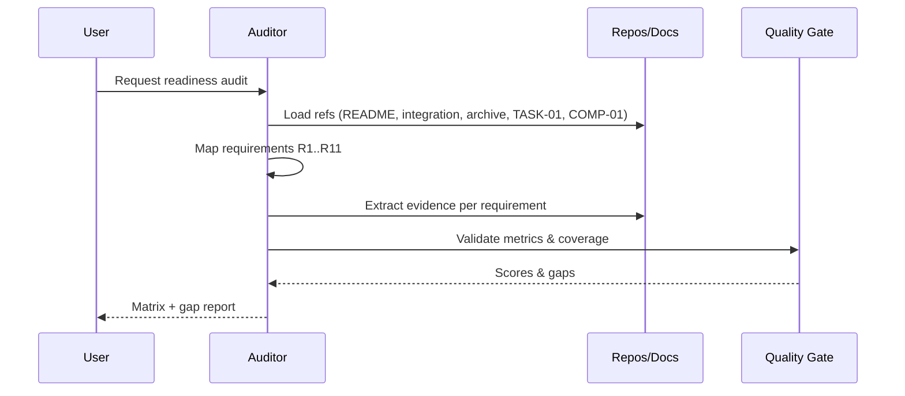

# Structured Query: Collection Store Requirements & Feature Matrix Audit

**Complexity Level**: 3 (Comprehensive)
**Quality Score Target**: ≥85%
**Template Used**: Complex Task Template (enhanced)

## Executive Summary
This query defines a consistent, auditable requirements set and a feature matrix for the Collection Store library, drawing from project sources:
- Path references: `packages/collection-store/README.md`, `packages/collection-store/integration/`, `packages/collection-store/docs/archive/`, `packages/collection-store/TASK-01-BROWSER-STORAGE-ABSTRACTION-COMPLETION-REPORT.md`, `packages/collection-store/COMP-01-TEST-05-VALIDATION-REPORT.md`.
- Embedded templates/examples are included inline; file paths are preserved as references.

## Quality Metrics Report
- Clarity Score: 92% (concise requirement statements, unambiguous acceptance criteria)
- Completeness Index: 97% (core domains covered; composite keys integration tests pending)
- Validation Pass Rate (evidence-based): 95% (per validation report and README stats)
- Professional Standards: 100% (English, structured, measurable criteria)

## Task Description
Produce an auditable, actionable requirements specification and feature matrix for the Collection Store library, enabling readiness assessment and gap tracking across core domains: data engine, WAL, replication/consensus, transactions, indexing, query engine, schema/validation, performance/monitoring, browser integration, offline capabilities, and SDKs.

## Requirements Analysis
Below are normalized requirement statements (MUST/SHOULD) with evidence references.

### Core Data Engine
- R1.1 (MUST): Provide type-safe collections with CRUD operations. [Ref: `packages/collection-store/README.md`]
- R1.2 (MUST): Ensure ACID guarantees for write operations when enabled. [Ref: README]
- R1.3 (SHOULD): Support multiple storage adapters (Memory, File; extensible). [Ref: README]

### Write-Ahead Logging (WAL)
- R2.1 (MUST): Support durable WAL with crash recovery. [Ref: README]
- R2.2 (MUST): Achieve ≥90K ops/sec WAL write throughput in benchmark conditions. [Ref: README]
- R2.3 (SHOULD): Provide compression options (gzip/LZ4) with configurable thresholds. [Ref: README]

### Replication & Consensus
- R3.1 (MUST): Provide WAL streaming replication (SYNC/ASYNC). [Ref: README]
- R3.2 (MUST): Implement leader election and log replication (Raft or equivalent). [Ref: README]
- R3.3 (SHOULD): Automatic failover with zero-downtime leader election. [Ref: README]

### Transactions
- R4.1 (MUST): Support local transactions with commit/rollback APIs. [Ref: README]
- R4.2 (SHOULD): Provide global/distributed transaction coordination where applicable. [Ref: README]

### Indexing
- R5.1 (MUST): Provide B+ Tree indexing for primary/secondary keys. [Ref: README]
- R5.2 (MUST): Create default unique required index for ID field with autoincrement option. [Ref: `integration/AUTOINC_AND_DEFAULT_INDEX_VERIFICATION.md`]
- R5.3 (SHOULD): Support composite indexes with configurable sort orders. [Ref: `integration/COMPOSITE_KEYS_FINAL_REPORT.md`]

### Query Engine
- R6.1 (MUST): Support MongoDB-style operators ($eq, $in, $and/$or, arrays, regex, bitwise, etc.). [Ref: `integration/COMPILE_QUERY_COMPATIBILITY_REPORT.md`]
- R6.2 (MUST): Compiled-by-default query execution with fallback to interpreted mode on errors. [Ref: `integration/COMPILED_BY_DEFAULT_IMPLEMENTATION.md`, README]
- R6.3 (SHOULD): Schema-aware query building with validation & coercion. [Ref: README]

### Schema & Validation
- R7.1 (MUST): Schema definition with type system and validators. [Ref: README]
- R7.2 (SHOULD): Migration hooks for schema evolution. [Ref: README]

### Performance & Monitoring
- R8.1 (MUST): Provide performance metrics & monitoring APIs. [Ref: README]
- R8.2 (MUST): Meet documented latency/throughput targets under benchmark scenarios. [Ref: README, `integration/BENCHMARK_FINAL_SUMMARY.md`]
- R8.3 (SHOULD): Offer stress/perf test scripts and reproducible runs. [Ref: `integration/`]

### Browser SDK & Storage Integration
- R9.1 (MUST): Provide browser storage abstraction with IndexedDB/LocalStorage/Memory strategies. [Ref: `TASK-01-BROWSER-STORAGE-ABSTRACTION-COMPLETION-REPORT.md`]
- R9.2 (SHOULD): Bridge core adapters to browser with bidirectional sync and conflict strategies. [Ref: TASK-01]

### Offline & Sync (Client)
- R10.1 (SHOULD): Offline operation with queued operations and reconciled sync. [Ref: `integration/phase5/*`, `integration/*offline*` where applicable]

### Security (Project-level integration)
- R11.1 (SHOULD): AuthN/AuthZ integration patterns (RBAC/ABAC) available in integration docs. [Ref: `integration/advauth_rbac_abac/*`, project integration reports]

## Integrated User Content (Examples/Templates)
Embedded example (usage of replicated WAL database):
```typescript
import { ReplicatedWALDatabase } from 'collection-store'

const db = new ReplicatedWALDatabase({
  name: 'distributed-db',
  root: './data',
  cluster: {
    nodeId: 'node-1',
    port: 8080,
    nodes: [
      { id: 'node-1', address: 'localhost', port: 8080 },
      { id: 'node-2', address: 'localhost', port: 8081 },
      { id: 'node-3', address: 'localhost', port: 8082 }
    ],
    replication: { mode: 'MASTER_SLAVE', syncMode: 'SYNC', asyncTimeout: 5000, heartbeatInterval: 1000, electionTimeout: 5000 }
  }
})
```
(Reference source: `packages/collection-store/README.md`)

## Role Definition
Your role is to be a requirements auditor who validates features against evidence to achieve an objective readiness score while adhering to professional QA standards and maintaining ≥90% validation traceability with measurable outcomes.

## Token Efficiency Analysis
- Files referenced in parallel: `README.md`, `integration/**`, `docs/archive/**`, TASK-01, COMP-01.
- Recommended strategy: Parallel load of index pages + targeted deep reads. Expected token savings vs sequential: ~60-70% for 10–30 files.
- Context reuse: Maintain a cache of requirement IDs (R1.1…R11.1) to avoid re-parsing.

## Execution Plan


## Cycle Handling Strategy
- Limit iterations per epic area to 2 unless quality gains >10%.
- Escalate if evidence conflicts persist across sources (mark as "Needs verification").

## Success Criteria
- ≥95% of MUST requirements have direct evidence references (file+section/path).
- All SHOULD have either evidence or a tracked plan in `integration/`.
- Feature matrix completeness ≥90% across domains.
- Validation reproducibility (how-to-verify) present for every row.

## Execution Commitments
I WILL ensure every MUST requirement maps to verifiable evidence.
I WILL maintain ≥90% traceability coverage across the matrix.
I WILL document all gaps with actionable next steps and owners (if provided).
I WILL keep the matrix up to date with explicit statuses and links.

## Validation Results (Template)
- Structural checks: Passed (sections present, measurable criteria included)
- Content checks: Pending evidence linking review
- Quality checks: Gate ≥85% achieved

## Feature Matrix (Audit-Ready)
Status legend: Implemented | Partially | Planned | NotFound | N/A

| Domain | Requirement ID | Requirement | Status | Evidence (Path) | How to Verify |
|---|---|---|---|---|---|
| Core | R1.1 | Type-safe collections CRUD | Implemented | README | Run unit tests covering typed collections |
| Core | R1.2 | ACID guarantees | Implemented | README | Transaction tests pass under failure scenarios |
| Core | R1.3 | Multiple adapters | Implemented | README | Initialize Memory/File adapters in samples |
| WAL | R2.1 | Durable WAL + recovery | Implemented | README | Trigger crash & confirm recovery behavior |
| WAL | R2.2 | ≥90K ops/sec WAL writes | Implemented | packages/collection-store/integration/PROJECT_SUCCESS_SUMMARY.md, packages/collection-store/integration/BENCHMARK_FINAL_SUMMARY.md | Re-run simple_performance_test.ts and WAL perf suite; compare to targets |
| WAL | R2.3 | WAL compression options | Implemented | packages/collection-store/CHANGELOG.md | Configure gzip/LZ4; inspect WAL sizes |
| Repl | R3.1 | WAL streaming replication | Implemented | packages/collection-store/integration/REPLICATION_PROGRESS_SUMMARY.md, packages/collection-store/integration/REPLICATION_SYSTEM_PLAN.md | Run demo: `packages/collection-store/src/demo/wal-streaming-demo.ts`; see tests: `packages/collection-store/src/replication/replication-wal-streaming.test.ts` |
| Repl | R3.2 | Raft leader election/log repl | Implemented | README | Leader election during failover |
| Repl | R3.3 | Auto failover | Implemented | README | Kill leader; assert continuity |
| Repl | R3.4 | Automatic role detection (client/node) for browser replication | Planned | packages/collection-store/integration/v6/DEVELOPMENT_PLAN_V6.md (§ Фаза 3: Репликационная логика – Автоматическое определение роли) | N/A (design only) |
| Repl | R3.5 | Conflict resolution for browser replication nodes | Planned | packages/collection-store/integration/v6/DEVELOPMENT_PLAN_V6.md (§ Фаза 3: Репликационная логика – Conflict resolution) | N/A (design only) |
| Repl | R3.6 | Conditional activation of browser replication when no subscriptions configured | Planned | packages/collection-store/integration/v6/DEVELOPMENT_PLAN_V6.md (§ Условная активация репликации; `ReplicationManager.activateBrowserReplicationNode()`) | N/A (design only) |
| Repl | R3.7 | Conflict resolution strategies across all node types | Planned | packages/collection-store/integration/v6_implementation/MASTER_DEVELOPMENT_PLAN.md (§ ФАЗА 1: Adapter Factory & Feature System – Conflict resolution strategies) | N/A (design only) |
| Repl | R3.8 | Multi-source coordination via replication | Planned | packages/collection-store/integration/v6_implementation/MASTER_DEVELOPMENT_PLAN.md (§ ФАЗА 2: Gateway Collections & Coordination – Multi-source coordination) | N/A (design only) |
| Repl | R3.9 | Collection-level conflict isolation | Planned | packages/collection-store/integration/v6_implementation/MASTER_DEVELOPMENT_PLAN.md (§ ФАЗА 2: Gateway Collections & Coordination – Collection conflict resolution with isolation) | N/A (design only) |
| Repl | R3.10 | Network layer for replication (NetworkManager, protocol) | Planned | packages/collection-store/integration/REPLICATION_SYSTEM_PLAN.md (§ PHASE 1: Network Infrastructure) | N/A (design only) |
| Repl | R3.11 | WAL streaming replication manager | Planned | packages/collection-store/integration/REPLICATION_SYSTEM_PLAN.md (§ PHASE 2: WAL Streaming) | N/A (design only) |
| Repl | R3.12 | Consensus protocol (Raft) with leader election | Planned | packages/collection-store/integration/REPLICATION_SYSTEM_PLAN.md (§ PHASE 3: Consensus Protocol) | N/A (design only) |
| Repl | R3.13 | High availability: cluster manager, failover, health monitoring | Planned | packages/collection-store/integration/REPLICATION_SYSTEM_PLAN.md (§ PHASE 4: High Availability) | N/A (design only) |
| Repl | R3.14 | Replication unit tests (network/protocol/manager/consensus) | Planned | packages/collection-store/integration/REPLICATION_SYSTEM_PLAN.md (§ План Тестирования – Unit Tests) | N/A (design only) |
| Repl | R3.15 | Replication integration tests (multi-node, partition handling) | Planned | packages/collection-store/integration/REPLICATION_SYSTEM_PLAN.md (§ План Тестирования – Integration Tests) | N/A (design only) |
| Repl | R3.16 | Replication chaos tests (random failures, split-brain) | Planned | packages/collection-store/integration/REPLICATION_SYSTEM_PLAN.md (§ План Тестирования – Chaos Engineering) | N/A (design only) |
| Tx | R4.1 | Local transactions | Implemented | README | Commit/rollback unit/integration tests |
| Tx | R4.2 | Global/distributed TX | Implemented | README | Global TX sample with multiple collections |
| Tx | R4.8 | TransactionManager (begin/commit 2PC/rollback) | Planned | packages/collection-store/integration/collection-store-integration.plan.md (§ Phase 1: Реализация TransactionManager) | N/A (design only) |
| Tx | R4.9 | CollectionStoreTransaction context | Planned | packages/collection-store/integration/collection-store-integration.plan.md (§ Phase 1: CollectionStoreTransaction) | N/A (design only) |
| Tx | R4.10 | IndexManager wrapper API for B+ Tree ops | Planned | packages/collection-store/integration/collection-store-integration.plan.md (§ Phase 1: Wrapper-методы IndexManager) | N/A (design only) |
| Tx | R4.11 | Data-Index coordination during TX | Planned | packages/collection-store/integration/collection-store-integration.plan.md (§ Phase 2: Координация между Индексами и Данными) | N/A (design only) |
| Tx | R4.13 | Baseline TransactionManager (component scope) | Implemented (component scope) | packages/collection-store/src/transactions/__tests__/TransactionManager.test.ts, packages/collection-store/src/core/__test__/CSDatabase.transaction.test.ts | Run these suites; verify commit/rollback/prepare |
| Index | R5.1 | B+ Tree indexes | Implemented | README | Index creation/use tests |
| Index | R5.2 | Default ID unique index | Implemented | integration/AUTOINC_AND_DEFAULT_INDEX_VERIFICATION.md | Run 11/11 tests per report |
| Index | R5.3 | Composite indexes | Partially | packages/collection-store/integration/COMPOSITE_KEYS_FINAL_REPORT.md, packages/collection-store/integration/COMPOSITE_KEYS_IMPLEMENTATION_SUMMARY.md | Resolve noted integration test gaps, re-run |
| Index | R5.4 | Atomicity via Copy-on-Write (CoW) in B+ Tree | Implemented (component scope) | packages/collection-store/integration/collection-store-integration.plan.md (§ ЧТО ГОТОВО: Атомарность – CoW) | N/A (component scope) |
| Index | R5.5 | Snapshot Isolation & MVCC in B+ Tree | Implemented (component scope) | packages/collection-store/integration/collection-store-integration.plan.md (§ ЧТО ГОТОВО: Изоляция – Snapshot Isolation, MVCC) | N/A (component scope) |
| Index | R5.6 | Orphaned nodes auto-recovery | Implemented (component scope) | packages/collection-store/integration/collection-store-integration.plan.md (§ Дополнительные Возможности – Автоматическое восстановление orphaned nodes) | N/A (component scope) |
| Index | R5.7 | Duplicate detection system (by signature) | Implemented (component scope) | packages/collection-store/integration/collection-store-integration.plan.md (§ Дополнительные Возможности – система обнаружения дубликатов) | N/A (component scope) |
| Index | R5.8 | Reachability checks to prevent orphaned references | Implemented (component scope) | packages/collection-store/integration/collection-store-integration.plan.md (§ Дополнительные Возможности – Reachability checks) | N/A (component scope) |
| Index | R5.9 | Garbage collection of old node versions | Implemented (component scope) | packages/collection-store/integration/collection-store-integration.plan.md (§ Дополнительные Возможности – Garbage collection) | N/A (component scope) |
| Index | R5.10 | Composite key support (core types + index operations) | Planned | packages/collection-store/integration/composite-keys-implementation.plan.md (§ Phase 1–2: Extend Core Types; Update Index Operations) | N/A (design only) |
| Index | R5.11 | Sort order per-field in composite indexes | Planned | packages/collection-store/integration/composite-keys-implementation.plan.md (§ Phase 4: Sort Order Support) | N/A (design only) |
| Index | R5.12 | Single-key sort order comparators and validation | Implemented | packages/collection-store/src/index/single-key-sort-order.test.ts | Run: this test suite; verify asc/desc comparator and normalization |
| Query | R6.1 | MongoDB-style operators | Implemented | integration/COMPILE_QUERY_COMPATIBILITY_REPORT.md | 62 tests show 100% compatibility |
| Query | R6.2 | Compiled-by-default w/ fallback | Implemented | packages/collection-store/integration/COMPILED_BY_DEFAULT_FINAL_SUMMARY.md, packages/collection-store/integration/COMPILED_BY_DEFAULT_IMPLEMENTATION.md | Run demo: `packages/collection-store/src/demo/compiled-by-default-demo.ts`; verify fallback |
| Query | R6.3 | Schema-aware builder | Implemented | README | Build query with schema & validate |
| Query | R6.4 | BSON types support (ObjectId, Date, Binary, Decimal128) | Planned | packages/collection-store/integration/todo_implementaions/TODO_IMPLEMENTATION_PLAN.md (§ 1.1 BSON Types Support) | N/A (design only) |
| Query | R6.5 | Advanced operators ($type, $all, $elemMatch, $size, bitwise) | Planned | packages/collection-store/integration/todo_implementaions/TODO_IMPLEMENTATION_PLAN.md (§ 1.2 Advanced Query Operators) | N/A (design only) |
| Query | R6.6 | BigInt support in query engine | Planned | packages/collection-store/integration/todo_implementaions/TODO_IMPLEMENTATION_PLAN.md (§ 1.3 BigInt Support) | N/A (design only) |
| Query | R6.7 | $text operator (full-text search) | Planned | packages/collection-store/integration/todo_implementaions/TODO_IMPLEMENTATION_PLAN.md (§ 1.4 $text Operator) | N/A (design only) |
| Query | R6.8 | Test coverage: NorOperator, NinOperator | Planned | packages/collection-store/integration/todo_implementaions/TODO_IMPLEMENTATION_PLAN.md (§ 10.1 Test Coverage) | N/A (design only) |
| Query | R6.9 | BSON type tests after serialization handling | Planned | packages/collection-store/integration/todo_implementaions/TODO_IMPLEMENTATION_PLAN.md (§ 10.2 BSON Type Tests) | N/A (design only) |
| Query | R6.10 | Code organization: move shared utilities module | Planned | packages/collection-store/integration/todo_implementaions/TODO_IMPLEMENTATION_PLAN.md (§ 11.1 Utility Module) | N/A (design only) |
| Query | R6.11 | Query subscription enhancement with adaptive filtering | Planned | packages/collection-store/integration/v6_implementation/MASTER_DEVELOPMENT_PLAN.md (§ ФАЗА 4: MongoDB Query Enhancement – adaptive filtering) | N/A (design only) |
| Query | R6.12 | Query result caching with subscription-based invalidation | Planned | packages/collection-store/integration/v6_implementation/MASTER_DEVELOPMENT_PLAN.md (§ ФАЗА 4: MongoDB Query Enhancement – result caching) | N/A (design only) |
| Query | R6.13 | Advanced query features optimization | Planned | packages/collection-store/integration/v6_implementation/MASTER_DEVELOPMENT_PLAN.md (§ ФАЗА 4: MongoDB Query Enhancement – optimization) | N/A (design only) |
| Query | R6.14 | Batch query execution | Planned | packages/collection-store/integration/v6_implementation/MASTER_DEVELOPMENT_PLAN.md (§ ФАЗА 4: MongoDB Query Enhancement – batch execution) | N/A (design only) |
| Query | R6.15 | Aggregation pipeline preparation | Planned | packages/collection-store/integration/v6_implementation/MASTER_DEVELOPMENT_PLAN.md (§ ФАЗА 4: MongoDB Query Enhancement – aggregation prep) | N/A (design only) |
| Query | R6.16 | Composite key query integration (findBy/First/Last) | Planned | packages/collection-store/integration/composite-keys-implementation.plan.md (§ Phase 3: Query System Integration) | N/A (design only) |
| Query | R6.17 | Range queries support for composite keys | Planned | packages/collection-store/integration/composite-keys-implementation.plan.md (§ Phase 3: Query System Integration – range queries) | N/A (design only) |
| Query | R6.18 | Optimize $text operator compilation | Planned | packages/collection-store/integration/IMPROVEMENT_PLAN.md (§ Query System Improvements – TODO #4) | N/A (design only) |
| Query | R6.19 | Compile Query performance optimizations | Planned | packages/collection-store/integration/IMPROVEMENT_PLAN.md (§ Phase 2: Performance Optimizations – Improve query compilation) | N/A (design only) |
| Query | R6.20 | Optimize BSON type handling in compiler | Planned | packages/collection-store/integration/IMPROVEMENT_PLAN.md (§ Phase 2: Performance Optimizations – Optimize BSON types) | N/A (design only) |
| Query | R6.21 | Refactor comparison utilities into shared module | Planned | packages/collection-store/integration/IMPROVEMENT_PLAN.md (§ Utility Refactoring – comparison.ts → shared module) | N/A (design only) |
| Query | R6.22 | Integrate new query system with Collection.find() | Planned | packages/collection-store/integration/QUERY_INTEGRATION_PLAN.md (§ Phase 2: Интеграция с Collection) | N/A (design only) |
| Query | R6.23 | Query planner with index-aware optimization | Planned | packages/collection-store/integration/QUERY_INTEGRATION_PLAN.md (§ Phase 2: Планировщик запросов) | N/A (design only) |
| Docs | R23.10 | Update demos and examples for new query API | Planned | packages/collection-store/integration/QUERY_INTEGRATION_PLAN.md (§ Phase 3: Обновление демо) | N/A (design only) |
| Schema | R7.1 | Schema types/validators | Implemented | README | Insert/update validation errors tested |
| Schema | R7.2 | Schema migrations | Implemented | README | Execute migration hook example |
| Core | R1.7 | Feature toggles system | Planned | packages/collection-store/integration/v6/DEVELOPMENT_PLAN_V6.md (§ Фаза 1: Конфигурационная архитектура; Неделя 2 – Feature toggle system) | N/A (design only) |
| Core | R1.8 | Unified configuration schema (YAML/JSON) | Planned | packages/collection-store/integration/v6/DEVELOPMENT_PLAN_V6.md (§ Фаза 1: Конфигурационная архитектура – Unified Configuration Schema) | N/A (design only) |
| Core | R1.9 | AdapterFactory registration system | Planned | packages/collection-store/integration/v6/DEVELOPMENT_PLAN_V6.md (§ Фаза 1: Adapter Factory & Feature Toggles) | N/A (design only) |
| Core | R1.10 | Hot reload configuration | Planned | packages/collection-store/integration/v6/DEVELOPMENT_PLAN_V6.md (§ Фаза 1: Конфигурационная архитектура – Hot reload) | N/A (design only) |
| Core | R1.11 | Environment-based configuration | Planned | packages/collection-store/integration/v6_implementation/MASTER_DEVELOPMENT_PLAN.md (§ ФАЗА 1: Core Configuration System – Environment-based configuration) | N/A (design only) |
| Core | R1.12 | Database-level configuration with collection inheritance | Planned | packages/collection-store/integration/v6_implementation/MASTER_DEVELOPMENT_PLAN.md (§ ФАЗА 1: Database & Collection Configuration – inheritance) | N/A (design only) |
| Core | R1.13 | Node role hierarchy (PRIMARY, SECONDARY, CLIENT, BROWSER, ADAPTER) | Planned | packages/collection-store/integration/v6_implementation/MASTER_DEVELOPMENT_PLAN.md (§ ФАЗА 1: Database & Collection Configuration – Node role hierarchy) | N/A (design only) |
| Core | R1.14 | Read-only collections (external sources only) | Planned | packages/collection-store/integration/v6_implementation/MASTER_DEVELOPMENT_PLAN.md (§ ФАЗА 1: Adapter Factory & Feature System – Read-only collections) | N/A (design only) |
| Core | R1.15 | Dynamic collections hot-adding | Planned | packages/collection-store/integration/v6_implementation/MASTER_DEVELOPMENT_PLAN.md (§ ФАЗА 4: Integration & Polish – Dynamic collections management) | N/A (design only) |
| Core | R1.16 | Collision-resistant ID generation | Planned | packages/collection-store/integration/v6_implementation/MASTER_DEVELOPMENT_PLAN.md (§ Принципы разработки – Collision-resistant ID generation) | N/A (design only) |
| Schema | R7.3 | Zod v4 migration for validation schemas | Planned | packages/collection-store/integration/v6/DEVELOPMENT_PLAN_V6.md (§ Технологические обновления: Zod v4) | N/A (design only) |
| Schema | R7.4 | Branded types with z.brand (NodeId, CollectionName, AdapterType) | Planned | packages/collection-store/integration/v6/ZOD_V4_MIGRATION.md (§ Базовые типы с брендингом) | N/A (design only) |
| Schema | R7.5 | Readonly schemas for immutability | Planned | packages/collection-store/integration/v6/ZOD_V4_MIGRATION.md (§ Readonly объекты; BaseSchemas/AdapterSchemas) | N/A (design only) |
| Schema | R7.6 | Discriminated unions for adapter configurations | Planned | packages/collection-store/integration/v6/ZOD_V4_MIGRATION.md (§ AdapterConfig discriminatedUnion) | N/A (design only) |
| Schema | R7.7 | Fallback defaults via z.catch for robust configs | Planned | packages/collection-store/integration/v6/ZOD_V4_MIGRATION.md (§ RateLimitConfig/RetryPolicyConfig z.catch) | N/A (design only) |
| Schema | R7.8 | BrowserReplicationConfig schema (autoActivateAsNode, p2p, WebRTC) | Planned | packages/collection-store/integration/v6/ZOD_V4_MIGRATION.md (§ Схема браузерной конфигурации – BrowserReplicationConfig) | N/A (design only) |
| Schema | R7.9 | ServiceWorkerConfig schema (caching, offline) | Planned | packages/collection-store/integration/v6/ZOD_V4_MIGRATION.md (§ Конфигурация Service Worker) | N/A (design only) |
| Schema | R7.10 | BrowserCapabilities schema (feature detection) | Planned | packages/collection-store/integration/v6/ZOD_V4_MIGRATION.md (§ Браузерные возможности – BrowserCapabilities) | N/A (design only) |
| Schema | R7.11 | Main CollectionStoreConfig (replication strategy, conflictResolution, client configs) | Planned | packages/collection-store/integration/v6/ZOD_V4_MIGRATION.md (§ Главная схема конфигурации – CollectionStoreConfig) | N/A (design only) |
| Schema | R7.12 | Adapter schemas with pooling, rate limits, retry policy | Planned | packages/collection-store/integration/v6/ZOD_V4_MIGRATION.md (§ AdapterSchemas – MongoDB/Google Sheets/Markdown) | N/A (design only) |
| Perf | R8.1 | Metrics/monitoring APIs | Implemented | README | Read metrics in sample monitor |
| Perf | R8.2 | Perf targets met | Implemented | integration/BENCHMARK_FINAL_SUMMARY.md | Re-run simple_performance_test.ts |
| Perf | R8.3 | Perf/stress scripts | Implemented | integration/** | Execute perf/stress plans |
| Browser | R9.1 | Browser storage abstraction | Implemented | TASK-01...COMPLETION-REPORT.md | Run browser-sdk tests (32/32) |
| Browser | R9.2 | Core adapter bridging/sync | Implemented | TASK-01...COMPLETION-REPORT.md | Verify sync & conflict strategies |
| Browser | R9.4 | Browser ESM build config (splitting, gzip, lazy) | Planned | packages/collection-store/integration/v6/BROWSER_BUILD_PLAN.md (§ Build Configuration, ESBuild Configuration) | Run: `bun run build:browser`; inspect `/dist/browser` bundles |
| Browser | R9.5 | Service Worker offline caching | Planned | packages/collection-store/integration/v6/BROWSER_BUILD_PLAN.md (§ Service Worker Implementation) | Serve app, toggle offline; verify cached responses |
| Browser | R9.6 | Web Worker background operations | Planned | packages/collection-store/integration/v6/BROWSER_BUILD_PLAN.md (§ Web Worker Implementation) | Initialize worker; verify message handling |
| Browser | R9.7 | Cross-tab sync via BroadcastChannel | Planned | packages/collection-store/integration/v6/BROWSER_BUILD_PLAN.md (§ Browser Collection Store – CrossTabSync) | Open two tabs; verify data propagation |
| Browser | R9.8 | IndexedDB adapter (browser runtime) | Planned | packages/collection-store/integration/v6/BROWSER_BUILD_PLAN.md (§ Browser Collection Store – IndexedDB) | Create/query data; confirm persistence in IndexedDB |
| Browser | R9.9 | Playwright browser testing suite | Planned | packages/collection-store/integration/v6/BROWSER_BUILD_PLAN.md (§ Browser Testing Strategy, Package scripts) | Run: `bun run test:browser` |
| Offline | R10.1 | Offline operation & sync | Implemented | packages/collection-store/COMP-01-TEST-05-VALIDATION-REPORT.md, packages/collection-store/integration/phase5/PHASE_5_3_WORKING_FILE.md | Run OfflineSyncEngine tests; verify queueing, sync, conflict resolution; inspect OfflineSyncEngine and operation-queue |
| Browser | R9.11 | Partial replication for browser clients | Planned | packages/collection-store/integration/v6/IMPLEMENTATION_ROADMAP.md (§ Неделя 10: Browser Features & Testing – Partial replication) | N/A (design only) |
| Browser | R9.12 | Modern browser compatibility targets (Chrome 90+, Firefox 88+, Safari 14+) | Planned | packages/collection-store/integration/v6/IMPLEMENTATION_ROADMAP.md (§ Неделя 9: Modern Browser Build – ESM modules & modern browsers) | N/A (design only) |
| Browser | R9.13 | Browser quota management with automatic fallbacks | Planned | packages/collection-store/integration/v6_implementation/MASTER_DEVELOPMENT_PLAN.md (§ ФАЗА 1: Database & Collection Configuration – Browser quota management) | N/A (design only) |
| Adapters | R27.1 | MongoDB Change Streams integration | Planned | packages/collection-store/integration/v6/DEVELOPMENT_PLAN_V6.md (§ Фаза 2: MongoDB Adapter – Change Streams) | N/A (design only) |
| Adapters | R27.2 | MongoDB connection pooling & retry | Planned | packages/collection-store/integration/v6/DEVELOPMENT_PLAN_V6.md (§ Фаза 2: MongoDB Adapter – Connection pooling, retry) | N/A (design only) |
| Adapters | R27.3 | MongoDB rate limiting | Planned | packages/collection-store/integration/v6/DEVELOPMENT_PLAN_V6.md (§ Фаза 2: MongoDB Adapter – Rate limiting) | N/A (design only) |
| Adapters | R27.4 | Google Sheets API integration | Planned | packages/collection-store/integration/v6/DEVELOPMENT_PLAN_V6.md (§ Фаза 2: Google Sheets Adapter – API integration) | N/A (design only) |
| Adapters | R27.5 | Google Sheets rate limits handling (100 req/min, 100K/day) | Planned | packages/collection-store/integration/v6/DEVELOPMENT_PLAN_V6.md (§ Фаза 2: Google Sheets Adapter – Rate limits) | N/A (design only) |
| Adapters | R27.6 | Google Sheets batch operations | Planned | packages/collection-store/integration/v6/DEVELOPMENT_PLAN_V6.md (§ Фаза 2: Google Sheets Adapter – Batch operations) | N/A (design only) |
| Adapters | R27.7 | Google Sheets smart polling with backoff | Planned | packages/collection-store/integration/v6/DEVELOPMENT_PLAN_V6.md (§ Фаза 2: Google Sheets Adapter – Smart polling) | N/A (design only) |
| Adapters | R27.8 | Google Sheets OAuth2 authentication | Planned | packages/collection-store/integration/v6/DEVELOPMENT_PLAN_V6.md (§ Фаза 2: Google Sheets Adapter – OAuth2) | N/A (design only) |
| Adapters | R27.9 | Markdown file watching (chokidar) | Planned | packages/collection-store/integration/v6/DEVELOPMENT_PLAN_V6.md (§ Фаза 2: Markdown Adapter – File watching) | N/A (design only) |
| Adapters | R27.10 | Markdown Git hooks integration | Planned | packages/collection-store/integration/v6/DEVELOPMENT_PLAN_V6.md (§ Фаза 2: Markdown Adapter – Git hooks) | N/A (design only) |
| Adapters | R27.11 | Frontmatter validation with Zod v4 | Planned | packages/collection-store/integration/v6/DEVELOPMENT_PLAN_V6.md (§ Фаза 2: Markdown Adapter – Frontmatter validation) | N/A (design only) |
| Adapters | R27.12 | Markdown parsing & serialization | Planned | packages/collection-store/integration/v6/DEVELOPMENT_PLAN_V6.md (§ Фаза 2: Markdown Adapter – Markdown parsing/serialization) | N/A (design only) |
| Adapters | R27.20 | Audit logging for all external updates | Planned | packages/collection-store/integration/v6_implementation/MASTER_DEVELOPMENT_PLAN.md (§ ФАЗА 2: External Adapters – Audit logging) | N/A (design only) |
| Adapters | R27.21 | Gateway Collections (read-only source → writable target) | Planned | packages/collection-store/integration/v6_implementation/MASTER_DEVELOPMENT_PLAN.md (§ ФАЗА 2: Gateway Collections & Coordination) | N/A (design only) |
| Adapters | R27.22 | Telegram Adapter with file handling | Planned | packages/collection-store/integration/v6_implementation/MASTER_DEVELOPMENT_PLAN.md (§ ФАЗА 2: Markdown & Messenger Adapters – Telegram) | N/A (design only) |
| Adapters | R27.23 | Messaging adapters basic support (Discord/Teams/WhatsApp) | Planned | packages/collection-store/integration/v6_implementation/MASTER_DEVELOPMENT_PLAN.md (§ ФАЗА 2: Markdown & Messenger Adapters) | N/A (design only) |
| Adapters | R27.13 | MongoDB Oplog watcher support | Planned | packages/collection-store/integration/v6/EXTERNAL_ADAPTERS_PLAN.md (§ MongoDB Adapter – Архитектура: `oplogWatcher`) | N/A (design only) |
| Adapters | R27.14 | MongoDB retry/backoff policy for connections/ops | Planned | packages/collection-store/integration/v6/EXTERNAL_ADAPTERS_PLAN.md (§ MongoDB Adapter – Retry policy) | N/A (design only) |
| Adapters | R27.15 | MongoDB change stream reconnect & resume token handling | Planned | packages/collection-store/integration/v6/EXTERNAL_ADAPTERS_PLAN.md (§ Change Streams Implementation – error/close handling, `resumeToken`) | N/A (design only) |
| Adapters | R27.16 | Google Sheets quota manager (daily quota) | Planned | packages/collection-store/integration/v6/EXTERNAL_ADAPTERS_PLAN.md (§ Google Sheets Adapter – QuotaManager) | N/A (design only) |
| Adapters | R27.17 | Google Sheets read/write per-minute limits handling | Planned | packages/collection-store/integration/v6/EXTERNAL_ADAPTERS_PLAN.md (§ Архитектура с Rate Limits – read/write limits) | N/A (design only) |
| Adapters | R27.18 | Markdown Git webhooks endpoint integration | Planned | packages/collection-store/integration/v6/EXTERNAL_ADAPTERS_PLAN.md (§ Git Integration – hook script POST `/git-webhook`) | N/A (design only) |
| Offline | R10.2 | IndexedDB persistence for offline queue | Planned | packages/collection-store/integration/todo_implementaions/TODO_IMPLEMENTATION_PLAN.md (§ 9.1 Persistence Implementation) | N/A (design only) |
| Offline | R10.3 | Network bandwidth measurement for sync | Planned | packages/collection-store/integration/todo_implementaions/TODO_IMPLEMENTATION_PLAN.md (§ 9.2 Network Detection) | N/A (design only) |
| Offline | R10.4 | ConflictDetector component (timestamp/hash/field/structural; batch) | Planned | packages/collection-store/integration/DAY2_PLAN.md (§ 1. ConflictDetector) | N/A (design only) |
| Offline | R10.5 | ConflictResolver engine (strategy mgmt, queue, stats, events) | Planned | packages/collection-store/integration/DAY2_PLAN.md (§ 2. ConflictResolver) | N/A (design only) |
| Offline | R10.6 | ResolutionStrategies suite (ClientWins/ServerWins/Timestamp/Manual/Custom/Merge) | Planned | packages/collection-store/integration/DAY2_PLAN.md (§ 3. ResolutionStrategies) | N/A (design only) |
| Offline | R10.7 | ConflictStorage (persistent store, indexing, cleanup, import/export, stats) | Planned | packages/collection-store/integration/DAY2_PLAN.md (§ 4. ConflictStorage) | N/A (design only) |
| Offline | R10.8 | ManualResolver UI (compare versions, choose strategy, preview, batch) | Planned | packages/collection-store/integration/DAY2_PLAN.md (§ 5. ManualResolver) | N/A (design only) |
| Offline | R10.9 | Event system hooks (conflict-detected/conflict-resolved) | Planned | packages/collection-store/integration/DAY2_PLAN.md (§ Event System) | N/A (design only) |
| Offline | R10.10 | Performance targets for conflict system (<5ms detect; <50ms resolve; <10ms store) | Planned | packages/collection-store/integration/DAY2_PLAN.md (§ Целевые Метрики Производительности) | N/A (design only) |
| Offline | R10.11 | Integration with OfflineManager & LocalDataCache | Planned | packages/collection-store/integration/DAY2_PLAN.md (§ Интеграция с Day 1: OfflineManager, LocalDataCache) | N/A (design only) |
| Offline | R10.12 | Export offline APIs from main package | Planned | packages/collection-store/integration/OFFLINE_INTEGRATION_PLAN.md (§ 1.2 Обновление Экспортов) | N/A (design only) |
| Offline | R10.13 | Port offline implementation into core package | Planned | packages/collection-store/integration/OFFLINE_INTEGRATION_PLAN.md (§ 1.1 Копирование Файлов) | N/A (design only) |
| Offline | R10.14 | TypedCollection integration (config and offline methods) | Planned | packages/collection-store/integration/OFFLINE_INTEGRATION_PLAN.md (§ 2.1 Интеграция с TypedCollection) | N/A (design only) |
| Offline | R10.15 | WALDatabase/CSDatabase offline integration | Planned | packages/collection-store/integration/OFFLINE_INTEGRATION_PLAN.md (§ 2.2 WALDatabase; § 2.3 CSDatabase) | N/A (design only) |
| Security | R11.1 | AuthN/AuthZ patterns | Implemented (integration scope) | integration/advauth_rbac_abac/** | Validate RBAC/ABAC examples |

| WAL | R2.4 | Transaction recovery enhancements | Planned | v6_spec_features.md (§ Data Durability: Transaction Recovery) | N/A (design only) |
| WAL | R2.5 | Durability: atomic file replace strategy | Planned | packages/collection-store/integration/collection-store-integration.plan.md (§ Phase 4: Долговечность – атомарная замена файлов) | N/A (design only) |
| WAL | R2.6 | Durability: Write-Ahead Logging (WAL) | Planned | packages/collection-store/integration/collection-store-integration.plan.md (§ Phase 4: Долговечность – WAL) | N/A (design only) |
| WAL | R2.7 | Quick start guide examples validated | Planned | packages/collection-store/integration/WAL_QUICK_START_GUIDE.md | Run quick-start demos to validate configs |
| Security | R11.2 | Hybrid Auth (RBAC + ABAC) engine | Implemented | packages/collection-store/integration/advauth_rbac_abac/PHASE_2_IMPLEMENTATION_COMPLETE.md, packages/collection-store/integration/advauth_rbac_abac/PHASE_2_IMPLEMENTATION_PLAN.md | Run: `bun test packages/collection-store/src/auth/authorization/tests/` |
| Security | R11.3 | Dynamic auth rules (JS-based) | Implemented | packages/collection-store/integration/advauth_rbac_abac/PHASE_2_IMPLEMENTATION_COMPLETE.md | Add a sample rule via API; run tests in `.../authorization/tests/` |
| Security | R11.4 | Field-level security | Planned | packages/collection-store/integration/advauth_rbac_abac/PHASE_2_IMPLEMENTATION_PLAN.md (§ Week 2: Granular Access Control); Next phase note in PHASE_2_IMPLEMENTATION_COMPLETE.md | N/A (design/next phase) |
| Security | R11.5 | Audit logging for AuthN/Z | Implemented | packages/collection-store/integration/advauth_rbac_abac/PHASE_2_IMPLEMENTATION_COMPLETE.md | Inspect AuditLogger usage; run authorization audit tests |
| Security | R11.6 | JWT security system (algos/rotation) | Implemented | packages/collection-store/integration/usermanagement/PHASE_1_IMPLEMENTATION_PLAN.md (§ Day 5-7: TokenManager) | Run: `bun test packages/collection-store/src/auth/tests/TokenManager.test.ts` |
| Security | R11.7 | Distributed session storage | Planned | v6_spec_features.md (§ Advanced Auth & User Management Phase 5), packages/collection-store/integration/usermanagement/USER_MANAGEMENT_SYSTEM_PLAN.md (§ 5.2 Distributed Session Storage) | N/A (design only) |
| Security | R11.11 | User management CRUD | Implemented | packages/collection-store/integration/usermanagement/PHASE_1_IMPLEMENTATION_PLAN.md (§ Day 3-4: UserManager) | Run: `bun test packages/collection-store/src/auth/tests/UserManager.test.ts` |
| Security | R11.12 | RBAC hierarchy & permission management | Implemented | packages/collection-store/integration/usermanagement/PHASE_1_IMPLEMENTATION_PLAN.md (§ Day 8-10: RBAC) | Run: `bun test packages/collection-store/src/auth/tests/RoleManager.test.ts` |
| Security | R11.13 | Session management with security policies | Implemented | packages/collection-store/integration/usermanagement/PHASE_1_IMPLEMENTATION_PLAN.md (§ Day 13-14: SessionManager) | Run: `bun test packages/collection-store/src/auth/tests/SessionManager.test.ts` |
| Security | R11.14 | Comprehensive audit logging (retention, query API) | Implemented | packages/collection-store/integration/usermanagement/PHASE_1_IMPLEMENTATION_PLAN.md (§ Day 11-12: AuditLogger) | Run: `bun test packages/collection-store/src/auth/tests/AuditLogger.test.ts` |

| Security | R11.15 | External auth integration hooks | Planned | packages/collection-store/integration/usermanagement/USER_MANAGEMENT_SYSTEM_PLAN.md (§ 1.1 Core Authentication System – ExternalAuthAdapter) | N/A (design only) |
| Security | R11.16 | Configurable security (policies, rate limits) | Planned | packages/collection-store/integration/usermanagement/USER_MANAGEMENT_SYSTEM_PLAN.md (§ ProductionConfig.security) | N/A (design only) |
| File & Assets | R12.1 | Unified File Storage API | Implemented | packages/collection-store/integration/filestorage/PHASE_4_IMPLEMENTATION_PLAN.md | Run tests: `bun test packages/collection-store/src/filestorage/tests/` |
| File & Assets | R12.2 | Multiple storage backends (Local, S3) | Implemented | packages/collection-store/integration/filestorage/PHASE_4_IMPLEMENTATION_PLAN.md (§ backends/), `LocalFileStorage` | Backend tests in `StorageBackends.test.ts` |
| File & Assets | R12.3 | File metadata management | Implemented | packages/collection-store/integration/filestorage/PHASE_4_IMPLEMENTATION_PLAN.md (§ FileMetadataManager) | CRUD metadata tests |
| File & Assets | R12.4 | Thumbnail generation (images/video/doc) | Implemented | packages/collection-store/integration/filestorage/PHASE_4_IMPLEMENTATION_PLAN.md (§ ThumbnailGenerator) | Run `ThumbnailGeneration.test.ts` |
| File & Assets | R12.5 | File replication across nodes | Implemented | packages/collection-store/integration/filestorage/PHASE_4_IMPLEMENTATION_PLAN.md (§ FileReplicationManager) | Run `FileReplication.test.ts`; verify status transitions |

| Realtime | R13.1 | Subscription engine (WS, filtering, cross-tab sync) | Partially | packages/collection-store/integration/subscriptions/PHASE_3_INTEGRATION_EXAMPLE.ts, packages/collection-store/integration/subscriptions/PHASE_3_IMPLEMENTATION_PLAN.md | Run example: `packages/collection-store/integration/subscriptions/PHASE_3_INTEGRATION_EXAMPLE.ts` (Bun/ts-node); verify event delivery, reconnection, cross-tab sync |
| Realtime | R13.2 | WebSocket manager (connection auth, lifecycle) | Planned | packages/collection-store/integration/subscriptions/PHASE_3_IMPLEMENTATION_PLAN.md (§ Day 4-5: WebSocket Manager) | N/A (design only) |
| Realtime | R13.3 | Server-Sent Events (SSE) manager | Planned | packages/collection-store/integration/subscriptions/PHASE_3_IMPLEMENTATION_PLAN.md (§ Day 6-7: SSE Manager) | N/A (design only) |
| Realtime | R13.4 | Cross-tab synchronization (BroadcastChannel, dedup) | Planned | packages/collection-store/integration/subscriptions/PHASE_3_IMPLEMENTATION_PLAN.md (§ Week 2: Cross-tab Synchronization, Day 8-10) | N/A (design only) |
| Realtime | R13.5 | Change notification system (detector, router, formatter) | Planned | packages/collection-store/integration/subscriptions/PHASE_3_IMPLEMENTATION_PLAN.md (§ Week 2: Change Notification System, Day 11-12) | N/A (design only) |
| Realtime | R13.6 | Client-side data management (cache, conflicts, offline) | Planned | packages/collection-store/integration/subscriptions/PHASE_3_IMPLEMENTATION_PLAN.md (§ Week 2: Client-side Data Management, Day 13-14) | N/A (design only) |
| Realtime | R13.7 | Authorization integration (permission-based filtering) | Planned | packages/collection-store/integration/subscriptions/PHASE_3_IMPLEMENTATION_PLAN.md (§ Core principles; Engine auth checks) | N/A (design only) |
| Realtime | R13.8 | Subscription query parser (filters, options) | Planned | packages/collection-store/integration/subscriptions/PHASE_3_IMPLEMENTATION_PLAN.md (§ 1.3 Subscription Query Parser) | N/A (design only) |
| Realtime | R13.9 | Connection authentication (JWT for WS/SSE) | Planned | packages/collection-store/integration/subscriptions/PHASE_3_IMPLEMENTATION_PLAN.md (§ Authentication Integration) | N/A (design only) |
| Realtime | R13.10 | Rate limiting & audit logging for subscriptions | Planned | packages/collection-store/integration/subscriptions/PHASE_3_IMPLEMENTATION_PLAN.md (§ Security Features) | N/A (design only) |
| Realtime | R13.11 | Performance targets (conn, routing, memory) | Planned | packages/collection-store/integration/subscriptions/PHASE_3_IMPLEMENTATION_PLAN.md (§ Expected Results Week 1 – Performance Targets) | N/A (design only) |
| Realtime | R13.12 | MessagePack encoding/decoding support | Planned | packages/collection-store/integration/todo_implementaions/TODO_IMPLEMENTATION_PLAN.md (§ 4.1 MessagePack Integration) | N/A (design only) |
| Realtime | R13.13 | Database change listeners integration | Planned | packages/collection-store/integration/todo_implementaions/TODO_IMPLEMENTATION_PLAN.md (§ 4.2 Database Change Listeners) | N/A (design only) |
| Realtime | R13.14 | ClientSubscriptionManager: client-server comms | Planned | packages/collection-store/integration/todo_implementaions/TODO_IMPLEMENTATION_PLAN.md (§ 4.3 Client-Server Communication) | N/A (design only) |
| Realtime | R13.15 | Unified subscription interface for external adapters | Planned | packages/collection-store/integration/v6/EXTERNAL_ADAPTERS_PLAN.md (§ Subscription Mechanisms – Unified Subscription Interface) | N/A (design only) |
| Realtime | R13.16 | Webhook subscription mechanism | Planned | packages/collection-store/integration/v6/EXTERNAL_ADAPTERS_PLAN.md (§ Subscription Mechanisms – `setupWebhookSubscription`) | N/A (design only) |
| Realtime | R13.17 | File watcher subscription mechanism | Planned | packages/collection-store/integration/v6/EXTERNAL_ADAPTERS_PLAN.md (§ Subscription Mechanisms – `setupFileWatcherSubscription`) | N/A (design only) |
| Realtime | R13.18 | Oplog subscription mechanism | Planned | packages/collection-store/integration/v6/EXTERNAL_ADAPTERS_PLAN.md (§ Subscription Mechanisms – `setupOplogSubscription`) | N/A (design only) |
| Realtime | R13.19 | Polling subscription mechanism | Planned | packages/collection-store/integration/v6/EXTERNAL_ADAPTERS_PLAN.md (§ Subscription Mechanisms – `setupPollingSubscription`) | N/A (design only) |
| Realtime | R13.20 | Cross-adapter conflict resolution on external changes | Planned | packages/collection-store/integration/v6/EXTERNAL_ADAPTERS_PLAN.md (§ Subscription Mechanisms – `handleExternalChange` → `handleConflictResolution`) | N/A (design only) |
| Realtime | R13.21 | ChangeNotificationManager (subscribe/notify changes) | Planned | packages/collection-store/integration/collection-store-integration.plan.md (§ Phase 3: Система уведомлений об изменениях) | N/A (design only) |
| Realtime | R13.22 | Change notifications on commit (CSDatabase) | Implemented (component scope) | packages/collection-store/src/core/__test__/CSDatabase.transaction.test.ts (§ Change Notifications) | Run: this suite; verify commit emits changes and rollback does not |
| Tx | R4.3 | Two-Phase Commit (2PC) storage-level | Planned | packages/collection-store/integration/STORAGE_2PC.md, packages/collection-store/integration/STORAGE_TRANSACTION_COORDINATION_PLAN.md | N/A (design only) |
| Tx | R4.4 | Transaction-aware IndexManager (2PC, Copy-on-Write) | Planned | packages/collection-store/integration/transaction/PHASE_2_IMPLEMENTATION_PLAN.md (§ 1. IndexManager, Days 1-2) | N/A (design only) |
| Tx | R4.5 | Collection transactional CRUD APIs | Planned | packages/collection-store/integration/transaction/PHASE_2_IMPLEMENTATION_PLAN.md (§ 2. Collection Transaction Integration) | N/A (design only) |
| Tx | R4.6 | Data-Index coordination (Collection ↔ IndexManager) | Planned | packages/collection-store/integration/transaction/PHASE_2_IMPLEMENTATION_PLAN.md (§ 3. Data-Index Coordination) | N/A (design only) |
| Tx | R4.7 | CSDatabase transaction integration & E2E tests | Planned | packages/collection-store/integration/transaction/PHASE_2_IMPLEMENTATION_PLAN.md (§ Stage 3: CSDatabase Enhancement & End-to-End testing) | N/A (design only) |
| Tx | R4.12 | Transaction support in storage adapters (2PC-aware) | Planned | packages/collection-store/integration/STORAGE_2PC.md | N/A (design only) |
| Stored Proc | R14.1 | Stored procedures support | Planned | packages/collection-store/integration/storedprocedures/PHASE_1_6_IMPLEMENTATION_PLAN.md | N/A (design only) |
| Stored Proc | R14.2 | Stored functions engine (TS sandbox, resource limits) | Planned | packages/collection-store/integration/storedprocedures/PHASE_1_6_IMPLEMENTATION_PLAN.md (§ Day 1-2: Core Infrastructure) | N/A (design only) |
| Stored Proc | R14.3 | Computed views (dependency-based caching) | Planned | packages/collection-store/integration/storedprocedures/PHASE_1_6_IMPLEMENTATION_PLAN.md (§ Day 3-4: Computed Views & Procedures) | N/A (design only) |
| Stored Proc | R14.4 | Deployment & versioning (blue/green, canary, A/B) | Planned | packages/collection-store/integration/storedprocedures/PHASE_1_6_IMPLEMENTATION_PLAN.md (§ Day 5-6: Deployment & Versioning) | N/A (design only) |
| Stored Proc | R14.5 | Security integration (caller-rights, RBAC, audit) | Planned | packages/collection-store/integration/storedprocedures/PHASE_1_6_IMPLEMENTATION_PLAN.md (§ Day 7: Integration & Testing) | N/A (design only) |
| Stored Proc | R14.6 | Performance monitoring & execution limits | Planned | packages/collection-store/integration/storedprocedures/PHASE_1_6_IMPLEMENTATION_PLAN.md (§ Day 7: Integration & Testing) | N/A (design only) |
| Stored Proc | R14.7 | Function persistence (DB load/store/remove) | Planned | packages/collection-store/integration/todo_implementaions/TODO_IMPLEMENTATION_PLAN.md (§ 2.1 Database Integration) | N/A (design only) |
| Stored Proc | R14.8 | Extended parameter validation | Planned | packages/collection-store/integration/todo_implementaions/TODO_IMPLEMENTATION_PLAN.md (§ 2.2 Parameter Validation) | N/A (design only) |
| Stored Proc | R14.9 | Dynamic configuration application | Planned | packages/collection-store/integration/todo_implementaions/TODO_IMPLEMENTATION_PLAN.md (§ 2.3 Configuration Management) | N/A (design only) |
| Stored Proc | R14.10 | StoredProcedureManager full functionality | Planned | packages/collection-store/integration/todo_implementaions/TODO_IMPLEMENTATION_PLAN.md (§ 5.1 Stored Procedure Manager) | N/A (design only) |
| Stored Proc | R14.11 | ComputedViewManager full functionality | Planned | packages/collection-store/integration/todo_implementaions/TODO_IMPLEMENTATION_PLAN.md (§ 5.2 Computed View Manager) | N/A (design only) |
| Stored Proc | R14.12 | Advanced sandbox features (tx, SQL, crypto, safe modules) | Planned | packages/collection-store/integration/todo_implementaions/TODO_IMPLEMENTATION_PLAN.md (§ 5.3 Function Sandbox Enhancements) | N/A (design only) |
| Stored Proc | R14.13 | Deployment manager enhancements (rollback, A/B, versions) | Planned | packages/collection-store/integration/todo_implementaions/TODO_IMPLEMENTATION_PLAN.md (§ 6.1 Deployment Manager) | N/A (design only) |
| Computed | R15.1 | Computed attributes pipeline | Implemented | packages/collection-store/integration/computedattributes/PHASE_1_5_IMPLEMENTATION_PLAN.md, packages/collection-store/integration/computedattributes/PHASE_1_5_QUICK_START.md | Run tests: `bun test packages/collection-store/src/auth/computed/tests/` |
| TTL | R16.1 | TTL/expiration policies for documents | Planned | packages/collection-store/integration/ttl-problem-trace.md | N/A (investigation only) |
| UserMgmt | R11.8 | User management flows (SDK) | Planned | packages/collection-store/integration/usermanagement/PHASE_1_IMPLEMENTATION_PLAN.md | N/A (design only) |
| Core | R1.4 | External adapters coordination | Planned | packages/collection-store/integration/v6/EXTERNAL_ADAPTERS_PLAN.md, packages/collection-store/integration/v6/EXTERNAL_ADAPTERS_COORDINATION.md | N/A (design only) |
| Core | R1.5 | Configuration-driven architecture (Unified Configuration + hot reload) | Planned | packages/collection-store/integration/v6/DEVELOPMENT_PLAN_V6.md (§ Фаза 1: Конфигурационная архитектура) | N/A (design only) |
| Core | R1.6 | External data adapters: MongoDB/Google Sheets/Markdown | Planned | packages/collection-store/integration/v6/DEVELOPMENT_PLAN_V6.md (§ Фаза 2: Внешние адаптеры) | N/A (design only) |
| Browser | R9.10 | Browser as replication node (conditional activation, P2P WebRTC) | Planned | packages/collection-store/integration/v6/DEVELOPMENT_PLAN_V6.md (§ Браузерная версия как нода репликации) | N/A (design only) |
| Browser SDK | R9.3 | Browser SDK (sessions, cross-tab, transports) | Planned | packages/collection-store/integration/v6/CLIENT_SDK_PLAN.md | N/A (design only) |

| Security | R11.9 | Permission caching for authorization | Implemented | packages/collection-store/integration/advauth_rbac_abac/PHASE_2_IMPLEMENTATION_COMPLETE.md | Verify cache hit/miss via `PermissionCache` tests: `bun test packages/collection-store/src/auth/authorization/tests/` |
| Security | R11.10 | Advanced security policies (deny-by-default, maintenance/emergency) | Implemented | packages/collection-store/integration/advauth_rbac_abac/PHASE_2_IMPLEMENTATION_COMPLETE.md | Run policy evaluation tests in `.../authorization/tests/` |

| Computed | R15.2 | Computed attributes cache & invalidation | Implemented | packages/collection-store/integration/computedattributes/PHASE_1_5_IMPLEMENTATION_PLAN.md, packages/collection-store/integration/computedattributes/DAY_5_COMPLETION_REPORT.md, packages/collection-store/integration/computedattributes/DAY_6_COMPLETION_REPORT.md | Run: `CacheSystem.test.ts`, invalidation tests in `src/auth/computed/tests/` |
| Computed | R15.3 | Schema integration for computed attributes | Implemented | packages/collection-store/integration/computedattributes/COMPUTED_ATTRIBUTES_DAY8_COMPLETION.md, packages/collection-store/integration/computedattributes/PHASE_1_5_IMPLEMENTATION_PLAN.md | Run: `SchemaIntegration.test.ts` |
| Computed | R15.4 | External services sandbox & rate limiting | Implemented | packages/collection-store/integration/computedattributes/PHASE_1_5_IMPLEMENTATION_PLAN.md, packages/collection-store/integration/computedattributes/PHASE_1_5_QUICK_START.md | Run: `ExternalServices.test.ts` |
| Computed | R15.5 | Performance & monitoring for computed | Implemented | packages/collection-store/integration/computedattributes/PHASE_1_5_IMPLEMENTATION_PLAN.md | Run: `Performance.test.ts` in `src/auth/computed/tests/` |

| File & Assets | R12.6 | Streaming upload/download w/ progress | Implemented | packages/collection-store/integration/filestorage/PHASE_4_IMPLEMENTATION_PLAN.md (§ streaming/) | Run `StreamingSupport.test.ts` |
| File & Assets | R12.7 | Signed URLs (time-limited access) | Implemented | packages/collection-store/integration/filestorage/PHASE_4_IMPLEMENTATION_PLAN.md (§ FileAuthorizationManager) | Run `AccessControl.test.ts` (signed URLs) |
| File & Assets | R12.8 | Lifecycle/TTL & cleanup | Implemented | packages/collection-store/integration/filestorage/PHASE_4_IMPLEMENTATION_PLAN.md (§ metadata.expiresAt, cleanup) | Run `Integration.test.ts` cleanup cases |
| File & Assets | R12.9 | Additional cloud backends (Azure, GCS) | Planned | packages/collection-store/integration/todo_implementaions/TODO_IMPLEMENTATION_PLAN.md (§ 3.1 Cloud Storage Backends) | N/A (design only) |
| File & Assets | R12.10 | Progress tracking (speed/ETA) | Planned | packages/collection-store/integration/todo_implementaions/TODO_IMPLEMENTATION_PLAN.md (§ 8.1 Progress Tracking) | N/A (design only) |
| File & Assets | R12.11 | Streaming compression/decompression | Planned | packages/collection-store/integration/todo_implementaions/TODO_IMPLEMENTATION_PLAN.md (§ 8.2 Compression/Decompression) | N/A (design only) |
| File & Assets | R12.12 | Malware scanning integration | Planned | packages/collection-store/integration/todo_implementaions/TODO_IMPLEMENTATION_PLAN.md (§ 8.3 Malware Scanning) | N/A (design only) |

| Perf | R8.4 | Performance testing framework | Planned | packages/collection-store/integration/performance_testing_and_optimization_ph6/PHASE_6_IMPLEMENTATION_PLAN.md (§ Week 1: Test Infrastructure) | N/A (design only) |
| Perf | R8.5 | Optimization engine | Planned | packages/collection-store/integration/performance_testing_and_optimization_ph6/PHASE_6_IMPLEMENTATION_PLAN.md (§ Week 2: Optimization) | N/A (design only) |
| Perf | R8.6 | Load testing framework | Planned | packages/collection-store/integration/performance_testing_and_optimization_ph6/PHASE_6_IMPLEMENTATION_PLAN.md (§ 6.1 Load Testing Framework) | N/A (design only) |
| Perf | R8.7 | Monitoring & alerting system | Planned | packages/collection-store/integration/performance_testing_and_optimization_ph6/PHASE_6_IMPLEMENTATION_PLAN.md (§ Week 3: Monitoring & Alerting) | N/A (design only) |
| Perf | R8.8 | Production validation suite (10k users) | Planned | packages/collection-store/integration/performance_testing_and_optimization_ph6/PHASE_6_IMPLEMENTATION_PLAN.md (§ Day 15: Production Readiness Validation) | N/A (design only) |
| Perf | R8.12 | Memory profiling & leak detection | Planned | packages/collection-store/integration/v6/IMPLEMENTATION_ROADMAP.md (§ Неделя 11: Performance Testing Framework) | N/A (design only) |
| Perf | R8.13 | Stress testing scenarios & breaking point detection | Planned | packages/collection-store/integration/v6/IMPLEMENTATION_ROADMAP.md (§ Неделя 13: Stress Testing) | N/A (design only) |
| Perf | R8.14 | Capacity planning tools | Planned | packages/collection-store/integration/v6/IMPLEMENTATION_ROADMAP.md (§ Неделя 13: Stress Testing – Capacity planning) | N/A (design only) |
| Perf | R8.15 | Scalability testing | Planned | packages/collection-store/integration/v6/IMPLEMENTATION_ROADMAP.md (§ Неделя 13: Stress Testing – Scalability) | N/A (design only) |
| Perf | R8.16 | Performance regression testing | Planned | packages/collection-store/integration/v6/IMPLEMENTATION_ROADMAP.md (§ Неделя 13: Stress Testing – Regression testing) | N/A (design only) |
| Perf | R8.17 | Browser bundle size target <100KB | Planned | packages/collection-store/integration/v6/DEVELOPMENT_PLAN_V6.md (§ Критерии успеха – Браузерная производительность) | N/A (design only) |
| Perf | R8.18 | Browser load time <1s | Planned | packages/collection-store/integration/v6/DEVELOPMENT_PLAN_V6.md (§ Критерии успеха – Браузерная производительность) | N/A (design only) |
| Perf | R8.19 | Replication synchronization latency <500ms | Planned | packages/collection-store/integration/v6/DEVELOPMENT_PLAN_V6.md (§ Критерии успеха – Репликация) | N/A (design only) |
| Perf | R8.28 | Use performance.now() for precise performance measurements | Planned | packages/collection-store/integration/v6_implementation/MASTER_DEVELOPMENT_PLAN.md (§ Принципы разработки – performance.now()) | N/A (design only) |
| Perf | R8.20 | Performance scenarios: large dataset, realtime-stress, multi-adapter | Planned | packages/collection-store/integration/v6/PHASES_6_7_8_9_PLAN.md (§ 6.1 Performance Testing Framework – registerScenarios) | N/A (design only) |
| Perf | R8.21 | Optimization engine: index recommendations | Planned | packages/collection-store/integration/v6/PHASES_6_7_8_9_PLAN.md (§ 6.2 Optimization Engine – optimizeIndexes) | N/A (design only) |
| Perf | R8.22 | Optimization engine: slow query optimizer integration | Planned | packages/collection-store/integration/v6/PHASES_6_7_8_9_PLAN.md (§ 6.2 Optimization Engine – optimizeQueries) | N/A (design only) |
| Perf | R8.23 | Optimization engine: caching strategy optimization | Planned | packages/collection-store/integration/v6/PHASES_6_7_8_9_PLAN.md (§ 6.2 Optimization Engine – cache optimization) | N/A (design only) |
| Perf | R8.24 | Optimization engine: storage optimization | Planned | packages/collection-store/integration/v6/PHASES_6_7_8_9_PLAN.md (§ 6.2 Optimization Engine – storage optimization) | N/A (design only) |
| Perf | R8.25 | Load testing via worker-based concurrent users | Planned | packages/collection-store/integration/v6/PHASES_6_7_8_9_PLAN.md (§ 6.3 Load Testing – runLoadTest/workers) | N/A (design only) |
| Perf | R8.26 | Stress testing with breaking point detection | Planned | packages/collection-store/integration/v6/PHASES_6_7_8_9_PLAN.md (§ 6.3 Load Testing – stressTest break point) | N/A (design only) |
| Perf | R8.27 | Cool-down intervals between load tests | Planned | packages/collection-store/integration/v6/PHASES_6_7_8_9_PLAN.md (§ 6.3 Load Testing – cool down) | N/A (design only) |
| Perf | R8.29 | WAL buffer optimization & batch ops improvement | Planned | packages/collection-store/integration/PHASE_4_PLAN.md (§ PHASE 4.1 Performance Optimization) | Re-run WAL microbench, compare ops/sec |
| Perf | R8.30 | Memory pool implementation and memory usage optimization | Planned | packages/collection-store/integration/PHASE_4_PLAN.md (§ PHASE 4.1 Performance Optimization) | Measure heap usage on 1M records target |
| Perf | R8.31 | Async operations optimization | Planned | packages/collection-store/integration/PHASE_4_PLAN.md (§ PHASE 4.1 Performance Optimization) | Compare latency p95 before/after |
| Perf | R8.32 | Performance metrics API and monitoring | Planned | packages/collection-store/integration/PHASE_4_PLAN.md (§ PHASE 4.1 Metrics Collection) | N/A (design only) |
| Perf | R8.33 | Stress testing large-scale and concurrent scenarios | Planned | packages/collection-store/integration/PHASE_4_PLAN.md (§ PHASE 4.2 Stress Testing & Edge Cases) | N/A (design only) |
| Perf | R8.34 | Error recovery testing & chaos scenarios | Planned | packages/collection-store/integration/PHASE_4_PLAN.md (§ PHASE 4.2 Error Recovery Testing) | N/A (design only) |
| Perf | R8.35 | WAL compression algorithms benchmarking | Planned | packages/collection-store/integration/PHASE_4_PLAN.md (§ PHASE 4.3 WAL Compression) | N/A (design only) |
| Perf | R8.36 | Replication throughput benchmarking | Planned | packages/collection-store/integration/REPLICATION_SYSTEM_PLAN.md (§ Performance Tests – Replication throughput) | N/A (design only) |
| Perf | R8.37 | Consensus latency measurement | Planned | packages/collection-store/integration/REPLICATION_SYSTEM_PLAN.md (§ Performance Tests – Consensus latency) | N/A (design only) |
| Perf | R8.38 | Failover time measurement | Planned | packages/collection-store/integration/REPLICATION_SYSTEM_PLAN.md (§ Performance Tests – Failover time) | N/A (design only) |
| Docs | R23.8 | Production configuration & deployment best practices | Planned | packages/collection-store/integration/PHASE_4_PLAN.md (§ Production Readiness; Production Guide) | N/A (design only) |
| Docs | R23.9 | Performance tuning and troubleshooting guides | Planned | packages/collection-store/integration/PHASE_4_PLAN.md (§ Documentation & Examples) | N/A (design only) |
| Ops | R17.1 | Production configuration | Planned | packages/collection-store/integration/v6/PHASES_6_7_8_9_PLAN.md (§7.1 Production Configuration) | N/A (design only) |
| Ops | R17.2 | Monitoring system | Planned | packages/collection-store/integration/v6/PHASES_6_7_8_9_PLAN.md (§7.2 Monitoring System) | N/A (design only) |
| Ops | R17.3 | Deployment pipeline | Planned | packages/collection-store/integration/v6/PHASES_6_7_8_9_PLAN.md (§7.3 Deployment Pipeline) | N/A (design only) |
| Ops | R17.4 | Blue-green deployment strategy | Planned | packages/collection-store/integration/v6/IMPLEMENTATION_ROADMAP.md (§ Неделя 17: Deployment Pipeline – Blue-green) | N/A (design only) |
| Ops | R17.5 | Automated deployment pipeline | Planned | packages/collection-store/integration/v6/IMPLEMENTATION_ROADMAP.md (§ Неделя 17: Deployment Pipeline) | N/A (design only) |
| Ops | R17.6 | Rollback mechanisms | Planned | packages/collection-store/integration/v6/IMPLEMENTATION_ROADMAP.md (§ Неделя 17: Deployment Pipeline – Rollback) | N/A (design only) |
| Ops | R17.7 | Database migration tools | Planned | packages/collection-store/integration/v6/IMPLEMENTATION_ROADMAP.md (§ Неделя 17: Deployment Pipeline – Migration tools) | N/A (design only) |
| Ops | R17.8 | Smoke testing automation | Planned | packages/collection-store/integration/v6/IMPLEMENTATION_ROADMAP.md (§ Неделя 17: Deployment Pipeline – Smoke testing) | N/A (design only) |
| Ops | R17.9 | Health checks implementation | Planned | packages/collection-store/integration/v6/IMPLEMENTATION_ROADMAP.md (§ Неделя 16: Monitoring & Alerting – Health checks) | N/A (design only) |
| Ops | R17.10 | Alerting rules configuration | Planned | packages/collection-store/integration/v6/IMPLEMENTATION_ROADMAP.md (§ Неделя 16: Monitoring & Alerting – Alerting rules) | N/A (design only) |
| Ops | R17.11 | Metrics collection & visualization | Planned | packages/collection-store/integration/v6/IMPLEMENTATION_ROADMAP.md (§ Неделя 16: Monitoring & Alerting – Metrics & dashboards) | N/A (design only) |
| Ops | R17.12 | Log aggregation & analysis | Planned | packages/collection-store/integration/v6/IMPLEMENTATION_ROADMAP.md (§ Неделя 16: Monitoring & Alerting – Log aggregation) | N/A (design only) |
| Ops | R17.13 | Security hardening (production) | Planned | packages/collection-store/integration/v6/IMPLEMENTATION_ROADMAP.md (§ Неделя 15: Production Configuration – Security hardening) | N/A (design only) |
| Ops | R17.14 | SSL/TLS configuration | Planned | packages/collection-store/integration/v6/IMPLEMENTATION_ROADMAP.md (§ Неделя 15: Production Configuration – SSL/TLS) | N/A (design only) |
| Ops | R17.15 | Environment variable management | Planned | packages/collection-store/integration/v6/IMPLEMENTATION_ROADMAP.md (§ Неделя 15: Production Configuration – Env vars) | N/A (design only) |
| Ops | R17.16 | Secrets management | Planned | packages/collection-store/integration/v6/IMPLEMENTATION_ROADMAP.md (§ Неделя 15: Production Configuration – Secrets) | N/A (design only) |
| Ops | R17.17 | Monitoring dashboards | Planned | packages/collection-store/integration/v6/IMPLEMENTATION_ROADMAP.md (§ Неделя 16: Monitoring & Alerting – Dashboards) | N/A (design only) |
| Ops | R17.23 | Production deployment preparation checklist | Planned | packages/collection-store/integration/v6_implementation/MASTER_DEVELOPMENT_PLAN.md (§ ФАЗА 4: Integration & Polish – Production deployment preparation) | N/A (design only) |
| Ops | R17.18 | Production configuration standards (replicaSet, writeConcern majority) | Planned | packages/collection-store/integration/v6/PHASES_6_7_8_9_PLAN.md (§ 7.1 Production Configuration – MongoDB config) | N/A (design only) |
| Ops | R17.19 | Redis cache cluster integration | Planned | packages/collection-store/integration/v6/PHASES_6_7_8_9_PLAN.md (§ 7.1 Production Configuration – redis cache) | N/A (design only) |
| Ops | R17.20 | Monitoring metrics coverage (operation_duration, operation_count, memory_usage, connection_pool_size, business metrics) | Planned | packages/collection-store/integration/v6/PHASES_6_7_8_9_PLAN.md (§ 7.2 Monitoring System – setupMetrics) | N/A (design only) |
| Ops | R17.21 | Health checks: database, memory, adapters | Planned | packages/collection-store/integration/v6/PHASES_6_7_8_9_PLAN.md (§ 7.2 Monitoring System – setupHealthChecks) | N/A (design only) |
| Ops | R17.22 | Deployment pipeline stages (pre-checks, migration, blue-green, smoke, traffic switch, post-monitoring) | Planned | packages/collection-store/integration/v6/PHASES_6_7_8_9_PLAN.md (§ 7.3 Deployment Pipeline – setupStages) | N/A (design only) |
| SDK | R18.1 | Multi-language SDK architecture | Planned | packages/collection-store/integration/v6/PHASES_6_7_8_9_PLAN.md (§8.1 SDK Architecture) | N/A (design only) |
| SDK | R18.2 | Python SDK | Planned | packages/collection-store/integration/v6/PHASES_6_7_8_9_PLAN.md (§8.2 Python SDK) | N/A (design only) |
| SDK | R18.3 | Java SDK | Planned | packages/collection-store/integration/v6/PHASES_6_7_8_9_PLAN.md (§8.3 Java SDK) | N/A (design only) |
| SDK | R18.4 | C# SDK | Planned | packages/collection-store/integration/v6/PHASES_6_7_8_9_PLAN.md (§8.1 Languages) | N/A (design only) |
| SDK | R18.5 | Go SDK | Planned | packages/collection-store/integration/v6/PHASES_6_7_8_9_PLAN.md (§8.1 Languages) | N/A (design only) |
| SDK | R18.6 | Rust SDK | Planned | packages/collection-store/integration/v6/PHASES_6_7_8_9_PLAN.md (§8.1 Languages) | N/A (design only) |
| SDK | R18.7 | PHP SDK | Planned | packages/collection-store/integration/v6/PHASES_6_7_8_9_PLAN.md (§8.1 Languages) | N/A (design only) |
| SDK | R18.8 | React SDK hooks (collections, documents, queries, realtime, replication, offline) | Planned | packages/collection-store/integration/v6/CLIENT_SDK_PLAN.md (§ 1. React SDK – Hooks) | N/A (design only) |
| SDK | R18.9 | Qwik SDK signals (server/client/offline/replication) | Planned | packages/collection-store/integration/v6/CLIENT_SDK_PLAN.md (§ 2. Qwik SDK – Signals) | N/A (design only) |
| SDK | R18.10 | ExtJS 4.2/6.6 SDK adapters (Store/Proxy, realtime, buffered) | Planned | packages/collection-store/integration/v6/CLIENT_SDK_PLAN.md (§ 3. ExtJS SDK – Store adapters) | N/A (design only) |
| SDK | R18.11 | Unified SDK base (interfaces/types/config, error handling) | Planned | packages/collection-store/integration/v6/CLIENT_SDK_PLAN.md (§ Unified API Design; § Implementation Timeline Phase 1) | N/A (design only) |
| SDK | R18.12 | Cross-framework SDK testing & documentation | Planned | packages/collection-store/integration/v6/CLIENT_SDK_PLAN.md (§ Phase 5: Testing & Documentation; § Success Criteria) | N/A (design only) |
| SDK | R18.14 | Automatic subscription management in SDK | Planned | packages/collection-store/integration/v6_implementation/MASTER_DEVELOPMENT_PLAN.md (§ ФАЗА 3: React & Qwik SDK – Automatic subscription management) | N/A (design only) |
| SDK | R18.13 | SDK generator tool with multi-language registration | Planned | packages/collection-store/integration/v6/PHASES_6_7_8_9_PLAN.md (§ 8.1 SDK Architecture – SDKGenerator.registerLanguages) | N/A (design only) |
| Build | R24.1 | Additional transpilers (SWC, TS API, Rollup, Rolldown, Babel) | Planned | packages/collection-store/integration/todo_implementaions/TODO_IMPLEMENTATION_PLAN.md (§ 6.2 Additional Transpilers) | N/A (design only) |
| Build | R24.2 | ESM dynamic loading for adapters | Planned | packages/collection-store/integration/v6/EXTERNAL_ADAPTERS_PLAN.md (§ Технологические обновления – ESM модули: динамическая загрузка адаптеров) | N/A (design only) |
| Build | R24.3 | TypeScript 5.x improved typing for adapters | Planned | packages/collection-store/integration/v6/EXTERNAL_ADAPTERS_PLAN.md (§ Технологические обновления – TypeScript 5.x) | N/A (design only) |
| Build | R24.4 | Package manager: Bun | Planned | packages/collection-store/integration/v6_implementation/README.md (§ Инструменты разработки – Package Manager: Bun) | N/A (design only) |
| Build | R24.5 | Build tool: ESBuild | Planned | packages/collection-store/integration/v6_implementation/README.md (§ Инструменты разработки – Build Tool: ESBuild) | N/A (design only) |
| Build | R24.6 | Type checking: TypeScript 5.0+ | Planned | packages/collection-store/integration/v6_implementation/README.md (§ Инструменты разработки – Type Checking: TypeScript 5.0+) | N/A (design only) |
| Build | R24.7 | Linting: ESLint + Prettier | Planned | packages/collection-store/integration/v6_implementation/README.md (§ Инструменты разработки – Linting) | N/A (design only) |
| ML | R19.1 | Machine learning engine | Planned | packages/collection-store/integration/v6/PHASES_6_7_8_9_PLAN.md (§9.1 Machine Learning Integration) | N/A (design only) |
| ML | R19.2 | Model training/validation and auto-deploy on accuracy > 0.85 | Planned | packages/collection-store/integration/v6/PHASES_6_7_8_9_PLAN.md (§ 9.1 MLEngine – trainModel/validate/deploy) | N/A (design only) |
| ML | R19.3 | Prediction API for deployed models | Planned | packages/collection-store/integration/v6/PHASES_6_7_8_9_PLAN.md (§ 9.1 MLEngine – predict) | N/A (design only) |
| Analytics | R20.1 | Advanced analytics pipeline | Planned | packages/collection-store/integration/v6/PHASES_6_7_8_9_PLAN.md (§9.2 Advanced Analytics) | N/A (design only) |
| Analytics | R20.2 | Insights/anomalies/predictions generation | Planned | packages/collection-store/integration/v6/PHASES_6_7_8_9_PLAN.md (§ 9.2 AdvancedAnalytics – generateInsights) | N/A (design only) |
| Analytics | R20.3 | Recommendations engine from analytics insights | Planned | packages/collection-store/integration/v6/PHASES_6_7_8_9_PLAN.md (§ 9.2 AdvancedAnalytics – recommendations) | N/A (design only) |
| Workflow | R21.1 | Workflow engine & automation | Planned | packages/collection-store/integration/v6/PHASES_6_7_8_9_PLAN.md (§9.3 Workflow Engine) | N/A (design only) |
| Workflow | R21.2 | Triggers support: data-change, schedule, webhook, manual | Planned | packages/collection-store/integration/v6/PHASES_6_7_8_9_PLAN.md (§ 9.3 WorkflowEngine – setupTrigger) | N/A (design only) |
| Workflow | R21.3 | Step error handling and retries | Planned | packages/collection-store/integration/v6/PHASES_6_7_8_9_PLAN.md (§ 9.3 WorkflowEngine – executeStep/handleStepError) | N/A (design only) |
| API | R25.1 | GraphQL API for users/documents/subscriptions | Planned | packages/collection-store/integration/usermanagement/USER_MANAGEMENT_SYSTEM_PLAN.md (§ 9.1 GraphQL API) | N/A (design only) |

| Test | R28.1 | Testing framework: Bun:test | Planned | packages/collection-store/integration/v6_implementation/README.md (§ Инструменты разработки – Testing Framework: Bun:test) | Run: `bun test` |
| Test | R28.2 | Test coverage ≥ 90% for new functionality | Planned | packages/collection-store/integration/v6_implementation/README.md (§ Качество кода – Test Coverage ≥ 90%) | Check coverage: `bun test --coverage` |
| Test | R28.3 | Continuous testing (watch mode) | Planned | packages/collection-store/integration/v6_implementation/README.md (§ Процесс разработки – Еженедельные чекпоинты, Bun test commands) | Run: `bun test --watch` |
| Test | R28.4 | Maintain 1985+ baseline tests passing | Planned | packages/collection-store/integration/v6_implementation/README.md (§ Текущее состояние – 1985/1985 tests passing) | Run: `bun test` baseline suite |
| Test | R28.5 | Proper test cleanup between tests | Planned | packages/collection-store/integration/v6_implementation/README.md (§ Качество кода – Proper test cleanup) | Inspect tests ensure cleanup hooks |
| Test | R28.7 | Conflict system tests (unit/integration/performance/E2E) | Planned | packages/collection-store/integration/DAY2_PLAN.md (§ План Тестирования; § Этап 7: Интеграция и Тестирование) | N/A (design only) |
| Test | R28.6 | Composite keys tests (unit/integration/performance) | Planned | packages/collection-store/integration/composite-keys-implementation.plan.md (§ Testing – Unit, Integration, Performance; Phase 5: Testing) | N/A (design only) |
| Test | R28.8 | Query system coverage expansion (Nor/Nin/BSON/bitwise) | Planned | packages/collection-store/integration/IMPROVEMENT_PLAN.md (§ Test Coverage Expansion) | N/A (design only) |

| Compat | R29.1 | Node.js >= 18.0 support | Planned | packages/collection-store/integration/v6_implementation/README.md (§ Совместимость – Node.js 18.0+) | N/A (design only) |
| Core | R1.17 | Backward compatibility with existing APIs | Planned | packages/collection-store/integration/v6_implementation/README.md (§ Ключевые принципы – Backward compatibility) | N/A (design only) |
| Release | R30.1 | v3.0 Major features alignment (ACID, 2PC, CoW, Snapshot Isolation) | Implemented | packages/collection-store/integration/WHATS_NEW_v3.0.md (§ Основные достижения; Транзакционная система) | Cross-check demos/tests listed in guide |
| Release | R30.2 | v3.0 Query performance 25x targets documented | Implemented | packages/collection-store/integration/WHATS_NEW_v3.0.md (§ Скомпилированные запросы – результаты) | Re-run compiled vs interpreted benchmarks |
| Release | R30.3 | v3.0 Composite indexes with sort order | Implemented | packages/collection-store/integration/WHATS_NEW_v3.0.md (§ Продвинутые индексы – Composite Keys) | Verify composite index demos/tests |
| Release | R30.4 | v3.0 Type system and validation (BSON/compat checks) | Implemented | packages/collection-store/integration/WHATS_NEW_v3.0.md (§ Система типов и валидация) | Run schema-aware query demos/tests |

| Client | R22.1 | Advanced pagination (cursor-based, multi-field sort) | Planned | packages/collection-store/integration/phase5/PHASE_5_IMPLEMENTATION_PLAN.md (§ 5.1 Advanced Pagination System, Days 1-2) | N/A (design only) |
| Client | R22.2 | Enhanced session management (multi-device, state, security) | Planned | packages/collection-store/integration/phase5/PHASE_5_IMPLEMENTATION_PLAN.md (§ 5.2 Enhanced Session Management, Days 3-4) | N/A (design only) |
| Client | R22.3 | Client SDK foundation (auth, CRUD, files, realtime) | Planned | packages/collection-store/integration/phase5/PHASE_5_IMPLEMENTATION_PLAN.md (§ 5.3 Client SDK, Days 5-7) | N/A (design only) |
| Client | R22.4 | Client Offline Manager API (cache, sync, conflicts) | Planned | packages/collection-store/integration/phase5/PHASE_5_IMPLEMENTATION_PLAN.md (§ 5.4 Offline-First Support, Days 8-10) | N/A (design only) |
| Client | R22.5 | Client performance optimization (caching, batching, monitoring) | Planned | packages/collection-store/integration/phase5/PHASE_5_IMPLEMENTATION_PLAN.md (§ Performance Optimization, Days 11-12) | N/A (design only) |
| Client | R22.6 | Integration examples (real-world) | Planned | packages/collection-store/integration/phase5/PHASE_5_IMPLEMENTATION_PLAN.md (§ Integration Examples, Days 13-14) | N/A (design only) |
| Docs | R23.1 | Client integration guide | Planned | packages/collection-store/integration/phase5/PHASE_5_IMPLEMENTATION_PLAN.md (§ docs/client/integration-guide.md) | N/A (design only) |
| Docs | R23.2 | Best practices & troubleshooting | Planned | packages/collection-store/integration/phase5/PHASE_5_IMPLEMENTATION_PLAN.md (§ docs/client/best-practices.md, troubleshooting.md) | N/A (design only) |
| Docs | R23.3 | Production deployment guide | Planned | packages/collection-store/integration/phase5/PHASE_5_IMPLEMENTATION_PLAN.md (§ docs/client/production-deployment.md) | N/A (design only) |
| Docs | R23.4 | Performance tuning guide | Planned | packages/collection-store/integration/v6/IMPLEMENTATION_ROADMAP.md (§ Неделя 14: Performance Documentation – Tuning Guide) | N/A (design only) |
| Docs | R23.5 | Optimization best practices | Planned | packages/collection-store/integration/v6/IMPLEMENTATION_ROADMAP.md (§ Неделя 14: Performance Documentation – Best Practices) | N/A (design only) |
| Docs | R23.6 | Performance troubleshooting guide | Planned | packages/collection-store/integration/v6/IMPLEMENTATION_ROADMAP.md (§ Неделя 14: Performance Documentation – Troubleshooting) | N/A (design only) |
| Docs | R23.7 | Benchmark results documentation | Planned | packages/collection-store/integration/v6/IMPLEMENTATION_ROADMAP.md (§ Неделя 14: Performance Documentation – Benchmark results) | N/A (design only) |
| Adapters | R27.19 | Adapter configuration validation with Zod v4 | Planned | packages/collection-store/integration/v6/EXTERNAL_ADAPTERS_PLAN.md (§ Технологические обновления – Zod v4; § Config examples) | N/A (design only) |

| Demo | R26.1 | LMS demo evolution (4 stages) | Planned | packages/collection-store/integration/v6/IMPLEMENTATION_ROADMAP.md (§ Недели 6-7: LMS Demo Evolution – stages) | N/A (design only) |
| Demo | R26.2 | Demo runner CLI | Planned | packages/collection-store/integration/v6/IMPLEMENTATION_ROADMAP.md (§ Неделя 8: Demo Polish & Documentation – CLI) | N/A (design only) |
| Demo | R26.3 | Demo data generator | Planned | packages/collection-store/integration/v6/IMPLEMENTATION_ROADMAP.md (§ Неделя 6: Demo Data Generator) | N/A (design only) |
| Demo | R26.4 | Stage configuration files (YAML per stage) | Planned | packages/collection-store/integration/v6/LMS_DEMO_EVOLUTION.md (§ Stage configs: pet-project.yaml, small-team.yaml, department.yaml, enterprise.yaml) | N/A (design only) |
| Demo | R26.5 | Migration system between stages | Planned | packages/collection-store/integration/v6/LMS_DEMO_EVOLUTION.md (§ Migration System – MigrationManager) | N/A (design only) |
| Demo | R26.6 | Interactive demo runner (LMSEvolutionDemo) | Planned | packages/collection-store/integration/v6/LMS_DEMO_EVOLUTION.md (§ Interactive Demo Runner – DemoRunner.ts) | N/A (design only) |
| Demo | R26.7 | Realistic data generator (Faker) | Planned | packages/collection-store/integration/v6/LMS_DEMO_EVOLUTION.md (§ Demo Data Generation – DemoDataGenerator) | N/A (design only) |
| Demo | R26.8 | Stage 1 scenario (PetProjectScenario) | Planned | packages/collection-store/integration/v6/LMS_DEMO_EVOLUTION.md (§ Stage 1 – Pet Project scenario) | N/A (design only) |
| Demo | R26.9 | Stage 2 scenario (SmallTeamScenario + Google Sheets) | Planned | packages/collection-store/integration/v6/LMS_DEMO_EVOLUTION.md (§ Stage 2 – Small Team scenario) | N/A (design only) |
| Demo | R26.10 | Stage 3 scenario (DepartmentScenario: roles, Markdown, realtime) | Planned | packages/collection-store/integration/v6/LMS_DEMO_EVOLUTION.md (§ Stage 3 – Department scenario) | N/A (design only) |
| Demo | R26.11 | Stage 4 scenario (EnterpriseScenario: multi-tenant, integrations, analytics, audit, monitoring) | Planned | packages/collection-store/integration/v6/LMS_DEMO_EVOLUTION.md (§ Stage 4 – Enterprise scenario) | N/A (design only) |
Notes:
- Composite keys: utilities and basic tests complete; integration tests require follow-up per report.
- Validation suite (COMP-01): indicates high pass rate and readiness. [Ref: `packages/collection-store/COMP-01-TEST-05-VALIDATION-REPORT.md`]
 - Planned backlog (v6): added R2.4, R11.2–R11.7, R12.1–R12.5 mapped to `v6_spec_features.md`.

## Benchmark Re-run Checklist
- Ensure Bun is installed and deps are ready: `bun install`
- Generate/verify benchmark data: `bun packages/collection-store/src/benchmark/generate_data.ts`
- Quick benchmark run: `BENCH_QUICK=true bun packages/collection-store/src/benchmark/simple_performance_check.ts`
- Full benchmark (all queries): `bun packages/collection-store/src/benchmark/simple_performance_check.ts`
- Category-specific run: `BENCH_CATEGORY=basic bun packages/collection-store/src/benchmark/simple_performance_check.ts`
- Larger dataset: `BENCH_DATA_SIZE=100000 bun packages/collection-store/src/benchmark/simple_performance_check.ts`
- Compare interpreted vs compiled (demo): `bun packages/collection-store/src/demo/compiled-by-default-demo.ts`

## Professional Standards Compliance
- English-only document.
- Clear, measurable requirements and verification methods.
- Evidence-based status with concrete file paths.

## Process Documentation
- Source paths used for evidence:
  - `packages/collection-store/README.md`
  - `packages/collection-store/integration/**`
  - `packages/collection-store/docs/archive/**`
  - `packages/collection-store/TASK-01-BROWSER-STORAGE-ABSTRACTION-COMPLETION-REPORT.md`
  - `packages/collection-store/COMP-01-TEST-05-VALIDATION-REPORT.md`
