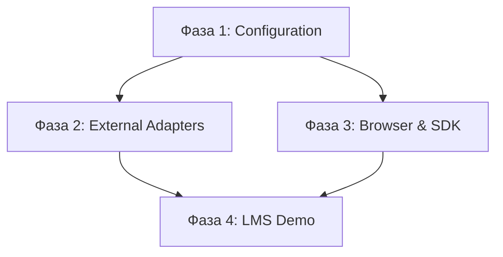

# ⏱️ Collection Store v6.0 - Implementation Timeline

## 📅 Общий план разработки (22 недели)

### 🎯 Цель проекта
Создание enterprise-grade Collection Store v6.0 с configuration-driven архитектурой, современной браузерной поддержкой и интеграцией с внешними системами.

---

## 📊 Временная диаграмма

```
Недели:  1  2  3  4  5  6  7  8  9 10 11 12 13 14 15 16 17 18 19 20 21 22
Фаза 1:  ████████████████████████
Фаза 2:                          ████████████████████████
Фаза 3:                                                  ████████████████████████
Фаза 4:                                                                          ████████████
```

---

## 🚀 ФАЗА 1: Configuration-Driven Foundation
**📅 Недели 1-6 | 🎯 Приоритет: КРИТИЧЕСКИЙ**

### Неделя 1-2: Core Configuration System
- [ ] ConfigurationManager с hot reload
- [ ] Unified Configuration Schema (Zod v4)
- [ ] Environment-based configuration
- [ ] Configuration validation

### Неделя 3-4: Database & Collection Configuration
- [ ] Database-level configuration с наследованием
- [ ] Node role hierarchy (PRIMARY, SECONDARY, CLIENT, BROWSER, ADAPTER)
- [ ] Cross-database transactions
- [ ] Browser quota management

### Неделя 5-6: Adapter Factory & Feature System
- [ ] AdapterFactory с registration system
- [ ] Feature toggles и dynamic configuration
- [ ] Read-only collections
- [ ] Conflict resolution strategies

**🎯 Критерии успеха:**
- ✅ Вся функциональность доступна через YAML/JSON конфигурацию
- ✅ Hot reload без перезапуска приложения
- ✅ Существующие 1985 тестов продолжают проходить

---

## 🔌 ФАЗА 2: External Adapters & Integration
**📅 Недели 7-12 | 🎯 Приоритет: ВЫСОКИЙ | 🔗 Зависит от: Фаза 1**

### Неделя 7-8: MongoDB & Google Sheets Adapters
- [ ] MongoDB Adapter с Change Streams
- [ ] Google Sheets Adapter с rate limiting
- [ ] Subscription-based updates
- [ ] Audit logging с репликацией

### Неделя 9-10: Markdown & Messenger Adapters
- [ ] Markdown Adapter с Git integration
- [ ] Telegram Adapter с file handling
- [ ] Discord/Teams/WhatsApp базовая поддержка
- [ ] File processing с thumbnails

### Неделя 11-12: Gateway Collections & Coordination
- [ ] Gateway Collections (read-only → writable)
- [ ] Multi-source coordination
- [ ] Flexible schema validation
- [ ] Collection conflict resolution

**🎯 Критерии успеха:**
- ✅ Все адаптеры интегрированы через существующую репликацию
- ✅ MongoDB Change Streams работают в real-time
- ✅ Gateway коллекции обеспечивают data flow

---

## 🌐 ФАЗА 3: Browser & Client SDK
**📅 Недели 13-18 | 🎯 Приоритет: ВЫСОКИЙ | 🔗 Зависит от: Фазы 1-2**

### Неделя 13-14: Browser Build & Replication Node
- [ ] Modern browser build (Chrome 90+, Firefox 88+, Safari 14+)
- [ ] Browser as replication node
- [ ] P2P синхронизация через WebRTC
- [ ] Service Workers для offline

### Неделя 15-16: React & Qwik SDK
- [ ] React SDK с hooks
- [ ] Qwik SDK с server/client signals
- [ ] Unified API design
- [ ] Automatic subscription management

### Неделя 17-18: ExtJS SDK & Testing
- [ ] ExtJS 4.2/6.6 SDK
- [ ] Cross-framework testing
- [ ] Performance benchmarks
- [ ] Comprehensive documentation

**🎯 Критерии успеха:**
- ✅ Единый API для всех фреймворков (95% совпадение)
- ✅ Bundle size < 100KB gzipped
- ✅ Cross-tab sync через BroadcastChannel

---

## 🎓 ФАЗА 4: LMS Demo Evolution
**📅 Недели 19-22 | 🎯 Приоритет: СРЕДНИЙ | 🔗 Зависит от: Фазы 1-3**

### Неделя 19-20: Enterprise LMS Architecture
- [ ] Multi-tenant architecture
- [ ] Role-based access control (RBAC)
- [ ] Advanced analytics
- [ ] Scalable infrastructure демонстрация

### Неделя 21-22: Real-world Integrations & Workflows
- [ ] External system integrations (SIS, LTI, SCORM)
- [ ] Complex workflows
- [ ] Real-time collaboration
- [ ] Mobile-responsive UI

**🎯 Критерии успеха:**
- ✅ Enterprise-grade LMS полностью функционален
- ✅ Multi-tenant architecture демонстрирует масштабируемость
- ✅ Real-time collaboration показывает современные возможности

---

## 📈 Прогресс трекинг

### Метрики успеха по фазам

| Фаза | Функциональность | Тесты | Performance | Документация |
|------|------------------|-------|-------------|--------------|
| 1    | Configuration-driven | 1985+ tests passing | Hot reload < 1s | API docs |
| 2    | External adapters | 90%+ coverage | Real-time < 500ms | Integration guides |
| 3    | Browser & SDK | Cross-framework | Bundle < 100KB | SDK docs |
| 4    | LMS Demo | Enterprise features | Scalable | Demo scenarios |

### Еженедельные чекпоинты

**Каждую пятницу:**
- [ ] Код ревью завершенных задач
- [ ] Обновление прогресса в планах
- [ ] Тестирование новой функциональности
- [ ] Планирование следующей недели

**Каждый месяц:**
- [ ] Демонстрация прогресса
- [ ] Performance benchmarks
- [ ] Обновление документации
- [ ] Планирование следующего месяца

---

## 🔄 Зависимости между фазами

### Критические зависимости


### Параллельная разработка
- **Фаза 2 и 3** могут частично выполняться параллельно после завершения Фазы 1
- **Фаза 4** требует завершения всех предыдущих фаз

---

## 🛠️ Технические требования

### Инструменты разработки
- **Package Manager**: Bun
- **Testing Framework**: Bun:test
- **Build Tool**: ESBuild
- **Type Checking**: TypeScript 5.0+
- **Linting**: ESLint + Prettier
- **Documentation**: TypeDoc

### Качество кода
- **Test Coverage**: >= 90% для новой функциональности
- **Performance**: Performance.now() для всех измерений
- **ID Generation**: Collision-resistant
- **Cleanup**: Proper test cleanup между тестами

### Совместимость
- **Browser Support**: Chrome 90+, Firefox 88+, Safari 14+
- **Node.js**: 18.0+
- **Existing Tests**: 1985 тестов должны продолжать проходить

---

## 📝 Deliverables по фазам

### Фаза 1 Deliverables
- [ ] ConfigurationManager с hot reload
- [ ] Zod v4 схемы валидации
- [ ] AdapterFactory с registration
- [ ] Feature toggles система
- [ ] Документация по конфигурации

### Фаза 2 Deliverables
- [ ] MongoDB Adapter с Change Streams
- [ ] Google Sheets Adapter с rate limiting
- [ ] Markdown Adapter с Git integration
- [ ] Telegram/Discord/Teams адаптеры
- [ ] Gateway Collections система

### Фаза 3 Deliverables
- [ ] Browser build для современных браузеров
- [ ] React SDK с hooks
- [ ] Qwik SDK с signals
- [ ] ExtJS 4.2/6.6 SDK
- [ ] Cross-framework documentation

### Фаза 4 Deliverables
- [ ] Enterprise LMS демо
- [ ] Multi-tenant architecture
- [ ] Real-time collaboration
- [ ] External integrations (SIS, LTI, SCORM)
- [ ] Mobile-responsive UI

---

## 🚨 Риски и митигация

### Высокие риски
1. **Backward compatibility** - существующие тесты могут сломаться
   - *Митигация*: Постепенная миграция, сохранение старых API

2. **Performance degradation** - новая архитектура может замедлить систему
   - *Митигация*: Continuous benchmarking, оптимизация

3. **External API changes** - изменения в MongoDB/Google Sheets API
   - *Митигация*: Версионирование адаптеров, fallback стратегии

### Средние риски
1. **Browser compatibility** - различия в реализации браузеров
   - *Митигация*: Polyfills, feature detection

2. **Complex workflows** - сложность LMS демо
   - *Митигация*: Поэтапная реализация, упрощение при необходимости

---

## 📋 Чеклист готовности к релизу

### Pre-release checklist
- [ ] Все 4 фазы завершены
- [ ] 1985+ тестов проходят
- [ ] Performance benchmarks соответствуют требованиям
- [ ] Documentation полная и актуальная
- [ ] Security audit пройден
- [ ] Browser compatibility протестирована

### Release checklist
- [ ] Version bump в package.json
- [ ] CHANGELOG.md обновлен
- [ ] Git tags созданы
- [ ] NPM package опубликован
- [ ] Documentation deployed
- [ ] Demo deployed

---

*Этот план обеспечивает структурированную разработку Collection Store v6.0 с четкими временными рамками и критериями успеха*