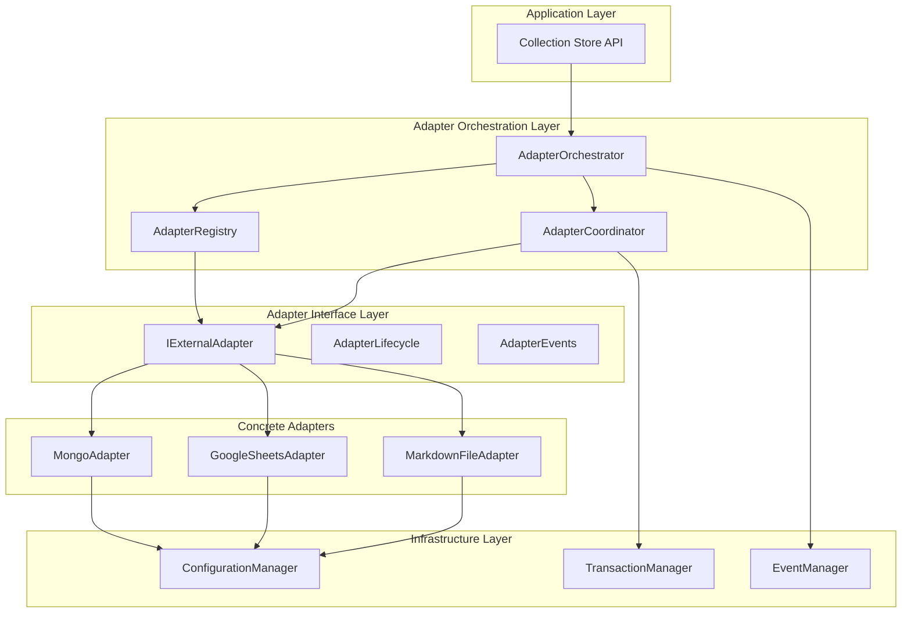
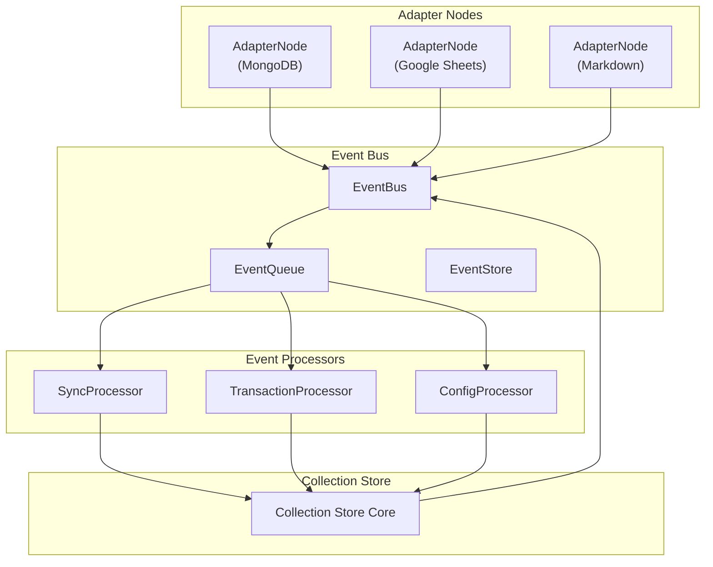
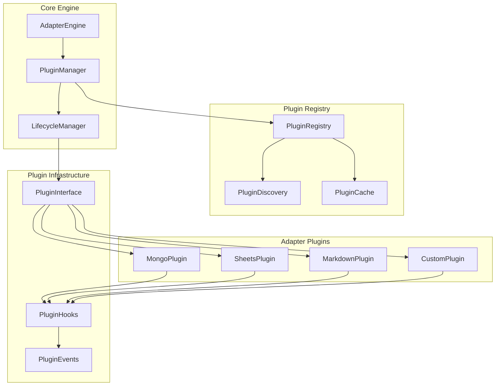
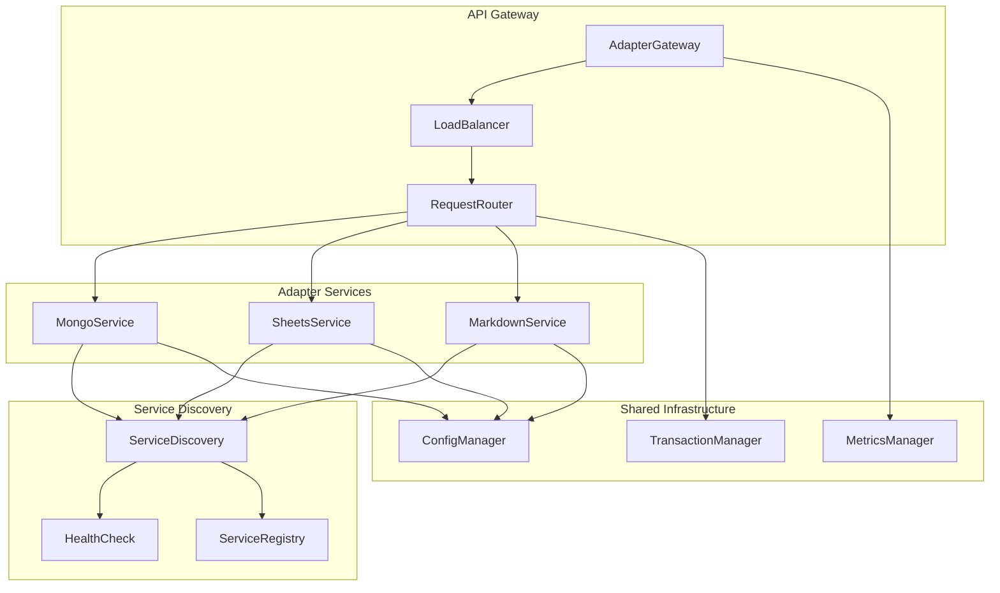

# 🎨🎨🎨 ENTERING CREATIVE PHASE: ADAPTER ARCHITECTURE DESIGN 🎨🎨🎨

## Component Description
**External Adapter System** - Комплексная архитектура для интеграции внешних источников данных (MongoDB, Google Sheets, Markdown Files) с Collection Store через унифицированный интерфейс с поддержкой real-time синхронизации, транзакций, и configuration-driven управления.

## Requirements & Constraints

### Functional Requirements
- **Unified Interface**: Единый API для всех типов адаптеров
- **Real-time Sync**: Поддержка real-time изменений через Change Streams/Webhooks
- **Transaction Support**: Интеграция с существующей 2PC системой
- **Configuration-Driven**: Hot reload конфигураций через ConfigurationManager
- **Plugin Architecture**: Возможность добавления новых адаптеров без изменения core
- **Error Recovery**: Graceful handling сбоев сети и внешних API

### Technical Constraints
- **Performance**: <100ms latency для real-time операций
- **Reliability**: 99.9% uptime с automatic recovery
- **Scalability**: Поддержка множественных экземпляров адаптеров
- **Security**: Безопасное хранение credentials и API keys
- **Memory**: Efficient resource usage для long-running processes

### Integration Constraints
- **Configuration System**: Использование существующего ConfigurationManager
- **Node Roles**: Интеграция с NodeRoleManager для capabilities
- **Transactions**: Расширение CrossDatabaseConfig для external systems
- **TypeScript**: Строгая типизация с Zod validation

## Multiple Architecture Options

### 🏗️ Option 1: Layered Adapter Architecture

**Description**: Классическая слоистая архитектура с четкими уровнями абстракции



**Pros**:
- ✅ Четкое разделение ответственности
- ✅ Легкое тестирование каждого слоя
- ✅ Простая интеграция с существующими системами
- ✅ Понятная структура для новых разработчиков
- ✅ Хорошая поддержка dependency injection

**Cons**:
- ❌ Потенциальная performance overhead от множественных слоев
- ❌ Сложность при cross-layer оптимизациях
- ❌ Риск over-engineering для простых адаптеров
- ❌ Возможные проблемы с circular dependencies

**Technical Fit**: High - хорошо интегрируется с существующей архитектурой
**Complexity**: Medium - стандартная enterprise архитектура
**Scalability**: High - легко масштабируется горизонтально

### ⚙️ Option 2: Event-Driven Adapter Architecture

**Description**: Архитектура на основе событий с асинхронной обработкой



**Pros**:
- ✅ Отличная scalability и performance
- ✅ Natural support для real-time операций
- ✅ Loose coupling между компонентами
- ✅ Easy horizontal scaling
- ✅ Built-in resilience через event replay

**Cons**:
- ❌ Сложность debugging и tracing
- ❌ Eventual consistency challenges
- ❌ Сложная обработка ошибок
- ❌ Требует sophisticated event management

**Technical Fit**: Medium - требует значительных изменений в архитектуре
**Complexity**: High - требует expertise в event-driven systems
**Scalability**: Very High - отличная для high-throughput scenarios

### 🔌 Option 3: Plugin-Based Adapter Architecture

**Description**: Модульная архитектура с динамической загрузкой адаптеров



**Pros**:
- ✅ Максимальная extensibility
- ✅ Dynamic loading/unloading адаптеров
- ✅ Изоляция между адаптерами
- ✅ Easy third-party adapter development
- ✅ Hot-swapping capabilities

**Cons**:
- ❌ Сложность plugin lifecycle management
- ❌ Security concerns с dynamic loading
- ❌ Potential memory leaks от plugins
- ❌ Debugging complexity

**Technical Fit**: Medium - требует новой plugin infrastructure
**Complexity**: High - сложная система управления plugins
**Scalability**: High - хорошая изоляция и независимость

### 🌐 Option 4: Microservice-Style Adapter Architecture

**Description**: Каждый адаптер как независимый сервис с API gateway



**Pros**:
- ✅ Полная изоляция адаптеров
- ✅ Independent scaling и deployment
- ✅ Technology diversity (разные языки/frameworks)
- ✅ Fault isolation
- ✅ Easy monitoring и observability

**Cons**:
- ❌ Network latency overhead
- ❌ Сложность distributed transactions
- ❌ Operational complexity
- ❌ Resource overhead от множественных процессов

**Technical Fit**: Low - слишком сложно для текущих требований
**Complexity**: Very High - требует microservice infrastructure
**Scalability**: Very High - но с operational overhead

## Options Analysis

### Performance Comparison
| Option | Latency | Throughput | Memory | CPU |
|--------|---------|------------|--------|-----|
| Layered | Medium | High | Medium | Medium |
| Event-Driven | Low | Very High | High | Medium |
| Plugin-Based | Medium | High | Medium | High |
| Microservice | High | Very High | Very High | High |

### Implementation Complexity
| Option | Development | Testing | Deployment | Maintenance |
|--------|-------------|---------|------------|-------------|
| Layered | Medium | Easy | Easy | Easy |
| Event-Driven | High | Hard | Medium | Medium |
| Plugin-Based | High | Hard | Hard | Hard |
| Microservice | Very High | Very Hard | Very Hard | Very Hard |

### Integration with Existing Systems
| Option | ConfigManager | NodeRoles | Transactions | Hot Reload |
|--------|---------------|-----------|--------------|------------|
| Layered | ✅ Perfect | ✅ Perfect | ✅ Perfect | ✅ Perfect |
| Event-Driven | ⚠️ Needs Adaptation | ⚠️ Needs Adaptation | ❌ Complex | ✅ Good |
| Plugin-Based | ✅ Good | ✅ Good | ⚠️ Needs Adaptation | ✅ Perfect |
| Microservice | ❌ Complex | ❌ Complex | ❌ Very Complex | ⚠️ Needs Adaptation |

## Recommended Approach

### 🏆 Selected Option: Layered Adapter Architecture (Option 1)

**Rationale**:
1. **Perfect Integration**: Seamlessly интегрируется с существующей Configuration-Driven Architecture
2. **Balanced Complexity**: Достаточно sophisticated для требований, но не over-engineered
3. **Development Speed**: Быстрая разработка благодаря знакомым паттернам
4. **Testing Simplicity**: Легкое unit и integration тестирование
5. **Future Evolution**: Может эволюционировать в event-driven при необходимости

### Implementation Guidelines

#### Core Architecture Components

```typescript
// Base adapter interface
interface IExternalAdapter {
  readonly id: string;
  readonly type: AdapterType;
  readonly capabilities: AdapterCapabilities;

  // Lifecycle methods
  initialize(config: AdapterConfig): Promise<void>;
  start(): Promise<void>;
  stop(): Promise<void>;
  dispose(): Promise<void>;

  // Data operations
  read(query: AdapterQuery): Promise<AdapterResult>;
  write(data: AdapterData): Promise<AdapterResult>;
  delete(query: AdapterQuery): Promise<AdapterResult>;

  // Real-time operations
  subscribe(callback: AdapterCallback): Promise<AdapterSubscription>;
  unsubscribe(subscription: AdapterSubscription): Promise<void>;

  // Transaction support
  beginTransaction(): Promise<AdapterTransaction>;
  commitTransaction(tx: AdapterTransaction): Promise<void>;
  rollbackTransaction(tx: AdapterTransaction): Promise<void>;

  // Health and monitoring
  healthCheck(): Promise<AdapterHealth>;
  getMetrics(): Promise<AdapterMetrics>;
}

// Adapter orchestrator
class AdapterOrchestrator {
  private registry: AdapterRegistry;
  private coordinator: AdapterCoordinator;
  private configManager: ConfigurationManager;

  async initializeAdapters(): Promise<void> {
    // Initialize all registered adapters
  }

  async executeOperation(operation: AdapterOperation): Promise<AdapterResult> {
    // Route operation to appropriate adapter(s)
  }

  async coordinateTransaction(transaction: CrossAdapterTransaction): Promise<void> {
    // Coordinate 2PC across multiple adapters
  }
}

// Adapter registry
class AdapterRegistry {
  private adapters: Map<string, IExternalAdapter>;

  register(adapter: IExternalAdapter): void {
    // Register adapter with validation
  }

  unregister(adapterId: string): void {
    // Safely unregister adapter
  }

  getAdapter(adapterId: string): IExternalAdapter | undefined {
    // Get adapter by ID
  }

  getAdaptersByType(type: AdapterType): IExternalAdapter[] {
    // Get all adapters of specific type
  }
}
```

#### Configuration Integration

```typescript
// Adapter configuration schema
const AdapterConfigSchema = z.object({
  adapters: z.record(z.object({
    type: z.enum(['mongodb', 'googlesheets', 'markdown']),
    enabled: z.boolean().default(true),
    config: z.record(z.any()), // Adapter-specific config
    capabilities: z.object({
      read: z.boolean().default(true),
      write: z.boolean().default(true),
      realtime: z.boolean().default(false),
      transactions: z.boolean().default(false)
    }),
    performance: z.object({
      maxConnections: z.number().default(10),
      timeout: z.number().default(30000),
      retryAttempts: z.number().default(3)
    })
  }))
});

// Hot reload integration
class AdapterConfigManager extends ConfigurationManager {
  async onConfigChange(changes: ConfigChanges): Promise<void> {
    // Handle adapter configuration changes
    for (const [adapterId, change] of changes.adapters) {
      if (change.type === 'added') {
        await this.initializeAdapter(adapterId, change.config);
      } else if (change.type === 'modified') {
        await this.reconfigureAdapter(adapterId, change.config);
      } else if (change.type === 'removed') {
        await this.removeAdapter(adapterId);
      }
    }
  }
}
```

#### Transaction Coordination

```typescript
// Cross-adapter transaction coordinator
class CrossAdapterTransactionCoordinator extends CrossDatabaseConfig {
  async beginCrossAdapterTransaction(adapters: string[]): Promise<CrossAdapterTransaction> {
    // Initialize 2PC transaction across adapters
    const transaction = new CrossAdapterTransaction();

    // Phase 1: Prepare
    for (const adapterId of adapters) {
      const adapter = this.registry.getAdapter(adapterId);
      const adapterTx = await adapter.beginTransaction();
      transaction.addParticipant(adapterId, adapterTx);
    }

    return transaction;
  }

  async commitCrossAdapterTransaction(transaction: CrossAdapterTransaction): Promise<void> {
    // Phase 2: Commit
    const participants = transaction.getParticipants();

    try {
      // Prepare phase
      for (const [adapterId, adapterTx] of participants) {
        const adapter = this.registry.getAdapter(adapterId);
        await adapter.prepareTransaction(adapterTx);
      }

      // Commit phase
      for (const [adapterId, adapterTx] of participants) {
        const adapter = this.registry.getAdapter(adapterId);
        await adapter.commitTransaction(adapterTx);
      }
    } catch (error) {
      // Rollback on any failure
      await this.rollbackCrossAdapterTransaction(transaction);
      throw error;
    }
  }
}
```

## Verification Checkpoint

### ✅ Requirements Verification
- **Unified Interface**: ✅ IExternalAdapter provides consistent API
- **Real-time Sync**: ✅ Subscribe/unsubscribe methods for real-time updates
- **Transaction Support**: ✅ Integration with existing 2PC system
- **Configuration-Driven**: ✅ Hot reload через ConfigurationManager
- **Plugin Architecture**: ✅ Registry pattern allows easy extension
- **Error Recovery**: ✅ Health checks и graceful error handling

### ✅ Technical Constraints Verification
- **Performance**: ✅ Layered architecture minimizes overhead
- **Reliability**: ✅ Health monitoring и automatic recovery mechanisms
- **Scalability**: ✅ Registry pattern supports multiple adapter instances
- **Security**: ✅ Configuration system handles secure credential storage
- **Memory**: ✅ Efficient resource management через lifecycle methods

### ✅ Integration Verification
- **Configuration System**: ✅ Perfect integration с ConfigurationManager
- **Node Roles**: ✅ Adapter capabilities integrate с NodeRoleManager
- **Transactions**: ✅ Extends existing CrossDatabaseConfig
- **TypeScript**: ✅ Строгая типизация с Zod validation

## 🎨🎨🎨 EXITING CREATIVE PHASE: ADAPTER ARCHITECTURE DESIGN 🎨🎨🎨

**Summary**: Выбрана Layered Adapter Architecture как оптимальный баланс между функциональностью, сложностью, и интеграцией с существующими системами.

**Key Decisions**:
- **Architecture Pattern**: Layered architecture с четкими уровнями абстракции
- **Interface Design**: IExternalAdapter с lifecycle, data operations, real-time, и transaction support
- **Registry Pattern**: AdapterRegistry для управления адаптерами
- **Configuration Integration**: Расширение ConfigurationManager для adapter-specific configs
- **Transaction Coordination**: Расширение CrossDatabaseConfig для cross-adapter 2PC

**Next Steps**: Переход к Configuration Schema Design для определения unified configuration approach для всех адаптеров.