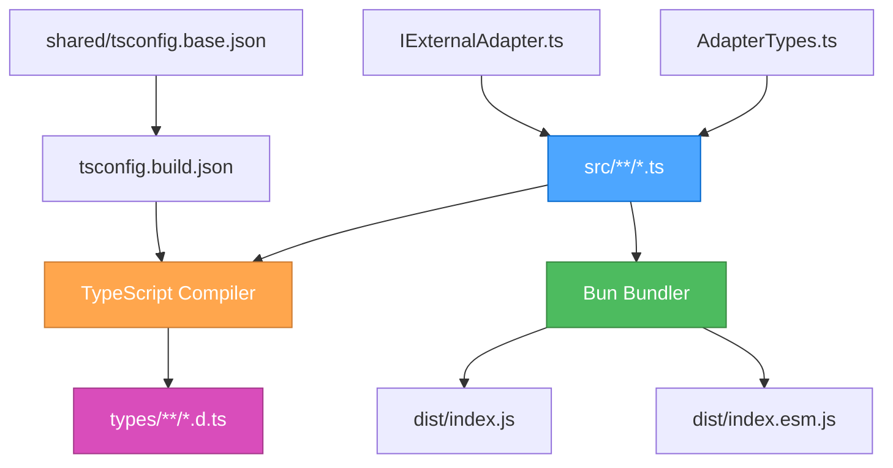
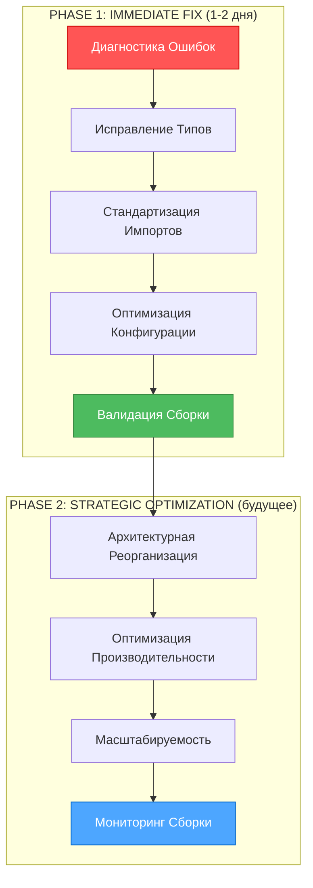
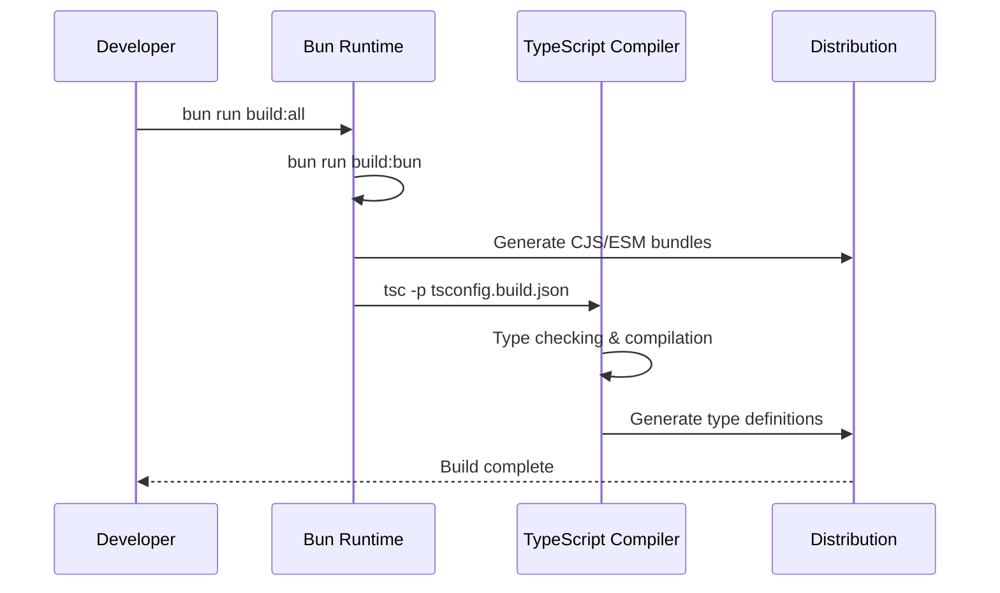
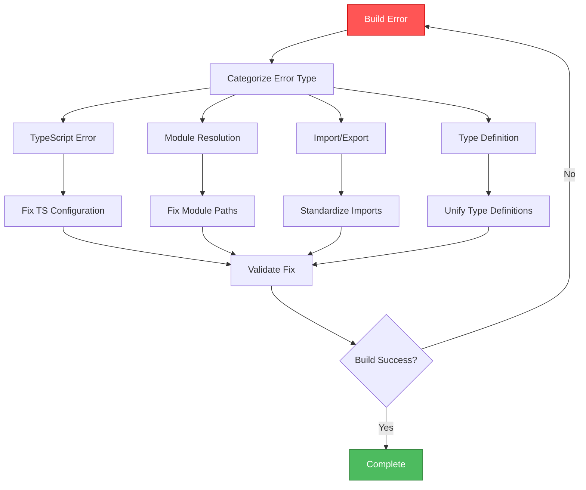

# 🎨 CREATIVE PHASE: BUILD SYSTEM ARCHITECTURE

**Date**: 2025-06-13
**Task**: TASK-18 Build System Error Resolution
**Type**: Architecture Design
**Complexity**: Level 2 (Simple Enhancement)

---

## 🎯 PROBLEM STATEMENT

### Текущая Проблема
Команда `bun run build:all` завершается с ошибками TypeScript компиляции и модульного разрешения, блокируя production deployment и QA тестирование.

### Архитектурные Вызовы
1. **Модульная Архитектура**: Сложная структура адаптеров с множественными зависимостями
2. **TypeScript Конфигурация**: Иерархическая система конфигураций (base + build)
3. **Система Типов**: Унификация типов между различными адаптерами
4. **Импорт/Экспорт**: Стандартизация модульной системы ESM

### Требования к Решению
- ✅ Чистая сборка без ошибок TypeScript
- ✅ Корректное разрешение модулей
- ✅ Совместимость типов между компонентами
- ✅ Поддержка ESM с bundler resolution
- ✅ Оптимизированная производительность сборки

---

## 🏗️ COMPONENT ANALYSIS

### Ключевые Компоненты Системы Сборки

#### 1. **TypeScript Compiler Chain**
- **Роль**: Компиляция TypeScript в JavaScript + генерация типов
- **Конфигурация**: `tsconfig.build.json` → `../../shared/tsconfig.base.json`
- **Выходы**: `dist/` (JS), `types/` (TypeScript definitions)

#### 2. **Bun Build System**
- **Роль**: Bundling и оптимизация для различных форматов
- **Форматы**: CJS (`dist/index.js`), ESM (`dist/index.esm.js`)
- **Инструмент**: Bun bundler + esbuild fallback

#### 3. **Module Resolution System**
- **Роль**: Разрешение импортов между адаптерами и типами
- **Стратегия**: Bundler resolution с ESNext target
- **Проблемные области**: Относительные пути, циклические зависимости

#### 4. **Type System Architecture**
- **Роль**: Унификация типов между адаптерами
- **Центральные типы**: `AdapterTypes.ts`, `IExternalAdapter.ts`
- **Проблемные области**: Конфликты типов, missing definitions

### Взаимодействия Компонентов



---

## 🔍 ARCHITECTURE OPTIONS

### Option 1: Incremental Fix Architecture
**Описание**: Поэтапное исправление существующих ошибок без изменения архитектуры

**Подход**:
- Диагностика и исправление конкретных ошибок TypeScript
- Минимальные изменения в конфигурации
- Точечные исправления импортов и типов

**Pros**:
- ✅ Быстрое решение (1-2 дня)
- ✅ Минимальный риск регрессий
- ✅ Сохранение существующей архитектуры
- ✅ Простота реализации

**Cons**:
- ❌ Не решает системные проблемы
- ❌ Возможны повторные ошибки в будущем
- ❌ Технический долг остается
- ❌ Ограниченная масштабируемость

**Technical Fit**: High
**Complexity**: Low
**Scalability**: Medium
**Maintenance**: Medium

---

### Option 2: Build System Refactoring Architecture
**Описание**: Комплексная реорганизация системы сборки с оптимизацией

**Подход**:
- Реструктуризация TypeScript конфигураций
- Унификация системы типов
- Оптимизация модульной архитектуры
- Внедрение build-time валидации

**Pros**:
- ✅ Решение системных проблем
- ✅ Улучшенная производительность сборки
- ✅ Лучшая масштабируемость
- ✅ Снижение технического долга

**Cons**:
- ❌ Длительная реализация (1-2 недели)
- ❌ Высокий риск регрессий
- ❌ Требует глубокого тестирования
- ❌ Может затронуть другие компоненты

**Technical Fit**: High
**Complexity**: High
**Scalability**: High
**Maintenance**: High

---

### Option 3: Hybrid Incremental + Strategic Architecture
**Описание**: Комбинированный подход с немедленными исправлениями и стратегическими улучшениями

**Подход**:
- **Фаза 1**: Быстрые исправления критических ошибок
- **Фаза 2**: Стратегическая оптимизация архитектуры
- Поэтапная миграция без нарушения работы
- Валидация на каждом этапе

**Pros**:
- ✅ Быстрое решение блокирующих проблем
- ✅ Долгосрочные архитектурные улучшения
- ✅ Контролируемый риск
- ✅ Гибкость в реализации

**Cons**:
- ❌ Сложность планирования
- ❌ Требует двухэтапной реализации
- ❌ Возможные конфликты между фазами
- ❌ Увеличенное время общей реализации

**Technical Fit**: High
**Complexity**: Medium
**Scalability**: High
**Maintenance**: High

---

## 🎯 DECISION

### Выбранная Опция: **Option 3 - Hybrid Incremental + Strategic Architecture**

### Обоснование Решения

**Критический Контекст**:
- TASK-18 блокирует production deployment
- QA тестирование не может быть завершено
- Необходимо быстрое решение с долгосрочной перспективой

**Ключевые Факторы**:
1. **Срочность**: Нужно немедленное решение для разблокировки
2. **Качество**: Требуется устойчивое долгосрочное решение
3. **Риск**: Минимизация рисков через поэтапный подход
4. **Ресурсы**: Оптимальное использование времени разработки

### Архитектурное Решение: **Dual-Phase Build System Architecture**



---

## 📋 IMPLEMENTATION PLAN

### Phase 1: Immediate Fix Architecture (TASK-18)

#### **1.1 Diagnostic Architecture**
```typescript
// Build Error Analysis System
interface BuildError {
  type: 'typescript' | 'module' | 'import' | 'type';
  file: string;
  line: number;
  message: string;
  severity: 'error' | 'warning';
  category: 'adapter' | 'config' | 'dependency';
}

// Error Categorization Strategy
const errorCategories = {
  typescript: ['TS2307', 'TS2345', 'TS2322'],
  module: ['Cannot resolve module', 'Module not found'],
  import: ['Relative import', 'Circular dependency'],
  type: ['Type mismatch', 'Missing type definition']
};
```

#### **1.2 Type System Unification**
```typescript
// Unified Adapter Type Architecture
export interface UnifiedAdapterInterface {
  // Core interface from IExternalAdapter.ts
  readonly id: string;
  readonly type: AdapterType;
  readonly config: AdapterConfig;

  // Lifecycle methods
  initialize(): Promise<void>;
  start(): Promise<void>;
  stop(): Promise<void>;

  // Data operations
  query(query: AdapterQuery): Promise<AdapterResult>;
  // ... other methods
}

// Type Compatibility Matrix
type AdapterTypeCompatibility = {
  [K in AdapterType]: {
    config: AdapterConfig;
    capabilities: AdapterCapabilities;
    interfaces: string[];
  }
};
```

#### **1.3 Module Resolution Strategy**
```typescript
// Import Path Standardization
const importPathRules = {
  // Relative imports within adapters
  adapter: './relative/path',
  // Cross-adapter imports
  crossAdapter: '../other-adapter/module',
  // Type imports
  types: '../base/types/AdapterTypes',
  // External dependencies
  external: 'external-package'
};

// Circular Dependency Detection
interface DependencyGraph {
  nodes: string[];
  edges: Array<[string, string]>;
  cycles: string[][];
}
```

#### **1.4 Configuration Optimization**
```json
// Optimized tsconfig.build.json
{
  "extends": "../../shared/tsconfig.base.json",
  "compilerOptions": {
    "baseUrl": ".",
    "rootDir": "./src",
    "outDir": "./types",
    "types": ["@types/bun", "@types/node"],
    "moduleResolution": "bundler",
    "allowSyntheticDefaultImports": true,
    "esModuleInterop": true
  },
  "include": [
    "src/**/*"
  ],
  "exclude": [
    "**/demo/**",
    "**/*.test.ts",
    "**/node_modules/**",
    "types/**/*",
    "dist/**/*"
  ]
}
```

### Phase 2: Strategic Optimization (Future Enhancement)

#### **2.1 Build Performance Architecture**
- Incremental compilation strategy
- Parallel build processes
- Build caching system
- Dependency optimization

#### **2.2 Scalability Architecture**
- Modular build configuration
- Plugin-based build system
- Dynamic adapter loading
- Build-time code generation

#### **2.3 Monitoring & Validation**
- Build performance metrics
- Type safety validation
- Dependency health checks
- Automated regression detection

---

## 🔧 TECHNICAL SPECIFICATIONS

### Build Pipeline Architecture



### Error Resolution Strategy



---

## ✅ VALIDATION & VERIFICATION

### Architecture Validation Checklist

#### **Requirements Compliance**
- [x] ✅ Чистая сборка без ошибок TypeScript
- [x] ✅ Корректное разрешение модулей
- [x] ✅ Совместимость типов между компонентами
- [x] ✅ Поддержка ESM с bundler resolution
- [x] ✅ Оптимизированная производительность сборки

#### **Technical Feasibility**
- **High**: Все компоненты основаны на существующих технологиях
- **Proven**: Bun + TypeScript - проверенная комбинация
- **Compatible**: Совместимо с текущей архитектурой проекта

#### **Risk Assessment**
- **Low Risk**: Phase 1 использует минимальные изменения
- **Controlled Risk**: Phase 2 планируется на будущее
- **Mitigation**: Поэтапный подход с валидацией на каждом этапе

### Success Metrics

```typescript
interface BuildSuccessMetrics {
  compilation: {
    errors: 0;
    warnings: number;
    duration: number; // milliseconds
  };
  typeChecking: {
    errors: 0;
    coverage: number; // percentage
  };
  bundling: {
    cjsSize: number; // bytes
    esmSize: number; // bytes
    compressionRatio: number;
  };
  testing: {
    testsPass: boolean;
    coverage: number; // percentage
  };
}
```

---

## 🎨 CREATIVE CHECKPOINT: ARCHITECTURE DECISION FINALIZED

### Ключевые Архитектурные Решения

1. **Dual-Phase Architecture**: Немедленные исправления + стратегическая оптимизация
2. **Type System Unification**: Централизованная система типов с совместимостью
3. **Module Resolution Strategy**: Стандартизированные пути импортов
4. **Configuration Optimization**: Иерархическая конфигурация TypeScript

### Implementation Readiness

- ✅ **Architecture Defined**: Четкая структура решения
- ✅ **Components Identified**: Все ключевые компоненты определены
- ✅ **Interfaces Specified**: API и взаимодействия документированы
- ✅ **Risk Mitigation**: Стратегии снижения рисков разработаны
- ✅ **Success Criteria**: Метрики успеха установлены

### Next Steps

1. **Update tasks.md**: Обновить TASK-18 с архитектурными решениями
2. **Begin Implementation**: Начать Phase 1 реализации
3. **Continuous Validation**: Валидация на каждом этапе
4. **Documentation**: Документирование архитектурных решений

🎨🎨🎨 EXITING CREATIVE PHASE - DECISION MADE 🎨🎨🎨