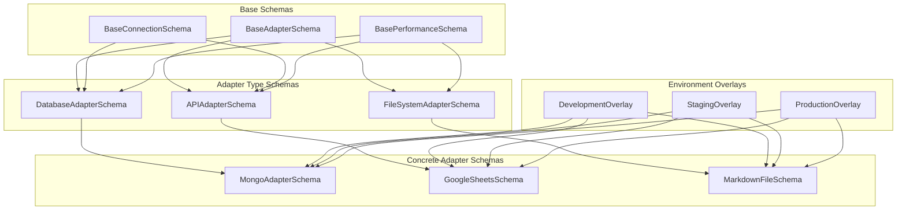
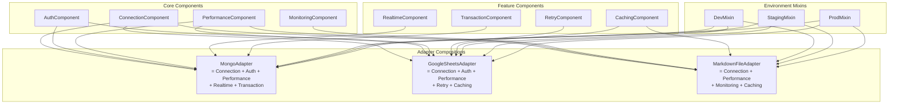
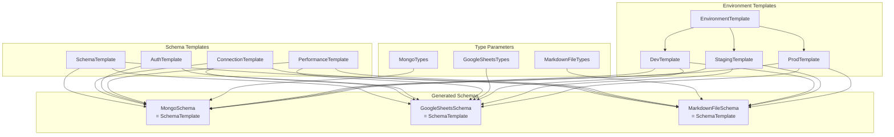
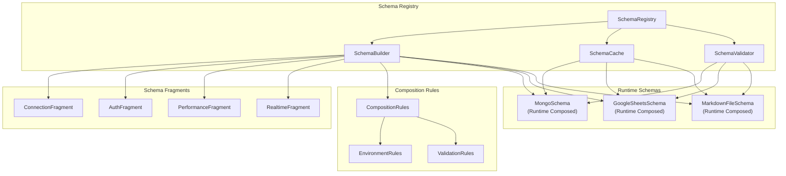

# 🎨🎨🎨 ENTERING CREATIVE PHASE: CONFIGURATION SCHEMA DESIGN 🎨🎨🎨

## Component Description
**Unified Configuration Schema System** - Комплексная система конфигурационных схем для всех типов внешних адаптеров с поддержкой inheritance hierarchy, environment-specific overrides, hot reload, и строгой типизации через Zod validation.

## Requirements & Constraints

### Functional Requirements
- **Schema Inheritance**: Базовые схемы с adapter-specific расширениями
- **Environment Overrides**: Development, staging, production конфигурации
- **Hot Reload Support**: Автоматическая перезагрузка при изменении конфигураций
- **Type Safety**: Строгая типизация с compile-time validation
- **Validation**: Runtime validation с детальными error messages
- **Credential Management**: Безопасное хранение API keys и secrets

### Technical Constraints
- **Zod Integration**: Использование существующей Zod v4 infrastructure
- **ConfigurationManager**: Интеграция с существующим hot reload system
- **Environment Config**: Расширение существующих environment schemas
- **Performance**: Минимальная overhead для validation
- **Memory**: Efficient schema caching и reuse

### Integration Constraints
- **Existing Schemas**: Совместимость с CollectionStoreConfig и EnvironmentConfig
- **Hot Reload**: Интеграция с FileWatcher system
- **Node Roles**: Поддержка role-based configuration access
- **Security**: Интеграция с credential storage system

## Multiple Configuration Options

### 🏗️ Option 1: Hierarchical Schema Inheritance

**Description**: Классическая иерархия схем с наследованием от базовых к специфичным



**Pros**:
- ✅ Четкая иерархия и наследование
- ✅ Переиспользование общих схем
- ✅ Легкое добавление новых адаптеров
- ✅ Понятная структура для разработчиков
- ✅ Хорошая поддержка TypeScript inference

**Cons**:
- ❌ Потенциальная сложность deep inheritance
- ❌ Tight coupling между уровнями
- ❌ Сложность при cross-cutting concerns
- ❌ Возможные проблемы с schema evolution

**Technical Fit**: High - хорошо интегрируется с Zod
**Complexity**: Medium - стандартная OOP иерархия
**Maintainability**: High - четкая структура

### 🧩 Option 2: Compositional Schema System

**Description**: Модульная система с композицией схем из независимых компонентов



**Pros**:
- ✅ Максимальная гибкость и переиспользование
- ✅ Loose coupling между компонентами
- ✅ Easy testing отдельных компонентов
- ✅ Простое добавление новых features
- ✅ Хорошая поддержка cross-cutting concerns

**Cons**:
- ❌ Сложность композиции схем
- ❌ Potential type inference issues
- ❌ Сложность debugging составных схем
- ❌ Возможные конфликты между компонентами

**Technical Fit**: Medium - требует advanced Zod patterns
**Complexity**: High - сложная система композиции
**Maintainability**: Medium - требует careful design

### 📋 Option 3: Template-Based Schema System

**Description**: Система шаблонов с параметризацией для разных типов адаптеров



**Pros**:
- ✅ Сильная типизация с generics
- ✅ Code generation возможности
- ✅ Consistent structure across adapters
- ✅ Easy parameterization для environments
- ✅ Хорошая поддержка IDE

**Cons**:
- ❌ Сложность template system
- ❌ Potential compilation overhead
- ❌ Сложность debugging generated schemas
- ❌ Limited runtime flexibility

**Technical Fit**: Medium - требует advanced TypeScript
**Complexity**: High - сложная template система
**Maintainability**: Medium - зависит от template quality

### 🌐 Option 4: Dynamic Schema Registry

**Description**: Runtime registry с динамической композицией и validation



**Pros**:
- ✅ Максимальная runtime flexibility
- ✅ Dynamic schema evolution
- ✅ Easy A/B testing конфигураций
- ✅ Runtime optimization возможности
- ✅ Plugin-like extensibility

**Cons**:
- ❌ Loss of compile-time safety
- ❌ Runtime performance overhead
- ❌ Сложность debugging runtime schemas
- ❌ Potential security concerns

**Technical Fit**: Low - не использует Zod strengths
**Complexity**: Very High - сложная runtime система
**Maintainability**: Low - сложность debugging

## Options Analysis

### Type Safety Comparison
| Option | Compile-time | Runtime | IDE Support | Error Messages |
|--------|--------------|---------|-------------|----------------|
| Hierarchical | ✅ Excellent | ✅ Excellent | ✅ Excellent | ✅ Clear |
| Compositional | ✅ Good | ✅ Excellent | ⚠️ Complex | ✅ Good |
| Template-Based | ✅ Excellent | ✅ Good | ✅ Excellent | ⚠️ Complex |
| Dynamic Registry | ❌ Limited | ✅ Good | ❌ Poor | ❌ Runtime Only |

### Development Experience
| Option | Learning Curve | Debugging | Testing | Documentation |
|--------|----------------|-----------|---------|---------------|
| Hierarchical | Easy | Easy | Easy | Easy |
| Compositional | Medium | Medium | Easy | Medium |
| Template-Based | Hard | Hard | Medium | Hard |
| Dynamic Registry | Very Hard | Very Hard | Hard | Very Hard |

### Integration with Existing Systems
| Option | Zod Integration | ConfigManager | Hot Reload | Environment Config |
|--------|-----------------|---------------|------------|-------------------|
| Hierarchical | ✅ Perfect | ✅ Perfect | ✅ Perfect | ✅ Perfect |
| Compositional | ✅ Good | ✅ Good | ✅ Good | ✅ Good |
| Template-Based | ⚠️ Complex | ⚠️ Complex | ✅ Good | ⚠️ Complex |
| Dynamic Registry | ❌ Poor | ❌ Poor | ⚠️ Complex | ❌ Poor |

## Recommended Approach

### 🏆 Selected Option: Hierarchical Schema Inheritance (Option 1)

**Rationale**:
1. **Perfect Zod Integration**: Leverages Zod's strengths для type safety и validation
2. **Excellent Developer Experience**: Понятная структура с отличной IDE поддержкой
3. **Seamless Integration**: Perfect fit с существующими ConfigurationManager и EnvironmentConfig
4. **Maintainability**: Четкая иерархия упрощает debugging и testing
5. **Performance**: Minimal overhead с compile-time optimization

### Implementation Guidelines

#### Base Schema Hierarchy

```typescript
// Base adapter schema
const BaseAdapterSchema = z.object({
  id: z.string().min(1),
  type: z.enum(['mongodb', 'googlesheets', 'markdown']),
  enabled: z.boolean().default(true),
  description: z.string().optional(),
  tags: z.array(z.string()).default([]),

  // Lifecycle configuration
  lifecycle: z.object({
    autoStart: z.boolean().default(true),
    startupTimeout: z.number().default(30000),
    shutdownTimeout: z.number().default(10000),
    healthCheckInterval: z.number().default(60000)
  }).default({}),

  // Capabilities
  capabilities: z.object({
    read: z.boolean().default(true),
    write: z.boolean().default(true),
    realtime: z.boolean().default(false),
    transactions: z.boolean().default(false),
    batch: z.boolean().default(false)
  }).default({})
});

// Base connection schema
const BaseConnectionSchema = z.object({
  timeout: z.number().default(30000),
  retryAttempts: z.number().default(3),
  retryDelay: z.number().default(1000),
  maxConnections: z.number().default(10),
  keepAlive: z.boolean().default(true)
});

// Base performance schema
const BasePerformanceSchema = z.object({
  batchSize: z.number().default(100),
  concurrency: z.number().default(5),
  throttle: z.object({
    enabled: z.boolean().default(false),
    requestsPerSecond: z.number().default(10),
    burstSize: z.number().default(20)
  }).default({})
});

// Base monitoring schema
const BaseMonitoringSchema = z.object({
  metrics: z.object({
    enabled: z.boolean().default(true),
    interval: z.number().default(60000),
    retention: z.number().default(86400000) // 24 hours
  }).default({}),

  logging: z.object({
    level: z.enum(['error', 'warn', 'info', 'debug']).default('info'),
    includePayload: z.boolean().default(false),
    maxPayloadSize: z.number().default(1024)
  }).default({})
});
```

#### Adapter Type Schemas

```typescript
// Database adapter schema (for MongoDB)
const DatabaseAdapterSchema = BaseAdapterSchema.extend({
  connection: BaseConnectionSchema.extend({
    host: z.string(),
    port: z.number().default(27017),
    database: z.string(),
    ssl: z.boolean().default(false),
    replicaSet: z.string().optional()
  }),

  authentication: z.object({
    username: z.string().optional(),
    password: z.string().optional(),
    authSource: z.string().default('admin'),
    mechanism: z.enum(['SCRAM-SHA-1', 'SCRAM-SHA-256']).default('SCRAM-SHA-256')
  }).optional(),

  performance: BasePerformanceSchema.extend({
    poolSize: z.number().default(10),
    bufferMaxEntries: z.number().default(0),
    useUnifiedTopology: z.boolean().default(true)
  })
});

// API adapter schema (for Google Sheets)
const APIAdapterSchema = BaseAdapterSchema.extend({
  connection: BaseConnectionSchema.extend({
    baseUrl: z.string().url(),
    apiVersion: z.string().default('v4'),
    userAgent: z.string().optional()
  }),

  authentication: z.object({
    type: z.enum(['oauth2', 'apikey', 'serviceaccount']),
    credentials: z.record(z.string()),
    scopes: z.array(z.string()).default([])
  }),

  performance: BasePerformanceSchema.extend({
    quotaManagement: z.object({
      enabled: z.boolean().default(true),
      requestsPerMinute: z.number().default(100),
      requestsPerDay: z.number().default(10000)
    }).default({})
  })
});

// File system adapter schema (for Markdown)
const FileSystemAdapterSchema = BaseAdapterSchema.extend({
  connection: z.object({
    basePath: z.string(),
    watchEnabled: z.boolean().default(true),
    watchDebounce: z.number().default(300),
    recursive: z.boolean().default(true)
  }),

  processing: z.object({
    encoding: z.string().default('utf8'),
    extensions: z.array(z.string()).default(['.md', '.markdown']),
    frontmatterParser: z.enum(['yaml', 'json', 'toml']).default('yaml'),
    contentProcessor: z.enum(['markdown', 'raw']).default('markdown')
  }).default({}),

  performance: BasePerformanceSchema.extend({
    cacheEnabled: z.boolean().default(true),
    cacheSize: z.number().default(1000),
    cacheTTL: z.number().default(300000) // 5 minutes
  })
});
```

#### Concrete Adapter Schemas

```typescript
// MongoDB adapter schema
const MongoAdapterSchema = DatabaseAdapterSchema.extend({
  type: z.literal('mongodb'),

  mongodb: z.object({
    collections: z.record(z.object({
      name: z.string(),
      schema: z.record(z.any()).optional(),
      indexes: z.array(z.object({
        fields: z.record(z.number()),
        options: z.record(z.any()).optional()
      })).default([])
    })),

    changeStreams: z.object({
      enabled: z.boolean().default(false),
      fullDocument: z.enum(['default', 'updateLookup']).default('default'),
      resumeAfter: z.string().optional()
    }).default({})
  })
});

// Google Sheets adapter schema
const GoogleSheetsAdapterSchema = APIAdapterSchema.extend({
  type: z.literal('googlesheets'),

  googlesheets: z.object({
    spreadsheetId: z.string(),
    sheets: z.record(z.object({
      name: z.string(),
      range: z.string().default('A:Z'),
      headerRow: z.number().default(1),
      schema: z.record(z.object({
        column: z.string(),
        type: z.enum(['string', 'number', 'boolean', 'date']),
        required: z.boolean().default(false)
      })).optional()
    })),

    sync: z.object({
      mode: z.enum(['pull', 'push', 'bidirectional']).default('bidirectional'),
      interval: z.number().default(60000), // 1 minute
      conflictResolution: z.enum(['local', 'remote', 'manual']).default('manual')
    }).default({})
  })
});

// Markdown file adapter schema
const MarkdownFileAdapterSchema = FileSystemAdapterSchema.extend({
  type: z.literal('markdown'),

  markdown: z.object({
    collections: z.record(z.object({
      path: z.string(),
      pattern: z.string().default('**/*.md'),
      schema: z.object({
        frontmatter: z.record(z.any()).optional(),
        content: z.object({
          type: z.enum(['markdown', 'raw']).default('markdown'),
          processor: z.string().optional()
        }).default({})
      }).optional()
    })),

    git: z.object({
      enabled: z.boolean().default(false),
      autoCommit: z.boolean().default(false),
      commitMessage: z.string().default('Auto-sync from Collection Store')
    }).default({})
  })
});
```

#### Environment-Specific Overrides

```typescript
// Development environment overrides
const DevelopmentAdapterOverrides = z.object({
  lifecycle: z.object({
    healthCheckInterval: z.number().default(10000) // More frequent in dev
  }).partial(),

  monitoring: z.object({
    logging: z.object({
      level: z.literal('debug'),
      includePayload: z.boolean().default(true)
    }).partial()
  }).partial(),

  performance: z.object({
    batchSize: z.number().default(10), // Smaller batches in dev
    throttle: z.object({
      enabled: z.boolean().default(false) // No throttling in dev
    }).partial()
  }).partial()
}).partial();

// Production environment overrides
const ProductionAdapterOverrides = z.object({
  lifecycle: z.object({
    healthCheckInterval: z.number().default(300000) // Less frequent in prod
  }).partial(),

  monitoring: z.object({
    logging: z.object({
      level: z.literal('warn'),
      includePayload: z.boolean().default(false)
    }).partial(),
    metrics: z.object({
      retention: z.number().default(604800000) // 7 days in prod
    }).partial()
  }).partial(),

  performance: z.object({
    batchSize: z.number().default(1000), // Larger batches in prod
    throttle: z.object({
      enabled: z.boolean().default(true) // Enable throttling in prod
    }).partial()
  }).partial()
}).partial();
```

#### Schema Composition and Validation

```typescript
// Schema factory for creating environment-specific schemas
class AdapterSchemaFactory {
  static createSchema(
    adapterType: 'mongodb' | 'googlesheets' | 'markdown',
    environment: 'development' | 'staging' | 'production'
  ) {
    const baseSchema = this.getBaseSchema(adapterType);
    const environmentOverrides = this.getEnvironmentOverrides(environment);

    return baseSchema.merge(environmentOverrides);
  }

  private static getBaseSchema(adapterType: string) {
    switch (adapterType) {
      case 'mongodb':
        return MongoAdapterSchema;
      case 'googlesheets':
        return GoogleSheetsAdapterSchema;
      case 'markdown':
        return MarkdownFileAdapterSchema;
      default:
        throw new Error(`Unknown adapter type: ${adapterType}`);
    }
  }

  private static getEnvironmentOverrides(environment: string) {
    switch (environment) {
      case 'development':
        return DevelopmentAdapterOverrides;
      case 'production':
        return ProductionAdapterOverrides;
      case 'staging':
        return z.object({}).partial(); // No overrides for staging
      default:
        throw new Error(`Unknown environment: ${environment}`);
    }
  }
}

// Configuration manager integration
class AdapterConfigurationManager extends ConfigurationManager {
  private schemaCache = new Map<string, z.ZodSchema>();

  async validateAdapterConfig(
    adapterId: string,
    config: unknown,
    environment: string
  ): Promise<AdapterConfig> {
    const cacheKey = `${adapterId}-${environment}`;

    if (!this.schemaCache.has(cacheKey)) {
      const adapterType = this.getAdapterType(config);
      const schema = AdapterSchemaFactory.createSchema(adapterType, environment);
      this.schemaCache.set(cacheKey, schema);
    }

    const schema = this.schemaCache.get(cacheKey)!;
    return schema.parse(config);
  }

  async onConfigChange(changes: ConfigChanges): Promise<void> {
    // Clear schema cache for changed adapters
    for (const adapterId of changes.adapters.keys()) {
      this.clearSchemaCache(adapterId);
    }

    // Validate and apply changes
    await super.onConfigChange(changes);
  }

  private clearSchemaCache(adapterId: string): void {
    const keysToDelete = Array.from(this.schemaCache.keys())
      .filter(key => key.startsWith(`${adapterId}-`));

    keysToDelete.forEach(key => this.schemaCache.delete(key));
  }
}
```

## Verification Checkpoint

### ✅ Requirements Verification
- **Schema Inheritance**: ✅ Clear hierarchy от base к concrete schemas
- **Environment Overrides**: ✅ Environment-specific overrides с merge functionality
- **Hot Reload Support**: ✅ Integration с ConfigurationManager и schema caching
- **Type Safety**: ✅ Строгая типизация с Zod и TypeScript inference
- **Validation**: ✅ Runtime validation с detailed error messages
- **Credential Management**: ✅ Secure credential handling в authentication schemas

### ✅ Technical Constraints Verification
- **Zod Integration**: ✅ Perfect использование Zod patterns и capabilities
- **ConfigurationManager**: ✅ Seamless integration с existing hot reload system
- **Environment Config**: ✅ Extends existing environment configuration approach
- **Performance**: ✅ Schema caching minimizes validation overhead
- **Memory**: ✅ Efficient caching с selective cache invalidation

### ✅ Integration Verification
- **Existing Schemas**: ✅ Compatible с CollectionStoreConfig и EnvironmentConfig
- **Hot Reload**: ✅ Integration с FileWatcher system
- **Node Roles**: ✅ Adapter capabilities support role-based access
- **Security**: ✅ Secure credential storage и validation

## 🎨🎨🎨 EXITING CREATIVE PHASE: CONFIGURATION SCHEMA DESIGN 🎨🎨🎨

**Summary**: Выбрана Hierarchical Schema Inheritance как оптимальный подход для unified configuration system с отличной type safety, developer experience, и integration с существующими системами.

**Key Decisions**:
- **Schema Pattern**: Hierarchical inheritance от base к concrete schemas
- **Environment Handling**: Override pattern с merge functionality
- **Validation Strategy**: Zod-based runtime validation с schema caching
- **Type Safety**: Compile-time и runtime type safety через TypeScript + Zod
- **Hot Reload**: Integration с ConfigurationManager для automatic schema updates
- **Credential Security**: Structured authentication schemas с secure storage

**Next Steps**: Переход к Transaction Coordination Algorithm для определения cross-adapter transaction management approach.