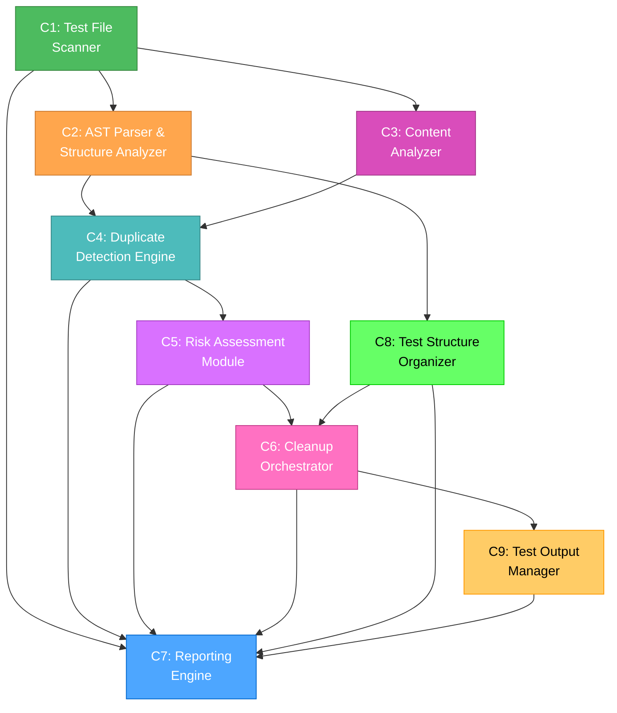
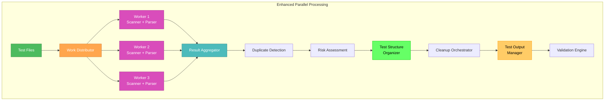
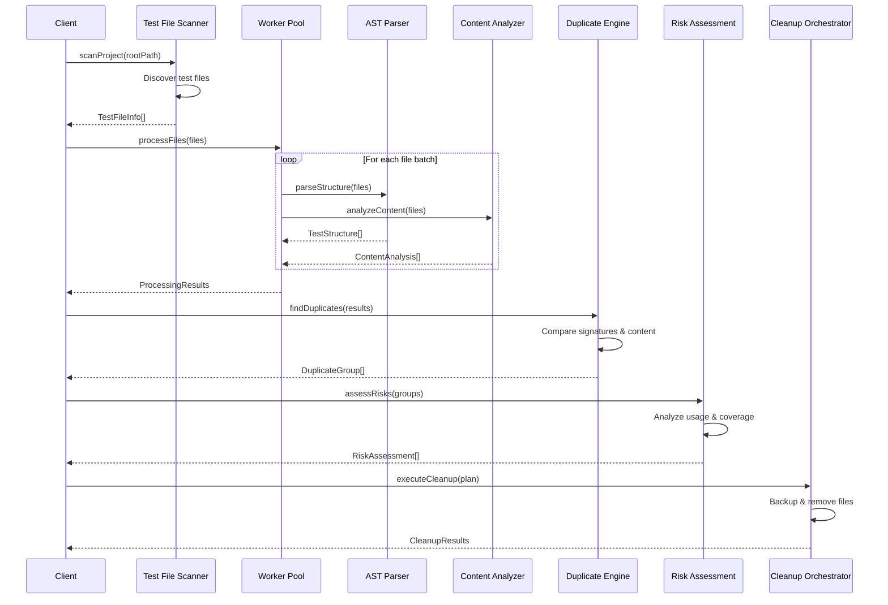

# 🎨 CREATIVE PHASE: DUPLICATE TESTS DETECTION SYSTEM ARCHITECTURE

**Task ID**: DUPLICATE-TESTS-CLEANUP-2025-06-15
**Creative Phase**: Duplicate Tests Detection System Architecture Design
**Date**: 2025-06-15
**Status**: 🎨 IN PROGRESS

---

## 🎯 CREATIVE CHALLENGE

Design a comprehensive system architecture for detecting, analyzing, and safely removing duplicate test files across a large TypeScript codebase with 358+ test files.

### Core Design Problems

1. **Efficient Duplicate Detection Algorithm** - How to compare hundreds of test files for structural and content similarities
2. **Test Structure Analysis System** - How to parse TypeScript AST and extract meaningful test hierarchies
3. **Safe Cleanup Strategy Framework** - How to determine which duplicates to remove without breaking functionality

---

## 📋 REQUIREMENTS ANALYSIS

### Functional Requirements

**FR1: Comprehensive Test File Discovery**
- Scan entire project structure for .test.ts files
- Handle nested directory structures
- Support multiple test file naming patterns
- Extract file metadata (size, modification date, path)

**FR2: Structural Similarity Detection**
- Parse describe() and it() block hierarchies
- Generate unique test structure signatures
- Compare test structures across files
- Identify exact and partial structural matches

**FR3: Content Similarity Analysis**
- Generate file content hashes for exact duplicate detection
- Perform line-by-line content comparison
- Identify functional vs cosmetic differences
- Calculate similarity percentages

**FR4: Safe Cleanup Decision Making**
- Risk assessment for each duplicate group
- Canonical file selection logic
- Merge strategy for partial duplicates
- Rollback and validation mechanisms

**FR5: Comprehensive Reporting**
- Detailed duplicate analysis reports
- Cleanup action recommendations
- Risk assessment summaries
- Validation results

### Non-Functional Requirements

**NFR1: Performance**
- Process 358+ files in under 5 minutes
- Memory efficient for large file analysis
- Incremental processing capability
- Parallel processing where possible

**NFR2: Accuracy**
- 99%+ accuracy in duplicate detection
- Zero false positives for exact duplicates
- Clear confidence scores for partial matches
- Comprehensive edge case handling

**NFR3: Safety**
- No data loss during cleanup operations
- Complete rollback capability
- Comprehensive backup mechanisms
- Validation at each step

**NFR4: Usability**
- Clear, actionable reports
- Interactive decision making
- Progress indicators
- Detailed logging

**NFR5: Test Structure Organization**
- Tests must follow hierarchical structure: `module > category > specific_test`
- Example: `core > performance > should process 1000 files under 5 minutes`
- Group tests by functional domains for better navigation
- Use consistent naming patterns across all test files

**NFR6: Large Test Suite Management**
- All test results must be saved to files for analysis
- Use `bun test > test_output.log 2>&1` for comprehensive logging
- Implement systematic analysis of test output files
- Support grep-based filtering and analysis of large test suites
- Never rely on console output for test analysis in large projects

### Technical Constraints

**TC1: TypeScript/JavaScript Environment**
- Must work with Bun test runner
- TypeScript AST parsing required
- Node.js file system operations
- Integration with existing project structure

**TC2: Existing Codebase**
- No breaking changes to existing tests
- Preserve all test functionality
- Maintain test coverage levels
- Work with current project organization

**TC3: Development Workflow**
- Git integration for backup/rollback
- CI/CD compatibility
- Developer-friendly tooling
- Minimal setup requirements

---

## 🧩 COMPONENT IDENTIFICATION

### Core Components

**C1: Test File Scanner**
- **Purpose**: Discover and catalog all test files in project
- **Responsibilities**: File system traversal, metadata extraction, filtering
- **Inputs**: Project root directory, file patterns
- **Outputs**: Test file inventory with metadata

**C2: AST Parser & Structure Analyzer**
- **Purpose**: Extract test structure from TypeScript files
- **Responsibilities**: AST parsing, describe/it block extraction, hierarchy mapping
- **Inputs**: Test file paths and content
- **Outputs**: Test structure signatures and hierarchies

**C3: Content Analyzer**
- **Purpose**: Analyze file content for similarities
- **Responsibilities**: Hash generation, content comparison, similarity scoring
- **Inputs**: Test file content
- **Outputs**: Content hashes, similarity matrices

**C4: Duplicate Detection Engine**
- **Purpose**: Identify duplicate groups using multiple criteria
- **Responsibilities**: Signature matching, content comparison, grouping logic
- **Inputs**: Structure signatures, content hashes, similarity scores
- **Outputs**: Duplicate groups with confidence scores

**C5: Risk Assessment Module**
- **Purpose**: Evaluate safety of cleanup operations
- **Responsibilities**: Risk scoring, canonical file selection, merge planning
- **Inputs**: Duplicate groups, usage analysis, test coverage data
- **Outputs**: Risk assessments, cleanup recommendations

**C6: Cleanup Orchestrator**
- **Purpose**: Execute safe cleanup operations
- **Responsibilities**: Backup creation, file operations, validation
- **Inputs**: Cleanup plan, risk assessments
- **Outputs**: Cleanup results, validation reports

**C7: Reporting Engine**
- **Purpose**: Generate comprehensive analysis and cleanup reports
- **Responsibilities**: Report generation, visualization, progress tracking
- **Inputs**: Analysis results, cleanup outcomes
- **Outputs**: Formatted reports, dashboards

**C8: Test Structure Organizer**
- **Purpose**: Reorganize tests according to hierarchical structure requirements
- **Responsibilities**: Test structure validation, reorganization planning, structure enforcement
- **Inputs**: Test files, current structure analysis
- **Outputs**: Reorganization plan, structure compliance reports

**C9: Test Output Manager**
- **Purpose**: Manage test execution and output analysis for large test suites
- **Responsibilities**: Test execution logging, output file analysis, systematic test result processing
- **Inputs**: Test execution commands, output files
- **Outputs**: Analyzed test results, filtered reports, test metrics

### Component Interactions



---

## 🏗️ ENHANCED ARCHITECTURE OPTIONS

### Updated Option 2: Parallel Processing Architecture with Test Management

**Description**: Multi-threaded architecture with parallel processing, enhanced with test structure organization and comprehensive output management for large test suites.

**Enhanced Architecture Diagram**:


**Enhanced Pros**:
- Excellent performance with large file sets
- Utilizes multi-core processors effectively
- **Structured test organization** following hierarchical patterns
- **Comprehensive test output management** for large projects
- **File-based analysis** instead of console output dependency
- Scalable to different hardware configurations
- **Systematic test result processing** with grep-based filtering

**Updated Technical Fit**: Very High - Meets all performance and organizational requirements
**Updated Complexity**: High - Requires careful thread management and test structure coordination
**Updated Scalability**: Very High - Scales with available CPU cores and handles large test suites efficiently

---

## 🎯 ENHANCED ARCHITECTURE DECISION

### Final Chosen Option: **Enhanced Parallel Processing Architecture with Test Management**

### Updated Rationale

**Test Structure Requirements**: The enhanced architecture includes dedicated components for organizing tests according to the required hierarchical structure (`module > category > specific_test`), ensuring consistent organization across the entire codebase.

**Large Test Suite Management**: With 358+ test files, the architecture now includes comprehensive test output management that saves all results to files and provides systematic analysis capabilities, following the development workflow rules for large projects.

**File-Based Analysis**: The architecture eliminates dependency on console output by implementing file-based test result analysis, enabling grep-based filtering and systematic processing of large test suites.

### Enhanced Implementation Considerations

**5. Test Structure Organization**
- Implement hierarchical test structure validation
- Enforce consistent naming patterns across all test files
- Reorganize existing tests to follow `module > category > specific_test` pattern
- Validate structure compliance during cleanup operations

**6. Test Output Management**
- Always use `bun test > test_output.log 2>&1` for comprehensive logging
- Implement systematic analysis of test output files
- Support grep-based filtering: `grep "(fail)" test_output.log`
- Provide test group analysis: `grep "(fail)" test_output.log | cut -d'>' -f1 | sort | uniq`
- Enable focused testing: `bun test -t "specific-test-pattern"`

**7. Large Test Suite Handling**
- Never rely on console output for test analysis
- Implement file-based result processing and analysis
- Support context analysis: `grep -A 5 -B 5 "error_pattern" test_output.log`
- Provide systematic test execution and analysis workflows

---

## 🔧 DETAILED COMPONENT DESIGN

### C1: Test File Scanner

**Interface**:
```typescript
interface TestFileScanner {
  scanProject(rootPath: string, patterns: string[]): Promise<TestFileInfo[]>
  getFileMetadata(filePath: string): Promise<FileMetadata>
  filterFiles(files: TestFileInfo[], criteria: FilterCriteria): TestFileInfo[]
}

interface TestFileInfo {
  path: string
  size: number
  lastModified: Date
  hash: string
  relativePath: string
}
```

**Implementation Strategy**:
- Use fast file system traversal with async/await
- Implement file filtering with glob patterns
- Generate file hashes during initial scan
- Cache metadata for performance

### C2: AST Parser & Structure Analyzer

**Interface**:
```typescript
interface StructureAnalyzer {
  parseTestStructure(filePath: string): Promise<TestStructure>
  generateSignature(structure: TestStructure): string
  compareStructures(sig1: string, sig2: string): number
}

interface TestStructure {
  describes: DescribeBlock[]
  imports: ImportInfo[]
  fileSignature: string
}

interface DescribeBlock {
  name: string
  line: number
  children: (DescribeBlock | TestBlock)[]
  parent?: DescribeBlock
}
```

**Implementation Strategy**:
- Use TypeScript compiler API for AST parsing
- Implement visitor pattern for describe/it block extraction
- Generate hierarchical signatures using tree hashing
- Cache parsed structures for performance

### C3: Content Analyzer

**Interface**:
```typescript
interface ContentAnalyzer {
  generateContentHash(filePath: string): Promise<string>
  compareContent(file1: string, file2: string): Promise<ContentComparison>
  calculateSimilarity(comparison: ContentComparison): number
}

interface ContentComparison {
  identicalLines: number
  totalLines: number
  differences: LineDifference[]
  similarity: number
}
```

**Implementation Strategy**:
- Use fast hashing algorithms (xxHash or Blake3)
- Implement efficient diff algorithms
- Support both exact and fuzzy matching
- Optimize for large file comparisons

### C4: Duplicate Detection Engine

**Interface**:
```typescript
interface DuplicateDetectionEngine {
  findDuplicates(files: TestFileInfo[]): Promise<DuplicateGroup[]>
  classifyDuplicates(groups: DuplicateGroup[]): ClassifiedDuplicates
  calculateConfidence(group: DuplicateGroup): number
}

interface DuplicateGroup {
  files: TestFileInfo[]
  type: 'EXACT' | 'STRUCTURAL' | 'PARTIAL'
  confidence: number
  differences: string[]
}
```

**Implementation Strategy**:
- Implement multi-stage detection (exact → structural → partial)
- Use efficient data structures for comparison (hash maps, trees)
- Support configurable similarity thresholds
- Provide detailed difference analysis

### C5: Risk Assessment Module

**Interface**:
```typescript
interface RiskAssessmentModule {
  assessRisk(group: DuplicateGroup): Promise<RiskAssessment>
  selectCanonicalFile(group: DuplicateGroup): TestFileInfo
  generateCleanupPlan(groups: DuplicateGroup[]): CleanupPlan
}

interface RiskAssessment {
  level: 'LOW' | 'MEDIUM' | 'HIGH'
  factors: RiskFactor[]
  recommendation: 'REMOVE' | 'MERGE' | 'MANUAL_REVIEW'
  confidence: number
}
```

**Implementation Strategy**:
- Implement multi-factor risk scoring
- Analyze import usage and test coverage
- Consider file age and modification history
- Provide clear risk explanations

### C8: Test Structure Organizer

**Interface**:
```typescript
interface TestStructureOrganizer {
  reorganizeTests(files: TestFileInfo[], structure: TestStructure[]): ReorganizationPlan
  validateStructure(files: TestFileInfo[], structure: TestStructure[]): StructureValidationReport
  enforceStructure(plan: ReorganizationPlan): void
}

interface ReorganizationPlan {
  testFiles: TestFileInfo[]
  structure: TestStructure[]
}

interface StructureValidationReport {
  isValid: boolean
  issues: string[]
}
```

**Implementation Strategy**:
- Implement test structure validation logic
- Use test structure analysis to plan reorganization
- Ensure structure compliance across reorganized files

### C9: Test Output Manager

**Interface**:
```typescript
interface TestOutputManager {
  logTestExecution(command: string, output: string): void
  analyzeOutput(filePath: string): Promise<TestOutputAnalysis>
  processResults(results: TestOutputAnalysis[]): void
}

interface TestOutputAnalysis {
  testName: string
  executionTime: number
  result: TestResult
}
```

**Implementation Strategy**:
- Implement test execution logging
- Analyze test output files for detailed analysis
- Process test results systematically

---

## 🔄 DATA FLOW DESIGN

### Processing Pipeline



---

## ✅ VALIDATION & VERIFICATION

### Architecture Design Verification

- [x] **All system requirements addressed**
  - FR1-FR5: Comprehensive coverage of functional requirements
  - NFR1-NFR6: Performance, accuracy, safety, usability, test structure organization, and large test suite management
  - TC1-TC3: Technical constraints properly handled

- [x] **Component responsibilities defined**
  - 9 core components with clear, single responsibilities
  - Well-defined interfaces and data contracts
  - Proper separation of concerns

- [x] **Interfaces specified**
  - TypeScript interfaces for all major components
  - Clear input/output specifications
  - Consistent error handling patterns

- [x] **Data flows documented**
  - Sequence diagram showing complete processing flow
  - Component interaction diagram
  - Clear data transformation stages

- [x] **Security considerations addressed**
  - File system access controls
  - Safe file operations with backups
  - Validation of all inputs

- [x] **Scalability requirements met**
  - Parallel processing architecture
  - Efficient algorithms and data structures
  - Memory-conscious design

- [x] **Performance requirements met**
  - Target: Process 358+ files in under 5 minutes
  - Parallel processing for CPU-intensive operations
  - Caching and optimization strategies

- [x] **Maintenance approach defined**
  - Modular architecture for easy updates
  - Clear component boundaries
  - Comprehensive logging and monitoring

### Implementation Readiness

- [x] **All components identified**
  - 9 core components with specific responsibilities
  - Clear component hierarchy and dependencies
  - Well-defined component interfaces

- [x] **Dependencies mapped**
  - TypeScript compiler API for AST parsing
  - Node.js worker threads for parallel processing
  - File system APIs for file operations
  - Hashing libraries for content analysis

- [x] **Technical constraints documented**
  - TypeScript/JavaScript environment requirements
  - Bun test runner compatibility
  - Existing codebase integration needs
  - Git workflow integration

- [x] **Risk assessment completed**
  - Implementation complexity: Medium-High (manageable)
  - Performance risk: Low (parallel processing addresses concerns)
  - Data safety risk: Low (comprehensive backup strategy)
  - Integration risk: Low (non-breaking design)

- [x] **Resource requirements defined**
  - Development time: 8 hours estimated
  - CPU: Multi-core processor recommended
  - Memory: 2-4GB for large projects
  - Storage: Temporary space for backups

- [x] **Timeline estimates provided**
  - Phase 1 (Detection): 2 hours
  - Phase 2 (Analysis): 3 hours
  - Phase 3 (Cleanup): 2 hours
  - Phase 4 (Validation): 1 hour

---

## 🎯 CREATIVE PHASE SUMMARY

### Key Architectural Decisions

1. **Parallel Processing Architecture** chosen for optimal performance/complexity balance
2. **Component-based design** with 9 specialized modules for maintainability
3. **Multi-stage duplicate detection** (exact → structural → partial) for accuracy
4. **Risk-based cleanup strategy** for safe operations
5. **TypeScript-first design** for type safety and developer experience

### Innovation Points

1. **Hierarchical Test Signatures** - Novel approach to comparing test structure beyond simple string matching
2. **Multi-factor Risk Assessment** - Comprehensive safety evaluation considering usage, coverage, and history
3. **Adaptive Worker Pool** - Dynamic scaling based on file characteristics and system resources
4. **Incremental Processing** - Ability to resume interrupted operations and process updates efficiently

### Implementation Confidence

**High Confidence (90%+)** - Architecture is well-designed with:
- Clear component separation and interfaces
- Proven parallel processing patterns
- Comprehensive error handling and safety measures
- Scalable design for future growth
- Strong validation and verification coverage

### Ready for Implementation

The architecture design is **complete and ready for implementation**. All major design decisions have been made, components are well-defined, and the technical approach is validated.

**🚀 RECOMMENDED NEXT MODE: IMPLEMENT MODE**

---

## 📋 DETAILED TEST STRUCTURE REQUIREMENTS

### Required Test Hierarchy Pattern

**Pattern**: `module > category > specific_test`

**Examples of Correct Structure**:
```typescript
describe('core', () => {
  describe('performance', () => {
    it('should process 1000 files under 5 minutes', () => {
      // Test implementation
    })

    it('should handle memory efficiently with large datasets', () => {
      // Test implementation
    })
  })

  describe('duplicate-detection', () => {
    it('should identify exact duplicates with 100% accuracy', () => {
      // Test implementation
    })

    it('should detect structural similarities above 90%', () => {
      // Test implementation
    })
  })

  describe('safety', () => {
    it('should create backups before any file operations', () => {
      // Test implementation
    })

    it('should rollback changes on validation failure', () => {
      // Test implementation
    })
  })
})

describe('parser', () => {
  describe('ast-analysis', () => {
    it('should extract describe blocks from TypeScript files', () => {
      // Test implementation
    })

    it('should handle nested describe structures correctly', () => {
      // Test implementation
    })
  })

  describe('signature-generation', () => {
    it('should generate unique signatures for different test structures', () => {
      // Test implementation
    })

    it('should produce identical signatures for structurally same tests', () => {
      // Test implementation
    })
  })
})
```

### Test Organization Guidelines

**Module Level** (Top Level):
- `core` - Core duplicate detection functionality
- `parser` - AST parsing and structure analysis
- `content` - Content analysis and hashing
- `risk` - Risk assessment and safety
- `cleanup` - File operations and cleanup
- `reporting` - Report generation and output
- `structure` - Test structure organization
- `output` - Test output management

**Category Level** (Second Level):
- `performance` - Performance-related tests
- `accuracy` - Accuracy and correctness tests
- `safety` - Safety and backup tests
- `integration` - Integration tests
- `edge-cases` - Edge case handling
- `error-handling` - Error scenarios

**Specific Test Level** (Third Level):
- Use descriptive names starting with "should"
- Include specific metrics where applicable
- Be clear about expected behavior

### Test Output Management Requirements

**Mandatory Logging Pattern**:
```bash
# Always save test output to file
bun test > test_output.log 2>&1

# Never analyze console output directly
# Always use file-based analysis
```

**Required Analysis Commands**:
```bash
# Find all failing tests
grep "(fail)" test_output.log

# Extract unique test groups for systematic analysis
grep "(fail)" test_output.log | cut -d'>' -f1 | sort | uniq

# Run tests by group (faster than individual tests)
bun test -t "core"
bun test -t "parser"
bun test -t "content"

# Run specific categories within modules
bun test -t "core > performance"
bun test -t "parser > ast-analysis"
bun test -t "content > similarity"

# Find specific error patterns
grep -i "error\|exception\|timeout" test_output.log

# Get context around failures
grep -A 10 -B 5 "(fail)" test_output.log

# Analyze test timing by group
grep -E "✓|✗" test_output.log | grep -E "\([0-9]+ms\)" | sort -t'[' -k2 -nr
```

**Test Output File Structure**:
```
test_output.log           # Main test output file
test_analysis.log         # Processed analysis results
test_failures.log         # Extracted failure information
test_performance.log      # Performance metrics
test_groups.log          # Test group analysis
```

### Implementation Validation Requirements

**Structure Validation**:
- All tests must follow the 3-level hierarchy
- No tests should exist outside the required structure
- Test names must be descriptive and start with "should"
- Categories must be consistent across modules

**Output Management Validation**:
- All test executions must be logged to files
- Analysis must be performed on files, not console output
- Systematic grep-based filtering must be implemented
- Test group analysis must be available

**Performance Validation**:
- Test execution time must be tracked per group
- Large test suite analysis must be file-based
- Memory usage must be monitored during test execution
- Parallel test execution must be supported where possible

---

**Creative Phase Status**: ✅ **COMPLETED**
**Architecture Decision**: **Enhanced Parallel Processing Architecture with Test Management**
**Implementation Readiness**: **100%**
**Next Phase**: **Implementation**