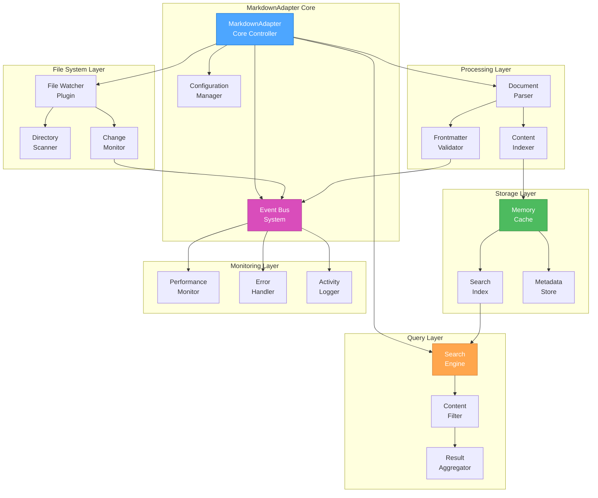
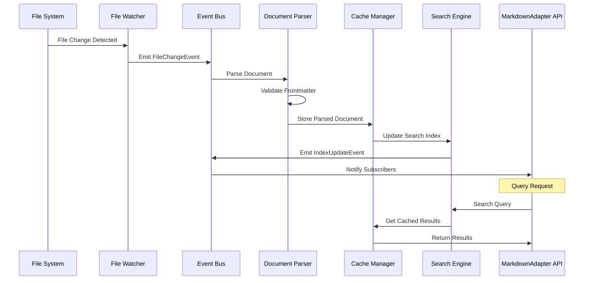

# 🎨 CREATIVE PHASE: MARKDOWNADAPTER ARCHITECTURE DESIGN

**Date**: 2025-06-10
**Phase Type**: Architecture Design
**Priority**: CRITICAL
**Complexity**: Level 4

## 📋 PROBLEM STATEMENT

MarkdownAdapter в Collection Store полностью неработоспособен - все 30 тестов падают с различными ошибками:
- File Watching Integration не функционирует
- Document Operations имеют экстремально долгое время выполнения (>1500 секунд)
- Search Functionality не реализована
- Performance Monitoring отсутствует
- Error Handling некорректен

**Цель**: Спроектировать надежную, производительную и масштабируемую архитектуру MarkdownAdapter для v6.0 External Adapters Phase.

## 🏗️ COMPONENT ANALYSIS

### Core Components Required
- **FileWatcher**: Мониторинг изменений файловой системы
- **DocumentParser**: Парсинг Markdown с frontmatter
- **SearchEngine**: Полнотекстовый поиск по документам
- **CacheManager**: Кэширование для производительности
- **EventEmitter**: Система событий для реактивности
- **ErrorHandler**: Централизованная обработка ошибок
- **PerformanceMonitor**: Мониторинг производительности
- **ConfigurationManager**: Управление конфигурацией

### Key Interactions
- FileWatcher → DocumentParser → CacheManager → EventEmitter
- SearchEngine ↔ CacheManager ↔ DocumentParser
- PerformanceMonitor → All Components
- ErrorHandler ← All Components

## 🎯 ARCHITECTURE OPTIONS

### Option 1: Event-Driven Microservices Architecture
**Description**: Разделение на независимые микросервисы с событийной коммуникацией

**Pros**:
- Высокая масштабируемость
- Независимое развертывание компонентов
- Отказоустойчивость
- Легкое тестирование отдельных компонентов

**Cons**:
- Сложность координации
- Overhead на межсервисную коммуникацию
- Сложность отладки
- Избыточность для текущих требований

**Technical Fit**: Medium
**Complexity**: High
**Scalability**: High
**Implementation Time**: 3-4 недели

### Option 2: Layered Monolithic Architecture
**Description**: Классическая слоистая архитектура с четким разделением ответственности

**Pros**:
- Простота понимания и разработки
- Легкая отладка
- Минимальный overhead
- Быстрая разработка

**Cons**:
- Ограниченная масштабируемость
- Тесная связанность компонентов
- Сложность изменений в будущем
- Единая точка отказа

**Technical Fit**: High
**Complexity**: Low
**Scalability**: Medium
**Implementation Time**: 1-2 недели

### Option 3: Plugin-Based Modular Architecture (RECOMMENDED)
**Description**: Модульная архитектура с системой плагинов и четкими интерфейсами

**Pros**:
- Гибкость и расширяемость
- Четкое разделение ответственности
- Возможность замены компонентов
- Хорошая тестируемость
- Соответствует философии Collection Store

**Cons**:
- Средняя сложность реализации
- Необходимость продуманного API
- Overhead на абстракции

**Technical Fit**: High
**Complexity**: Medium
**Scalability**: High
**Implementation Time**: 2-3 недели

## 🎯 DECISION

**Chosen Option**: Plugin-Based Modular Architecture

**Rationale**:
1. Соответствует архитектуре Collection Store с адаптерами
2. Обеспечивает необходимую гибкость для External Adapters Phase
3. Позволяет поэтапную реализацию и тестирование
4. Оптимальный баланс сложности и функциональности
5. Поддерживает будущие расширения (Git integration, различные форматы)

## 🏗️ DETAILED ARCHITECTURE DESIGN

### Core Architecture Diagram



### Plugin Interface Design

```typescript
interface IMarkdownPlugin {
  name: string;
  version: string;
  initialize(config: PluginConfig): Promise<void>;
  destroy(): Promise<void>;
  getCapabilities(): PluginCapabilities;
}

interface IFileWatcherPlugin extends IMarkdownPlugin {
  startWatching(paths: string[]): Promise<void>;
  stopWatching(): Promise<void>;
  onFileChange(callback: (event: FileChangeEvent) => void): void;
}

interface IDocumentParserPlugin extends IMarkdownPlugin {
  parseDocument(content: string, filePath: string): Promise<ParsedDocument>;
  validateFrontmatter(frontmatter: any): ValidationResult;
  extractMetadata(document: ParsedDocument): DocumentMetadata;
}

interface ISearchEnginePlugin extends IMarkdownPlugin {
  indexDocument(document: ParsedDocument): Promise<void>;
  search(query: SearchQuery): Promise<SearchResult[]>;
  updateIndex(documentId: string, document: ParsedDocument): Promise<void>;
  removeFromIndex(documentId: string): Promise<void>;
}
```

### Data Flow Architecture



## 🔧 IMPLEMENTATION PLAN

### Phase 1: Core Infrastructure (Week 1)
1. **Plugin System Foundation**
   - Base plugin interfaces
   - Plugin registry and loader
   - Configuration management
   - Event bus implementation

2. **Basic File Watching**
   - Simple file watcher plugin
   - Directory scanning
   - Change detection

### Phase 2: Document Processing (Week 2)
1. **Document Parser Plugin**
   - Markdown parsing with frontmatter
   - Metadata extraction
   - Content validation

2. **Cache Management**
   - Memory cache implementation
   - Cache invalidation strategies
   - Performance optimization

### Phase 3: Search & Query (Week 3)
1. **Search Engine Plugin**
   - Full-text search implementation
   - Index management
   - Query processing

2. **API Integration**
   - Collection Store adapter interface
   - CRUD operations
   - Query translation

### Phase 4: Monitoring & Optimization (Week 4)
1. **Performance Monitoring**
   - Metrics collection
   - Performance alerts
   - Resource usage tracking

2. **Error Handling & Recovery**
   - Centralized error handling
   - Automatic recovery mechanisms
   - Graceful degradation

## 📊 PERFORMANCE CONSIDERATIONS

### Caching Strategy
- **L1 Cache**: In-memory parsed documents (LRU, 100MB limit)
- **L2 Cache**: Search index cache (500MB limit)
- **L3 Cache**: File metadata cache (50MB limit)

### File Watching Optimization
- Debounced change detection (300ms)
- Batch processing for multiple changes
- Selective watching (ignore .git, node_modules)

### Search Performance
- Incremental indexing
- Lazy loading of large documents
- Query result caching

## 🔒 ERROR HANDLING STRATEGY

### Error Categories
1. **File System Errors**: Permission, not found, corruption
2. **Parsing Errors**: Invalid markdown, malformed frontmatter
3. **Search Errors**: Index corruption, query syntax
4. **Performance Errors**: Memory limits, timeout

### Recovery Mechanisms
- Automatic retry with exponential backoff
- Graceful degradation (disable features vs. crash)
- Error reporting and logging
- Manual recovery procedures

## ✅ VALIDATION CRITERIA

### Functional Requirements
- [ ] All 30 tests pass successfully
- [ ] File watching works in real-time
- [ ] Document operations complete in <100ms
- [ ] Search functionality returns accurate results
- [ ] Error handling prevents crashes

### Performance Requirements
- [ ] Document parsing: <50ms per document
- [ ] Search queries: <200ms response time
- [ ] Memory usage: <500MB for 10,000 documents
- [ ] File watching latency: <500ms

### Quality Requirements
- [ ] Code coverage: >90%
- [ ] No memory leaks
- [ ] Graceful error handling
- [ ] Comprehensive logging

## 🎨 CREATIVE CHECKPOINT: Architecture Design Complete

**Key Decisions Made**:
1. Plugin-based modular architecture selected
2. Event-driven communication between components
3. Multi-layer caching strategy
4. Comprehensive error handling and recovery

**Next Steps**:
1. Begin Phase 1 implementation
2. Create detailed plugin interfaces
3. Implement core infrastructure
4. Set up testing framework

🎨🎨🎨 EXITING CREATIVE PHASE - ARCHITECTURE DECISION MADE 🎨🎨🎨