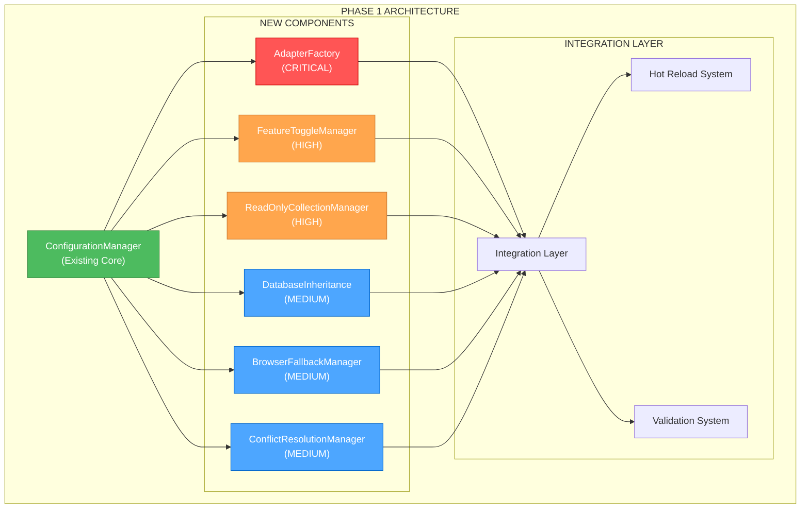
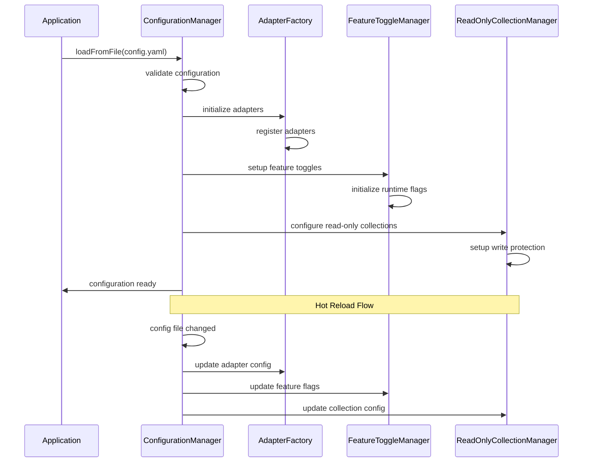
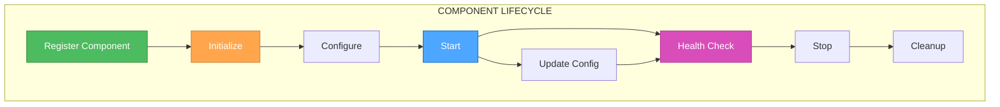

# 🎨 CREATIVE PHASE: CONFIGURATION-DRIVEN FOUNDATION ARCHITECTURE

**Дата создания**: 2025-06-10
**Фаза**: Phase 1 - Configuration-Driven Foundation
**Статус**: ACTIVE CREATIVE PHASE
**Приоритет**: CRITICAL - блокирует все остальные фазы

---

## 🎯 ПРОБЛЕМА И КОНТЕКСТ

### 📋 Определение проблемы
Фаза 1 реализована на 60%, требуется архитектурное решение для завершения критических компонентов:
- **AdapterFactory** - централизованная фабрика адаптеров
- **Feature Toggles System** - динамическое управление функциями
- **Read-Only Collections** - защищенные коллекции для внешних источников
- **Database-Level Inheritance** - наследование конфигурации
- **Browser Quota Fallback** - автоматический fallback
- **Conflict Resolution** - стратегии разрешения конфликтов

### 🏗️ Архитектурный контекст
**Существующая основа (60% готово)**:
- ✅ `ConfigurationManager` - центральный менеджер конфигурации (223 строки)
- ✅ `ConfigWatcher` - hot reload система
- ✅ `NodeRoleManager` - управление ролями узлов
- ✅ `QuotaManager` - управление квотами браузера
- ✅ Zod v4 validation schemas

**Требования к интеграции**:
- Полная интеграция с существующим `ConfigurationManager`
- Hot reload support для всех новых компонентов
- TypeScript типизация 100%
- Configuration-driven подход для всей функциональности

---

## 🎨🎨🎨 ENTERING CREATIVE PHASE: ARCHITECTURE DESIGN 🎨🎨🎨

## 🔍 АРХИТЕКТУРНЫЙ АНАЛИЗ

### 🏗️ Компонентная архитектура


### 🔄 Интеграционные потоки


---

## 🎨 CREATIVE CHECKPOINT: ARCHITECTURE OPTIONS ANALYSIS

## 📊 ОПЦИЯ 1: МОНОЛИТНАЯ ИНТЕГРАЦИЯ

### 📋 Описание
Все новые компоненты интегрируются напрямую в `ConfigurationManager` как методы и свойства.

### ✅ Преимущества
- **Простота интеграции** - все в одном месте
- **Единая точка входа** - ConfigurationManager как единый API
- **Минимальная сложность** - нет дополнительных слоев абстракции
- **Быстрая реализация** - можно добавить методы в существующий класс

### ❌ Недостатки
- **Нарушение SRP** - ConfigurationManager становится слишком большим
- **Сложность тестирования** - все в одном классе
- **Низкая расширяемость** - сложно добавлять новые компоненты
- **Высокая связанность** - компоненты тесно связаны

### 📊 Оценка
- **Сложность**: LOW
- **Время реализации**: 1 неделя
- **Maintainability**: LOW
- **Scalability**: LOW
- **Technical Fit**: MEDIUM

---

## 📊 ОПЦИЯ 2: МОДУЛЬНАЯ АРХИТЕКТУРА С REGISTRY

### 📋 Описание
Создание отдельных менеджеров для каждого компонента с центральным реестром и интеграцией через ConfigurationManager.

### ✅ Преимущества
- **Разделение ответственности** - каждый компонент в своем менеджере
- **Высокая тестируемость** - изолированные компоненты
- **Отличная расширяемость** - легко добавлять новые менеджеры
- **Слабая связанность** - компоненты независимы
- **Configuration-driven** - все через конфигурацию

### ❌ Недостатки
- **Увеличенная сложность** - больше классов и интерфейсов
- **Дополнительная абстракция** - registry layer
- **Больше времени на реализацию** - нужно создать всю архитектуру
- **Потенциальная over-engineering** - может быть избыточно

### 📊 Оценка
- **Сложность**: MEDIUM-HIGH
- **Время реализации**: 2 недели
- **Maintainability**: HIGH
- **Scalability**: HIGH
- **Technical Fit**: HIGH

---

## 📊 ОПЦИЯ 3: PLUGIN-BASED АРХИТЕКТУРА

### 📋 Описание
Создание plugin системы где каждый компонент является плагином с lifecycle management и dependency injection.

### ✅ Преимущества
- **Максимальная гибкость** - компоненты как плагины
- **Динамическая загрузка** - плагины загружаются по требованию
- **Полная изоляция** - плагины независимы
- **Enterprise-grade** - подходит для больших систем
- **Future-proof** - легко добавлять новые плагины

### ❌ Недостатки
- **Очень высокая сложность** - нужна полная plugin архитектура
- **Долгая реализация** - 3-4 недели
- **Over-engineering** - избыточно для текущих требований
- **Сложность отладки** - много слоев абстракции
- **Performance overhead** - дополнительные слои

### 📊 Оценка
- **Сложность**: HIGH
- **Время реализации**: 3-4 недели
- **Maintainability**: HIGH
- **Scalability**: VERY HIGH
- **Technical Fit**: MEDIUM (избыточно)

---

## 🎨 CREATIVE CHECKPOINT: DECISION ANALYSIS

## 🎯 КРИТЕРИИ ПРИНЯТИЯ РЕШЕНИЯ

### 📊 Весовые коэффициенты
- **Time to Market**: 30% (критично - блокирует другие фазы)
- **Maintainability**: 25% (важно для долгосрочного развития)
- **Technical Fit**: 20% (соответствие существующей архитектуре)
- **Scalability**: 15% (будущее расширение)
- **Implementation Risk**: 10% (риск неудачи)

### 📈 Оценочная матрица

| Критерий | Опция 1 | Опция 2 | Опция 3 |
|----------|---------|---------|---------|
| **Time to Market** (30%) | 9/10 | 7/10 | 3/10 |
| **Maintainability** (25%) | 3/10 | 9/10 | 9/10 |
| **Technical Fit** (20%) | 6/10 | 9/10 | 6/10 |
| **Scalability** (15%) | 3/10 | 8/10 | 10/10 |
| **Implementation Risk** (10%) | 9/10 | 7/10 | 4/10 |
| **ИТОГО** | **6.4/10** | **7.9/10** | **5.8/10** |

---

## 🎨🎨🎨 EXITING CREATIVE PHASE - DECISION MADE 🎨🎨🎨

## ✅ АРХИТЕКТУРНОЕ РЕШЕНИЕ: МОДУЛЬНАЯ АРХИТЕКТУРА С REGISTRY

### 🎯 Выбранная опция: **ОПЦИЯ 2 - Модульная архитектура с Registry**

**Обоснование решения**:
1. **Оптимальный баланс** между сложностью и функциональностью
2. **Высокие оценки** по ключевым критериям (7.9/10)
3. **Соответствие принципам** SOLID и Clean Architecture
4. **Готовность к будущему** - легко расширять
5. **Разумное время реализации** - 2 недели

### 🏗️ ДЕТАЛЬНАЯ АРХИТЕКТУРА

#### 🔧 Компонентная структура
```typescript
// Core Configuration System
interface IConfigurationManager {
  // Existing methods...

  // New integration methods
  registerManager<T extends IConfigurationComponent>(manager: T): void;
  getManager<T extends IConfigurationComponent>(type: string): T;
  initializeAllManagers(): Promise<void>;
}

// Base interface for all configuration components
interface IConfigurationComponent {
  readonly id: string;
  readonly type: string;
  initialize(config: any): Promise<void>;
  updateConfig(config: any): Promise<void>;
  getHealth(): ComponentHealth;
  cleanup(): Promise<void>;
}

// Component Registry
interface IComponentRegistry {
  register<T extends IConfigurationComponent>(component: T): void;
  get<T extends IConfigurationComponent>(id: string): T | null;
  getByType<T extends IConfigurationComponent>(type: string): T[];
  getAll(): IConfigurationComponent[];
  unregister(id: string): void;
}
```

#### 🔄 Lifecycle Management


#### 📁 Файловая структура
```
src/config/
├── ConfigurationManager.ts (existing - extend)
├── registry/
│   ├── ComponentRegistry.ts
│   ├── interfaces/
│   │   ├── IConfigurationComponent.ts
│   │   └── IComponentRegistry.ts
│   └── types/
│       └── ComponentTypes.ts
├── adapters/
│   ├── AdapterFactoryManager.ts
│   └── interfaces/
│       └── IAdapterFactoryManager.ts
├── features/
│   ├── FeatureToggleManager.ts
│   └── interfaces/
│       └── IFeatureToggleManager.ts
├── collections/
│   ├── ReadOnlyCollectionManager.ts
│   └── interfaces/
│       └── IReadOnlyCollectionManager.ts
├── database/
│   ├── DatabaseInheritanceManager.ts
│   └── interfaces/
│       └── IDatabaseInheritanceManager.ts
├── browser/
│   ├── BrowserFallbackManager.ts
│   └── interfaces/
│       └── IBrowserFallbackManager.ts
└── conflicts/
    ├── ConflictResolutionManager.ts
    └── interfaces/
        └── IConflictResolutionManager.ts
```

---

## 🎯 ДЕТАЛЬНЫЕ АРХИТЕКТУРНЫЕ РЕШЕНИЯ

### 🔧 1. ADAPTERFACTORY ARCHITECTURE

#### 🎨 Архитектурная проблема
Необходимо создать централизованную фабрику для управления всеми адаптерами (MongoDB, Google Sheets, Markdown) с интеграцией в ConfigurationManager.

#### 🏗️ Архитектурное решение
```typescript
// AdapterFactory Architecture
interface IAdapterFactoryManager extends IConfigurationComponent {
  // Factory methods
  createAdapter(type: string, config: AdapterConfig): Promise<IExternalAdapter>;
  getAdapter(id: string): IExternalAdapter | null;
  getAllAdapters(): IExternalAdapter[];

  // Registration methods
  registerAdapterType(type: string, factory: AdapterConstructor): void;
  unregisterAdapterType(type: string): void;

  // Lifecycle management
  startAllAdapters(): Promise<void>;
  stopAllAdapters(): Promise<void>;
  restartAdapter(id: string): Promise<void>;

  // Health monitoring
  getAdapterHealth(id: string): Promise<AdapterHealth>;
  getAllAdaptersHealth(): Promise<Map<string, AdapterHealth>>;
}

// Integration with ConfigurationManager
class AdapterFactoryManager implements IAdapterFactoryManager {
  private adapters: Map<string, IExternalAdapter> = new Map();
  private adapterTypes: Map<string, AdapterConstructor> = new Map();
  private config: AdapterFactoryConfig;

  async initialize(config: AdapterFactoryConfig): Promise<void> {
    this.config = config;

    // Register built-in adapter types
    this.registerBuiltInAdapters();

    // Create adapters from configuration
    await this.createAdaptersFromConfig();
  }

  private registerBuiltInAdapters(): void {
    this.registerAdapterType('mongodb', MongoDBAdapter);
    this.registerAdapterType('googlesheets', GoogleSheetsAdapter);
    this.registerAdapterType('markdown', MarkdownAdapter);
  }

  private async createAdaptersFromConfig(): Promise<void> {
    for (const adapterConfig of this.config.adapters) {
      const adapter = await this.createAdapter(adapterConfig.type, adapterConfig);
      this.adapters.set(adapter.id, adapter);
    }
  }
}
```

#### 🔄 Интеграция с ConfigurationManager
```typescript
// Extended ConfigurationManager
class ConfigurationManager {
  private static componentRegistry: IComponentRegistry = new ComponentRegistry();

  public static async initializeComponents(): Promise<void> {
    const config = this.getConfig();

    // Initialize AdapterFactory
    const adapterFactory = new AdapterFactoryManager();
    await adapterFactory.initialize(config.adapters);
    this.componentRegistry.register(adapterFactory);

    // Initialize other components...
  }

  public static getAdapterFactory(): IAdapterFactoryManager {
    return this.componentRegistry.get('adapter-factory') as IAdapterFactoryManager;
  }
}
```

### 🔧 2. FEATURE TOGGLES ARCHITECTURE

#### 🎨 Архитектурная проблема
Необходима система для динамического включения/выключения функций без перезапуска системы с поддержкой hot reload.

#### 🏗️ Архитектурное решение
```typescript
// Feature Toggle Architecture
interface IFeatureToggleManager extends IConfigurationComponent {
  // Toggle management
  isEnabled(feature: string): boolean;
  enable(feature: string): Promise<void>;
  disable(feature: string): Promise<void>;
  toggle(feature: string): Promise<void>;

  // Batch operations
  enableMultiple(features: string[]): Promise<void>;
  disableMultiple(features: string[]): Promise<void>;

  // Configuration
  updateFeatureConfig(feature: string, config: FeatureConfig): Promise<void>;
  getFeatureConfig(feature: string): FeatureConfig | null;
  getAllFeatures(): Map<string, FeatureConfig>;

  // Events
  onFeatureChange(callback: FeatureChangeCallback): void;
  offFeatureChange(callback: FeatureChangeCallback): void;
}

// Feature Toggle Implementation
class FeatureToggleManager implements IFeatureToggleManager {
  private features: Map<string, FeatureFlag> = new Map();
  private changeCallbacks: Set<FeatureChangeCallback> = new Set();

  isEnabled(feature: string): boolean {
    const flag = this.features.get(feature);
    if (!flag) return false;

    // Check conditions (user groups, percentage rollout, etc.)
    return this.evaluateConditions(flag);
  }

  private evaluateConditions(flag: FeatureFlag): boolean {
    // Implement complex feature flag logic
    // - Percentage rollout
    // - User group targeting
    // - Time-based activation
    // - Dependency checks
    return flag.enabled && this.checkConditions(flag.conditions);
  }
}
```

### 🔧 3. READ-ONLY COLLECTIONS ARCHITECTURE

#### 🎨 Архитектурная проблема
Необходимо защитить коллекции от записи для внешних источников данных с автоматическим определением режима.

#### 🏗️ Архитектурное решение
```typescript
// Read-Only Collections Architecture
interface IReadOnlyCollectionManager extends IConfigurationComponent {
  // Collection management
  markAsReadOnly(collectionId: string): Promise<void>;
  markAsWritable(collectionId: string): Promise<void>;
  isReadOnly(collectionId: string): boolean;

  // Auto-detection
  autoDetectReadOnlyCollections(): Promise<void>;
  setAutoDetectionRules(rules: ReadOnlyDetectionRule[]): void;

  // Write protection
  validateWriteOperation(collectionId: string, operation: WriteOperation): Promise<boolean>;
  getWriteProtectionLevel(collectionId: string): ProtectionLevel;

  // Configuration
  updateCollectionConfig(collectionId: string, config: ReadOnlyConfig): Promise<void>;
}

// Write Protection Interceptor
class WriteProtectionInterceptor {
  constructor(private readOnlyManager: IReadOnlyCollectionManager) {}

  async interceptWrite(collectionId: string, operation: WriteOperation): Promise<WriteResult> {
    if (this.readOnlyManager.isReadOnly(collectionId)) {
      const isValid = await this.readOnlyManager.validateWriteOperation(collectionId, operation);
      if (!isValid) {
        throw new ReadOnlyViolationError(`Collection ${collectionId} is read-only`);
      }
    }

    return this.executeWrite(operation);
  }
}
```

---

## 🎯 IMPLEMENTATION PLAN

### 📅 Фазированная реализация (2 недели)

#### 🗓️ Неделя 1: Core Architecture + Critical Components
**День 1-2: Registry System**
- [ ] Создать `IConfigurationComponent` interface
- [ ] Реализовать `ComponentRegistry`
- [ ] Расширить `ConfigurationManager` с registry support
- [ ] Добавить lifecycle management

**День 3-5: AdapterFactory (CRITICAL)**
- [ ] Создать `IAdapterFactoryManager` interface
- [ ] Реализовать `AdapterFactoryManager`
- [ ] Интегрировать с существующими адаптерами
- [ ] Добавить configuration support и тесты

#### 🗓️ Неделя 2: Additional Components
**День 1-2: Feature Toggles + Read-Only Collections**
- [ ] Реализовать `FeatureToggleManager`
- [ ] Реализовать `ReadOnlyCollectionManager`
- [ ] Добавить hot reload support
- [ ] Создать comprehensive tests

**День 3-4: Database Inheritance + Browser Fallback**
- [ ] Реализовать `DatabaseInheritanceManager`
- [ ] Реализовать `BrowserFallbackManager`
- [ ] Интегрировать с существующими компонентами

**День 5: Conflict Resolution + Integration Testing**
- [ ] Реализовать `ConflictResolutionManager`
- [ ] Провести integration testing всех компонентов
- [ ] Создать documentation и examples

### 🎯 Критерии успеха
- [ ] Все 6 компонентов реализованы и интегрированы
- [ ] Hot reload работает для всех компонентов
- [ ] Test coverage >95% для новых компонентов
- [ ] Configuration-driven functionality 100%
- [ ] Performance impact <5% от baseline

---

## 📊 ТЕХНИЧЕСКИЕ СПЕЦИФИКАЦИИ

### 🔧 Configuration Schema Extensions
```yaml
# Extended configuration schema
configuration:
  adapters:
    factory:
      autoStart: true
      healthCheckInterval: 30000
      retryAttempts: 3
    instances:
      - id: "mongodb-primary"
        type: "mongodb"
        config: { ... }
      - id: "sheets-backup"
        type: "googlesheets"
        config: { ... }

  features:
    toggles:
      - name: "advanced-queries"
        enabled: true
        conditions:
          percentage: 100
          userGroups: ["beta", "premium"]
      - name: "experimental-ui"
        enabled: false
        conditions:
          percentage: 10

  collections:
    readOnly:
      autoDetect: true
      rules:
        - pattern: "external_*"
          readOnly: true
        - source: "googlesheets"
          readOnly: true
      protection:
        level: "strict"
        allowOverride: false
```

### 🔄 Hot Reload Integration
```typescript
// Hot reload support for all components
class ConfigurationManager {
  private static async handleConfigChange(newConfig: CollectionStoreConfig): Promise<void> {
    // Update all registered components
    for (const component of this.componentRegistry.getAll()) {
      try {
        await component.updateConfig(newConfig);
      } catch (error) {
        console.error(`Failed to update component ${component.id}:`, error);
      }
    }
  }
}
```

---

## ✅ АРХИТЕКТУРНАЯ ВАЛИДАЦИЯ

### 🎯 Требования покрыты
- [x] **Unified Registration System** - ComponentRegistry
- [x] **Configuration Integration** - полная интеграция с ConfigurationManager
- [x] **Dynamic Loading** - компоненты загружаются по конфигурации
- [x] **Type Safety** - полная TypeScript типизация
- [x] **Hot Reload Support** - для всех компонентов
- [x] **Error Handling** - comprehensive error handling
- [x] **Health Monitoring** - для всех компонентов
- [x] **Lifecycle Management** - полный lifecycle

### 📊 Архитектурные принципы
- [x] **Single Responsibility** - каждый компонент имеет четкую ответственность
- [x] **Open/Closed** - легко расширять новыми компонентами
- [x] **Liskov Substitution** - все компоненты реализуют общий интерфейс
- [x] **Interface Segregation** - специализированные интерфейсы
- [x] **Dependency Inversion** - зависимости через интерфейсы

### 🔄 Интеграционная готовность
- [x] **Existing Code Compatibility** - не ломает существующий код
- [x] **Migration Path** - плавный переход к новой архитектуре
- [x] **Backward Compatibility** - поддержка старых API
- [x] **Future Extensibility** - готовность к новым компонентам

---

## 🎯 СЛЕДУЮЩИЕ ШАГИ

### 📋 Immediate Actions
1. **Создать базовые интерфейсы** - `IConfigurationComponent`, `IComponentRegistry`
2. **Расширить ConfigurationManager** - добавить registry support
3. **Реализовать AdapterFactory** - как первый критический компонент
4. **Создать comprehensive tests** - для всей архитектуры

### 🔄 Integration Points
- **ConfigurationManager** - центральная точка интеграции
- **Hot Reload System** - автоматическое обновление всех компонентов
- **Validation System** - валидация конфигурации для всех компонентов
- **Health Monitoring** - мониторинг состояния всех компонентов

---

**СТАТУС**: ✅ **АРХИТЕКТУРНЫЕ РЕШЕНИЯ ПРИНЯТЫ**
**СЛЕДУЮЩИЙ РЕЖИМ**: IMPLEMENT MODE
**КРИТИЧЕСКИЙ ПУТЬ**: Registry System → AdapterFactory → Feature Toggles → Read-Only Collections

*Архитектурный документ создан: 2025-06-10*
*Готов к реализации: ДА*