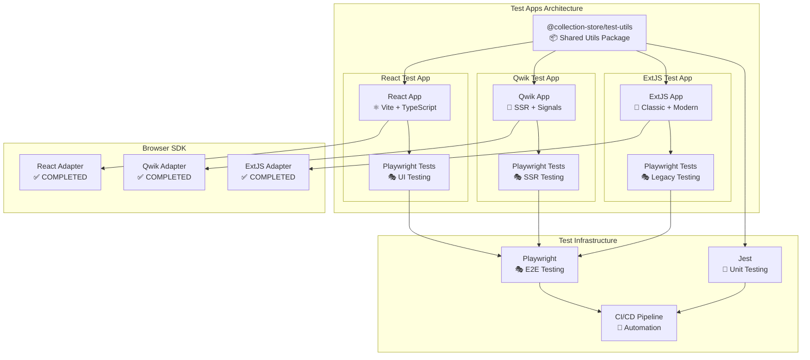

# 🎨 CREATIVE PHASE: QA TEST APPS ARCHITECTURE

*Дата создания: 2025-06-13*
*Тип: Architecture Design*
*Статус: COMPLETED*
*Приоритет: HIGH*

---

## 🎯 PROBLEM STATEMENT

### Архитектурная проблема
Для комплексного QA тестирования Browser SDK требуется создание тестовых приложений для каждого поддерживаемого фреймворка (React, Qwik, ExtJS). Необходимо принять архитектурные решения о:

1. **Структуре тестовых приложений**: Как организовать test apps для эффективного тестирования
2. **Общих компонентах**: Какие элементы можно переиспользовать между фреймворками
3. **Тестовых сценариях**: Как структурировать тесты для покрытия всех use cases
4. **CI/CD интеграции**: Как интегрировать test apps в автоматизированное тестирование
5. **Данных и моков**: Как организовать тестовые данные и mock services

### Контекст
- **Browser SDK**: Полностью реализован (TASK-01 through TASK-14 completed)
- **Framework Adapters**: React, Qwik, ExtJS адаптеры готовы
- **Testing Infrastructure**: Jest + Playwright настроены
- **QA Plan**: Детальный план тестирования создан

### Требования
- **Cross-Framework Consistency**: Одинаковые тестовые сценарии для всех фреймворков
- **Real-World Scenarios**: Тестирование реальных use cases
- **Performance Testing**: Возможность измерения производительности
- **CI/CD Ready**: Автоматизированное выполнение в pipeline
- **Maintainability**: Легкость поддержки и обновления

---

## 🔍 OPTIONS ANALYSIS

### Option 1: Monorepo Test Apps Architecture
**Description**: Создание всех тестовых приложений в едином monorepo с общими утилитами

**Pros**:
- Единая система управления зависимостями
- Переиспользование общих компонентов и утилит
- Консистентная структура проекта
- Легкость CI/CD настройки
- Централизованное управление тестовыми данными

**Cons**:
- Сложность настройки build системы для разных фреймворков
- Потенциальные конфликты зависимостей
- Больший размер репозитория

**Complexity**: Medium
**Implementation Time**: 3-4 дня

### Option 2: Independent Test Apps Architecture
**Description**: Создание независимых тестовых приложений для каждого фреймворка

**Pros**:
- Полная изоляция между фреймворками
- Нет конфликтов зависимостей
- Простота настройки каждого приложения
- Возможность использования framework-specific инструментов
- Легкость отладки проблем

**Cons**:
- Дублирование кода и конфигураций
- Сложность поддержания консистентности
- Больше работы по настройке CI/CD
- Разрозненные тестовые данные

**Complexity**: Low
**Implementation Time**: 2-3 дня

### Option 3: Hybrid Test Apps Architecture ⭐ **SELECTED**
**Description**: Комбинированный подход с общими утилитами и независимыми приложениями

**Pros**:
- Баланс между переиспользованием и изоляцией
- Общие утилиты и данные при независимых приложениях
- Гибкость в настройке каждого фреймворка
- Умеренная сложность поддержки
- Хорошая масштабируемость

**Cons**:
- Средняя сложность архитектуры
- Требует четкого разделения ответственности
- Некоторое дублирование конфигураций

**Complexity**: Medium
**Implementation Time**: 3-4 дня

---

## 🎯 DECISION

### Selected Architecture: Hybrid Test Apps Architecture

**Rationale**:
1. **Optimal Balance**: Обеспечивает переиспользование общих компонентов при сохранении изоляции framework-specific кода
2. **Maintainability**: Централизованные тестовые сценарии и утилиты упрощают поддержку
3. **Scalability**: Легко добавлять новые фреймворки и тестовые сценарии
4. **Performance**: Общие утилиты для измерения производительности обеспечивают консистентные метрики
5. **CI/CD Ready**: Структура поддерживает автоматизированное тестирование

### Key Architectural Decisions:

1. **Shared Utils Package**: NPM package с общими утилитами, сценариями и mock данными
2. **Independent Apps**: Каждый фреймворк имеет независимое приложение с собственными зависимостями
3. **Common Test Scenarios**: Единые тестовые сценарии для всех фреймворков
4. **Performance Tracking**: Встроенная система измерения производительности
5. **Mock Data Generation**: Централизованная генерация тестовых данных

---

## 📊 ARCHITECTURE DIAGRAM

---

## 📋 IMPLEMENTATION PLAN

### Phase 1: Shared Utils Package (1 день)
1. **Create shared-utils package structure**
2. **Implement common test scenarios**
3. **Create performance tracking utilities**
4. **Add mock data generators**
5. **Setup package build and publish**

### Phase 2: React Test App (1 день)
1. **Setup React application with Vite**
2. **Integrate Collection Store React adapter**
3. **Implement TestRunner component**
4. **Add shared-utils dependency**
5. **Create Playwright test configuration**

### Phase 3: Qwik Test App (1 день)
1. **Setup Qwik application**
2. **Integrate Collection Store Qwik adapter**
3. **Implement TestRunner component with signals**
4. **Add shared-utils dependency**
5. **Configure SSR testing**

### Phase 4: ExtJS Test App (1 день)
1. **Setup ExtJS application structure**
2. **Integrate Collection Store ExtJS adapter**
3. **Implement TestRunner panel and controller**
4. **Add shared-utils integration**
5. **Configure legacy browser testing**

### Phase 5: CI/CD Integration (0.5 дня)
1. **Create test execution scripts**
2. **Setup parallel test execution**
3. **Configure test reporting**
4. **Add performance benchmarking**

**Total Estimated Time**: 4.5 дня

---

## ✅ CREATIVE PHASE COMPLETE

### Summary
- **Problem**: Архитектура тестовых приложений для QA
- **Solution**: Hybrid Test Apps Architecture с shared utils
- **Decision**: Комбинированный подход для оптимального баланса
- **Implementation**: Готов детальный план реализации

### Next Steps
- Обновить tasks.md с новой архитектурной задачей
- Добавить implementation tasks для test apps
- Перейти к IMPLEMENT MODE для реализации

---

*Creative Phase Completed: 2025-06-13*
*Ready for Implementation*