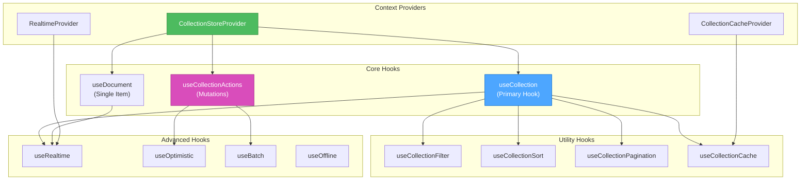

# 🎨 CREATIVE PHASE: REACT SDK UI/UX DESIGN

**Date**: 2025-06-10
**Phase Type**: UI/UX Design
**Priority**: HIGH
**Complexity**: Level 3

## 📋 PROBLEM STATEMENT

React SDK для Collection Store требует проработки пользовательского опыта для разработчиков:
- Отсутствует четкий API для React разработчиков
- Нет интуитивных хуков для работы с коллекциями
- Отсутствует TypeScript поддержка для лучшего DX
- Нет примеров использования и документации

**Цель**: Спроектировать интуитивный и мощный React SDK с отличным Developer Experience (DX) для Collection Store v6.0.

## 👥 USER NEEDS ANALYSIS

### Target Personas

#### 1. Frontend React Developer
- **Опыт**: 2-5 лет React разработки
- **Потребности**: Простые хуки, TypeScript поддержка, хорошая документация
- **Pain Points**: Сложные API, отсутствие типизации, плохая производительность

#### 2. Full-Stack Developer
- **Опыт**: 3-7 лет, знает backend и frontend
- **Потребности**: Интеграция с существующими системами, real-time updates
- **Pain Points**: Сложная настройка, отсутствие real-time возможностей

#### 3. Senior Architect
- **Опыт**: 5+ лет, принимает архитектурные решения
- **Потребности**: Производительность, масштабируемость, безопасность
- **Pain Points**: Vendor lock-in, производительность, сложность интеграции

### User Stories

```
Как React разработчик,
Я хочу использовать простой хук useCollection,
Чтобы получить данные из коллекции с автоматическими обновлениями.

Как Full-Stack разработчик,
Я хочу real-time обновления в React компонентах,
Чтобы пользователи видели изменения данных мгновенно.

Как Senior Architect,
Я хочу контролировать производительность и кэширование,
Чтобы обеспечить оптимальную работу приложения.
```

## 🎯 UI/UX OPTIONS

### Option 1: Simple Hooks API
**Description**: Минималистичный API с базовыми хуками

```typescript
// Basic API
const { data, loading, error } = useCollection('users');
const { mutate } = useCollectionMutation('users');

// Usage
function UserList() {
  const { data: users, loading } = useCollection('users');

  if (loading) return <div>Loading...</div>;

  return (
    <div>
      {users.map(user => <UserCard key={user.id} user={user} />)}
    </div>
  );
}
```

**Pros**:
- Простота использования
- Быстрое освоение
- Минимальная настройка
- Легкая отладка

**Cons**:
- Ограниченная функциональность
- Нет advanced features
- Сложно расширять
- Не подходит для сложных случаев

**Usability**: High
**Learnability**: High
**Efficiency**: Medium
**Implementation Time**: 1-2 недели

### Option 2: Comprehensive Hooks Ecosystem
**Description**: Полная экосистема хуков для всех возможных сценариев

```typescript
// Comprehensive API
const { data, loading, error, refetch } = useCollection('users', {
  filter: { active: true },
  sort: { name: 1 },
  pagination: { page: 1, limit: 20 }
});

const { data: user } = useDocument('users', userId);
const { mutate, isLoading } = useCollectionMutation('users');
const { subscribe, unsubscribe } = useCollectionSubscription('users');
const { cache, invalidate } = useCollectionCache('users');
const { optimistic } = useOptimisticUpdates('users');

// Advanced usage
function UserManagement() {
  const { data: users, loading } = useCollection('users', {
    filter: useCollectionFilter(),
    sort: useCollectionSort(),
    pagination: useCollectionPagination()
  });

  const { mutate } = useCollectionMutation('users', {
    onSuccess: () => invalidateQueries(['users']),
    optimistic: true
  });

  return <UserInterface users={users} onUpdate={mutate} />;
}
```

**Pros**:
- Полная функциональность
- Гибкость и контроль
- Подходит для enterprise
- Расширяемость

**Cons**:
- Сложность изучения
- Много API для запоминания
- Возможная путаница
- Overhead для простых случаев

**Usability**: Medium
**Learnability**: Low
**Efficiency**: High
**Implementation Time**: 4-6 недель

### Option 3: Progressive API with Smart Defaults (RECOMMENDED)
**Description**: Прогрессивный API, который прост для начинающих, но мощный для экспертов

```typescript
// Level 1: Simple usage
const users = useCollection('users');

// Level 2: With options
const users = useCollection('users', {
  filter: { active: true },
  realtime: true
});

// Level 3: Advanced configuration
const users = useCollection('users', {
  filter: { active: true },
  sort: { name: 1 },
  pagination: { page: 1, limit: 20 },
  cache: { ttl: 300, strategy: 'stale-while-revalidate' },
  optimistic: true,
  subscription: {
    events: ['create', 'update', 'delete'],
    throttle: 100
  }
});

// Composition for complex scenarios
function UserDashboard() {
  const users = useCollection('users', {
    filter: { active: true },
    realtime: true
  });

  const { create, update, remove } = useCollectionActions('users');

  const handleCreateUser = useCallback(async (userData) => {
    await create(userData, { optimistic: true });
  }, [create]);

  return (
    <UserInterface
      users={users.data}
      loading={users.loading}
      onCreate={handleCreateUser}
    />
  );
}
```

**Pros**:
- Прогрессивная сложность
- Хорошие defaults
- Гибкость для экспертов
- Отличный DX
- TypeScript поддержка

**Cons**:
- Средняя сложность реализации
- Требует хорошую документацию
- Больше тестирования

**Usability**: High
**Learnability**: High
**Efficiency**: High
**Implementation Time**: 3-4 недели

## 🎯 DECISION

**Chosen Option**: Progressive API with Smart Defaults

**Rationale**:
1. Обеспечивает отличный DX для всех уровней разработчиков
2. Простой старт с возможностью роста
3. Соответствует современным практикам React разработки
4. Хорошо интегрируется с TypeScript
5. Поддерживает все требования v6.0 Client SDK

## 🎨 DETAILED UX DESIGN

### Core Hooks Architecture



### TypeScript Interface Design

```typescript
// Core Types
interface CollectionHookOptions<T = any> {
  filter?: FilterQuery<T>;
  sort?: SortQuery<T>;
  pagination?: PaginationOptions;
  cache?: CacheOptions;
  realtime?: boolean | RealtimeOptions;
  optimistic?: boolean;
  enabled?: boolean;
}

interface CollectionHookResult<T = any> {
  data: T[];
  loading: boolean;
  error: Error | null;
  refetch: () => Promise<void>;
  hasMore: boolean;
  loadMore: () => Promise<void>;
  total: number;
}

// Main Hook
function useCollection<T = any>(
  collectionName: string,
  options?: CollectionHookOptions<T>
): CollectionHookResult<T>;

// Actions Hook
interface CollectionActions<T = any> {
  create: (data: Partial<T>, options?: MutationOptions) => Promise<T>;
  update: (id: string, data: Partial<T>, options?: MutationOptions) => Promise<T>;
  remove: (id: string, options?: MutationOptions) => Promise<void>;
  batch: (operations: BatchOperation<T>[]) => Promise<BatchResult<T>>;
}

function useCollectionActions<T = any>(
  collectionName: string
): CollectionActions<T>;
```

### Component Patterns

```typescript
// Pattern 1: Simple List Component
function UserList() {
  const users = useCollection('users');

  if (users.loading) return <LoadingSpinner />;
  if (users.error) return <ErrorMessage error={users.error} />;

  return (
    <div className="user-list">
      {users.data.map(user => (
        <UserCard key={user.id} user={user} />
      ))}
    </div>
  );
}

// Pattern 2: Interactive Component with Actions
function UserManagement() {
  const users = useCollection('users', {
    realtime: true,
    filter: { active: true }
  });

  const { create, update, remove } = useCollectionActions('users');

  const handleCreateUser = useCallback(async (userData: UserData) => {
    try {
      await create(userData, { optimistic: true });
      toast.success('User created successfully');
    } catch (error) {
      toast.error('Failed to create user');
    }
  }, [create]);

  return (
    <div className="user-management">
      <UserForm onSubmit={handleCreateUser} />
      <UserList
        users={users.data}
        onUpdate={update}
        onDelete={remove}
      />
    </div>
  );
}

// Pattern 3: Advanced Component with Filtering
function UserDashboard() {
  const [filter, setFilter] = useState({ active: true });
  const [sort, setSort] = useState({ name: 1 });

  const users = useCollection('users', {
    filter,
    sort,
    pagination: { limit: 20 },
    realtime: true,
    cache: { ttl: 300 }
  });

  return (
    <div className="user-dashboard">
      <UserFilters
        filter={filter}
        onFilterChange={setFilter}
        sort={sort}
        onSortChange={setSort}
      />

      <UserGrid
        users={users.data}
        loading={users.loading}
        hasMore={users.hasMore}
        onLoadMore={users.loadMore}
      />
    </div>
  );
}
```

### Error Handling UX

```typescript
// Error Boundary for Collection Store
function CollectionErrorBoundary({ children }: { children: React.ReactNode }) {
  return (
    <ErrorBoundary
      fallback={({ error, retry }) => (
        <div className="collection-error">
          <h3>Something went wrong</h3>
          <p>{error.message}</p>
          <button onClick={retry}>Try Again</button>
        </div>
      )}
    >
      {children}
    </ErrorBoundary>
  );
}

// Hook-level error handling
function useCollectionWithErrorHandling<T>(
  collectionName: string,
  options?: CollectionHookOptions<T>
) {
  const result = useCollection(collectionName, options);

  useEffect(() => {
    if (result.error) {
      // Log error to monitoring service
      errorReporting.captureException(result.error);

      // Show user-friendly notification
      toast.error('Failed to load data. Please try again.');
    }
  }, [result.error]);

  return result;
}
```

## 📱 RESPONSIVE & ACCESSIBILITY

### Responsive Design Considerations
- Mobile-first approach for components
- Touch-friendly interaction areas
- Optimized loading states for mobile
- Efficient data loading strategies

### Accessibility Features
- ARIA labels for dynamic content
- Keyboard navigation support
- Screen reader compatibility
- High contrast mode support

## 🔧 IMPLEMENTATION PLAN

### Phase 1: Core Hooks (Week 1)
1. **useCollection Hook**
   - Basic data fetching
   - Loading and error states
   - Simple filtering and sorting

2. **useCollectionActions Hook**
   - CRUD operations
   - Basic error handling
   - TypeScript interfaces

### Phase 2: Advanced Features (Week 2)
1. **Real-time Updates**
   - WebSocket integration
   - Optimistic updates
   - Conflict resolution

2. **Caching & Performance**
   - Query caching
   - Background refetching
   - Memory optimization

### Phase 3: Developer Experience (Week 3)
1. **TypeScript Support**
   - Complete type definitions
   - Generic type support
   - IDE autocomplete

2. **Documentation & Examples**
   - API documentation
   - Usage examples
   - Best practices guide

### Phase 4: Testing & Polish (Week 4)
1. **Testing Suite**
   - Unit tests for hooks
   - Integration tests
   - Performance tests

2. **Developer Tools**
   - React DevTools integration
   - Debug utilities
   - Performance monitoring

## ✅ VALIDATION CRITERIA

### Developer Experience
- [ ] API интуитивен для новых пользователей
- [ ] TypeScript поддержка полная
- [ ] Документация понятна и полна
- [ ] Примеры покрывают основные сценарии

### Performance
- [ ] Время загрузки <200ms
- [ ] Память использования <50MB
- [ ] Bundle size <100KB gzipped
- [ ] Real-time updates <100ms latency

### Accessibility
- [ ] WCAG 2.1 AA compliance
- [ ] Keyboard navigation
- [ ] Screen reader support
- [ ] High contrast support

## 🎨 CREATIVE CHECKPOINT: UX Design Complete

**Key Decisions Made**:
1. Progressive API with smart defaults selected
2. Three-tier hook architecture designed
3. Comprehensive TypeScript support planned
4. Mobile-first responsive approach

**Next Steps**:
1. Implement core useCollection hook
2. Add TypeScript definitions
3. Create documentation and examples
4. Build testing suite

🎨🎨🎨 EXITING CREATIVE PHASE - UX DESIGN DECISION MADE 🎨🎨🎨