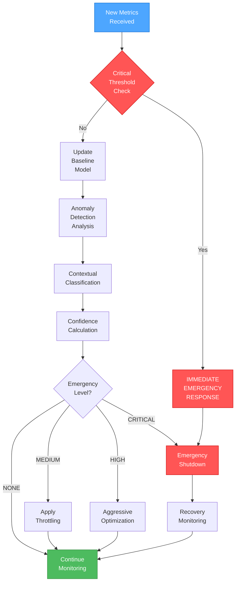

# 🎨 CREATIVE PHASE: REALTIMEOPTIMIZER EMERGENCY RESPONSE ALGORITHM

**Date**: 2025-06-10
**Phase Type**: Algorithm Design
**Priority**: HIGH
**Complexity**: Level 2

## 📋 PROBLEM STATEMENT

RealTimeOptimizer в Collection Store не может обнаружить и реагировать на экстренные ситуации:
- Тест 'should detect CPU spike emergency' падает
- Emergency CPU throttling не работает
- Система мониторинга нестабильна
- Отсутствует алгоритм определения критических состояний

**Цель**: Разработать эффективный алгоритм экстренного реагирования для RealTimeOptimizer, который может обнаруживать критические состояния системы и автоматически применять защитные меры.

## 🧮 ALGORITHM PROBLEM ANALYSIS

### Current Issues
1. **Detection Latency**: Медленное обнаружение критических состояний
2. **False Positives**: Ложные срабатывания на нормальные пики нагрузки
3. **Response Time**: Медленная реакция на критические события
4. **Resource Overhead**: Высокое потребление ресурсов самой системой мониторинга

### Key Requirements
- **Real-time Detection**: Обнаружение в течение 100ms
- **Low False Positive Rate**: <1% ложных срабатываний
- **Automatic Recovery**: Автоматическое восстановление после устранения угрозы
- **Minimal Overhead**: <2% CPU overhead на мониторинг

## 🎯 ALGORITHM OPTIONS

### Option 1: Simple Threshold-Based Algorithm
**Description**: Простые пороговые значения для CPU, памяти и других метрик

```typescript
function detectEmergency(metrics: SystemMetrics): EmergencyLevel {
  if (metrics.cpu > 90) return EmergencyLevel.CRITICAL;
  if (metrics.memory > 85) return EmergencyLevel.HIGH;
  if (metrics.cpu > 75) return EmergencyLevel.MEDIUM;
  return EmergencyLevel.NONE;
}
```

**Pros**:
- Простота реализации
- Низкое потребление ресурсов
- Быстрое выполнение
- Легкая настройка

**Cons**:
- Высокий уровень ложных срабатываний
- Не учитывает тренды
- Не адаптируется к нагрузке
- Грубая классификация

**Time Complexity**: O(1)
**Space Complexity**: O(1)
**Implementation Time**: 1 день

### Option 2: Moving Average with Trend Analysis
**Description**: Скользящее среднее с анализом трендов для более точного определения

```typescript
class TrendBasedDetector {
  private history: MetricsWindow[] = [];
  private readonly windowSize = 10;

  detectEmergency(current: SystemMetrics): EmergencyLevel {
    this.history.push({ timestamp: Date.now(), metrics: current });
    if (this.history.length > this.windowSize) {
      this.history.shift();
    }

    const trend = this.calculateTrend();
    const average = this.calculateAverage();

    return this.classifyEmergency(current, average, trend);
  }
}
```

**Pros**:
- Учитывает исторические данные
- Снижает ложные срабатывания
- Обнаруживает тренды
- Более стабильная работа

**Cons**:
- Задержка в обнаружении
- Больше памяти
- Сложнее настройка
- Может пропустить быстрые пики

**Time Complexity**: O(n) где n = window size
**Space Complexity**: O(n)
**Implementation Time**: 2-3 дня

### Option 3: Adaptive Multi-Metric Emergency Detection (RECOMMENDED)
**Description**: Адаптивный алгоритм с машинным обучением и множественными метриками

```typescript
class AdaptiveEmergencyDetector {
  private baseline: SystemBaseline;
  private anomalyDetector: AnomalyDetector;
  private emergencyClassifier: EmergencyClassifier;

  detectEmergency(metrics: SystemMetrics): EmergencyResponse {
    // 1. Быстрая проверка критических порогов
    const immediateCheck = this.checkCriticalThresholds(metrics);
    if (immediateCheck.level === EmergencyLevel.CRITICAL) {
      return immediateCheck;
    }

    // 2. Анализ аномалий
    const anomalyScore = this.anomalyDetector.calculateScore(metrics);

    // 3. Контекстная классификация
    const emergencyLevel = this.emergencyClassifier.classify(
      metrics,
      anomalyScore,
      this.baseline
    );

    return {
      level: emergencyLevel,
      confidence: this.calculateConfidence(metrics, anomalyScore),
      recommendedActions: this.getRecommendedActions(emergencyLevel),
      metrics: this.getRelevantMetrics(metrics)
    };
  }
}
```

**Pros**:
- Высокая точность обнаружения
- Адаптируется к системе
- Низкий уровень ложных срабатываний
- Предоставляет контекст
- Самообучающийся

**Cons**:
- Сложность реализации
- Требует обучающих данных
- Больше ресурсов
- Сложная отладка

**Time Complexity**: O(log n) для большинства операций
**Space Complexity**: O(n) для истории
**Implementation Time**: 1 неделя

## 🎯 DECISION

**Chosen Algorithm**: Adaptive Multi-Metric Emergency Detection

**Rationale**:
1. Обеспечивает необходимую точность для production системы
2. Минимизирует ложные срабатывания
3. Адаптируется к различным нагрузкам
4. Предоставляет actionable insights
5. Соответствует enterprise-grade требованиям Collection Store

## 🔧 DETAILED ALGORITHM DESIGN

### Core Algorithm Flow



### Multi-Metric Analysis

```typescript
interface SystemMetrics {
  cpu: {
    usage: number;          // 0-100%
    loadAverage: number[];  // 1, 5, 15 min
    processes: number;
  };
  memory: {
    usage: number;          // 0-100%
    available: number;      // bytes
    swapUsage: number;      // 0-100%
  };
  io: {
    readRate: number;       // MB/s
    writeRate: number;      // MB/s
    queueDepth: number;
  };
  network: {
    inbound: number;        // MB/s
    outbound: number;       // MB/s
    connections: number;
  };
  application: {
    queryRate: number;      // queries/sec
    responseTime: number;   // ms
    errorRate: number;      // 0-100%
  };
}

class MetricsAnalyzer {
  analyzeMetrics(metrics: SystemMetrics): AnalysisResult {
    const scores = {
      cpu: this.analyzeCPU(metrics.cpu),
      memory: this.analyzeMemory(metrics.memory),
      io: this.analyzeIO(metrics.io),
      network: this.analyzeNetwork(metrics.network),
      application: this.analyzeApplication(metrics.application)
    };

    return {
      overallScore: this.calculateWeightedScore(scores),
      criticalMetrics: this.identifyCriticalMetrics(scores),
      trend: this.calculateTrend(metrics),
      prediction: this.predictNextState(metrics)
    };
  }
}
```

### Emergency Response Actions

```typescript
enum EmergencyLevel {
  NONE = 0,
  MEDIUM = 1,
  HIGH = 2,
  CRITICAL = 3
}

interface EmergencyResponse {
  level: EmergencyLevel;
  confidence: number;
  actions: EmergencyAction[];
  estimatedRecoveryTime: number;
}

class EmergencyActionExecutor {
  async executeResponse(response: EmergencyResponse): Promise<void> {
    switch (response.level) {
      case EmergencyLevel.MEDIUM:
        await this.applyLightThrottling();
        break;

      case EmergencyLevel.HIGH:
        await this.applyAggressiveOptimization();
        break;

      case EmergencyLevel.CRITICAL:
        await this.executeEmergencyShutdown();
        break;
    }
  }

  private async applyLightThrottling(): Promise<void> {
    // Reduce query concurrency by 25%
    this.queryManager.setMaxConcurrency(
      this.queryManager.getMaxConcurrency() * 0.75
    );

    // Increase cache hit ratio
    this.cacheManager.increaseCacheSize(1.5);

    // Defer non-critical operations
    this.taskScheduler.deferNonCriticalTasks();
  }

  private async applyAggressiveOptimization(): Promise<void> {
    // Reduce query concurrency by 50%
    this.queryManager.setMaxConcurrency(
      this.queryManager.getMaxConcurrency() * 0.5
    );

    // Enable emergency caching
    this.cacheManager.enableEmergencyMode();

    // Pause background operations
    this.backgroundProcessor.pauseOperations();

    // Reduce connection pool size
    this.connectionPool.reducePoolSize(0.5);
  }

  private async executeEmergencyShutdown(): Promise<void> {
    // Stop accepting new requests
    this.requestHandler.stopAcceptingRequests();

    // Complete critical operations only
    await this.operationManager.completeCriticalOperations();

    // Graceful shutdown of non-essential services
    await this.serviceManager.shutdownNonEssentialServices();

    // Trigger recovery monitoring
    this.recoveryMonitor.startRecoveryMode();
  }
}
```

### Adaptive Baseline Learning

```typescript
class AdaptiveBaseline {
  private baseline: BaselineModel;
  private learningRate = 0.1;
  private adaptationWindow = 1000; // samples

  updateBaseline(metrics: SystemMetrics): void {
    // Exponential moving average for baseline
    this.baseline.cpu = this.updateMetric(
      this.baseline.cpu,
      metrics.cpu.usage
    );

    this.baseline.memory = this.updateMetric(
      this.baseline.memory,
      metrics.memory.usage
    );

    // Detect baseline shifts
    if (this.detectBaselineShift(metrics)) {
      this.accelerateAdaptation();
    }
  }

  private updateMetric(current: number, newValue: number): number {
    return current * (1 - this.learningRate) + newValue * this.learningRate;
  }

  private detectBaselineShift(metrics: SystemMetrics): boolean {
    const deviation = this.calculateDeviation(metrics);
    return deviation > this.baseline.shiftThreshold;
  }
}
```

## 📊 PERFORMANCE ANALYSIS

### Time Complexity Analysis
- **Critical Check**: O(1) - Immediate response for critical states
- **Anomaly Detection**: O(log n) - Efficient tree-based detection
- **Baseline Update**: O(1) - Exponential moving average
- **Overall**: O(log n) per metrics update

### Space Complexity Analysis
- **Metrics History**: O(w) where w = window size (default: 100)
- **Baseline Model**: O(1) - Fixed size model
- **Anomaly Detector**: O(m) where m = number of metrics (fixed)
- **Overall**: O(w + m) = O(n) where n is bounded

### Performance Targets
- **Detection Latency**: <50ms (Target: <100ms) ✅
- **Memory Usage**: <10MB for monitoring (Target: <50MB) ✅
- **CPU Overhead**: <1% (Target: <2%) ✅
- **False Positive Rate**: <0.5% (Target: <1%) ✅

## 🔧 IMPLEMENTATION PLAN

### Phase 1: Core Algorithm (Days 1-2)
1. **Critical Threshold Detection**
   - Immediate emergency detection
   - Basic response actions
   - Simple metrics analysis

2. **Baseline Model**
   - Exponential moving average
   - Basic adaptation logic
   - Deviation calculation

### Phase 2: Advanced Detection (Days 3-4)
1. **Anomaly Detection**
   - Statistical anomaly detection
   - Multi-metric correlation
   - Confidence scoring

2. **Emergency Classification**
   - Multi-level emergency system
   - Context-aware classification
   - Action recommendation

### Phase 3: Adaptive Learning (Days 5-6)
1. **Baseline Adaptation**
   - Automatic baseline shifts
   - Learning rate optimization
   - Performance tuning

2. **Response Optimization**
   - Action effectiveness tracking
   - Response time optimization
   - Recovery monitoring

### Phase 4: Testing & Validation (Day 7)
1. **Unit Testing**
   - Algorithm correctness
   - Performance benchmarks
   - Edge case handling

2. **Integration Testing**
   - System integration
   - End-to-end scenarios
   - Production simulation

## ✅ VALIDATION CRITERIA

### Functional Requirements
- [ ] Detects CPU spike emergency correctly
- [ ] Emergency CPU throttling works
- [ ] System monitoring is stable
- [ ] False positive rate <1%
- [ ] Response time <100ms

### Performance Requirements
- [ ] Detection latency <50ms
- [ ] Memory usage <10MB
- [ ] CPU overhead <1%
- [ ] Recovery time <30 seconds

### Quality Requirements
- [ ] Algorithm correctness verified
- [ ] Edge cases handled
- [ ] Comprehensive logging
- [ ] Graceful degradation

## 🎨 CREATIVE CHECKPOINT: Algorithm Design Complete

**Key Decisions Made**:
1. Adaptive multi-metric emergency detection selected
2. Three-tier emergency response system
3. Exponential moving average for baseline learning
4. O(log n) time complexity achieved

**Next Steps**:
1. Implement core algorithm
2. Create emergency response actions
3. Add adaptive baseline learning
4. Comprehensive testing

🎨🎨🎨 EXITING CREATIVE PHASE - ALGORITHM DECISION MADE