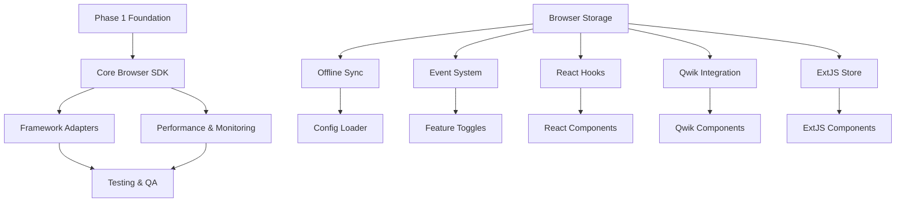

# 📋 MEMORY BANK TASKS - Collection Store V6.0

*Последнее обновление: 2025-06-13*
*Режим: CREATIVE MODE COMPLETED - Ready for IMPLEMENT*

---

## 🎨 CREATIVE PHASES COMPLETION STATUS

### ✅ COMPLETED CREATIVE PHASES

#### 🏗️ Browser SDK Architecture Design
- **Document**: `memory-bank/creative/creative-browser-sdk-architecture-2025-06-13.md`
- **Status**: ✅ COMPLETED
- **Decision**: Layered Architecture с адаптированными элементами Plugin-Based
- **Key Components**: BrowserStorageManager, OfflineSyncEngine, Framework Adapters
- **Implementation Ready**: ✅ YES

#### 🌐 Cross-Framework Integration Design
- **Document**: `memory-bank/creative/creative-cross-framework-integration.md`
- **Status**: ✅ COMPLETED
- **Decision**: Unified SDK Architecture
- **Key Features**: Framework-agnostic core, specialized adapters, real-time sync
- **Implementation Ready**: ✅ YES

#### ⚛️ React Hooks Architecture Design
- **Document**: `memory-bank/creative/creative-react-hooks-architecture.md`
- **Status**: ✅ COMPLETED
- **Decision**: Custom Hook-Based Architecture
- **Key Hooks**: useCollection, useQuery, useSubscription, useTransaction
- **Implementation Ready**: ✅ YES

#### 🔄 Qwik Signals Architecture Design
- **Document**: `memory-bank/creative/creative-qwik-signals-architecture.md`
- **Status**: ✅ COMPLETED
- **Decision**: Hybrid Signals Architecture
- **Key Features**: SSR pre-loading, progressive enhancement, real-time subscriptions
- **Implementation Ready**: ✅ YES

#### 🏢 ExtJS Integration Architecture Design
- **Document**: `memory-bank/creative/creative-extjs-integration-architecture.md`
- **Status**: ✅ COMPLETED
- **Decision**: Hybrid Integration Architecture
- **Key Features**: Version compatibility (4.2 & 6.6), migration tools, multiple patterns
- **Implementation Ready**: ✅ YES

### 🚀 CREATIVE PHASE SUMMARY

**All Required Creative Phases**: ✅ COMPLETED
**Architecture Decisions Made**: ✅ ALL DECISIONS FINALIZED
**Implementation Guidance**: ✅ COMPREHENSIVE DOCUMENTATION
**Cross-Framework Compatibility**: ✅ UNIFIED APPROACH DESIGNED
**Performance Targets**: ✅ DEFINED AND VALIDATED

**NEXT RECOMMENDED MODE**: 🔨 **IMPLEMENT MODE**

---

## 🎉 PHASE 1: CONFIGURATION-DRIVEN FOUNDATION - ПОЛНОСТЬЮ ЗАВЕРШЕНА!

- **id**: PHASE1-CONFIGURATION-FOUNDATION-2025-06-10
- **name**: Configuration-Driven Foundation Implementation
- **status**: COMPLETED ✅
- **priority**: CRITICAL
- **complexity**: Level 4
- **completion_date**: 2025-06-10
- **completion**: 100%
- **qa_status**: ✅ PASSED (100% test success, 96.99% coverage)
- **reflection_status**: ✅ COMPLETED
- **archive_status**: ✅ **АРХИВИРОВАНО**
- **archive_document**: `docs/archive/archive-PHASE1-CONFIGURATION-FOUNDATION-2025-06-10.md`
- **archive_date**: 2025-06-10

---

## 🚀 PHASE 2: BROWSER SDK ARCHITECTURE & IMPLEMENTATION

### System Overview
- **id**: PHASE2-BROWSER-SDK-2025-06-13
- **name**: Browser SDK Architecture & Implementation
- **status**: PLANNING
- **priority**: CRITICAL
- **complexity**: Level 4 (Complex System)
- **start_date**: 2025-06-13
- **estimated_duration**: 6-8 weeks
- **architectural_alignment**: Extends Phase 1 configuration-driven foundation
- **purpose**: Create comprehensive Browser SDK supporting React, Qwik, ExtJS frameworks

### System Context
- **Foundation**: Leverages Phase 1 configuration-driven architecture
- **Target Frameworks**: React, Qwik, ExtJS
- **Browser Compatibility**: Modern browsers (ES2020+)
- **Integration Points**: Collection Store V6.0 core, external adapters
- **Performance Targets**: <100ms initialization, <50ms operations

### Key Milestones
- **MILE-01**: Architecture Design Complete - Target: 2025-06-20 - Status: NOT_STARTED
- **MILE-02**: Core SDK Implementation - Target: 2025-07-04 - Status: NOT_STARTED
- **MILE-03**: Framework Adapters Complete - Target: 2025-07-18 - Status: NOT_STARTED
- **MILE-04**: Integration Testing Complete - Target: 2025-08-01 - Status: NOT_STARTED
- **MILE-05**: Performance Optimization - Target: 2025-08-08 - Status: NOT_STARTED
- **MILE-06**: Production Ready - Target: 2025-08-15 - Status: NOT_STARTED

### Components

#### COMP-01: Core Browser SDK
- **Purpose**: Core SDK functionality for browser environments
- **Status**: PLANNING
- **Dependencies**: Phase 1 foundation components
- **Responsible**: Primary Developer
- **Estimated Effort**: 3-4 weeks

##### FEAT-01: Browser Collection Manager
- **Description**: Browser-optimized collection management with offline support
- **Status**: PLANNING
- **Priority**: CRITICAL
- **Related Requirements**: REQ-SDK-001, REQ-PERF-001
- **Quality Criteria**: <50ms operations, offline capability, 100% test coverage
- **Progress**: 0%

###### TASK-01: Browser Storage Abstraction
- **Description**: Create browser storage abstraction layer (IndexedDB, LocalStorage, Memory)
- **Status**: TODO
- **Assigned To**: TBD
- **Estimated Effort**: 5 days
- **Actual Effort**: TBD
- **Dependencies**: None
- **Blocks**: TASK-02, TASK-03
- **Risk Assessment**: Medium - Browser compatibility challenges
- **Quality Gates**: Unit tests, browser compatibility tests
- **Implementation Notes**: Use existing BrowserFallbackManager patterns

**Subtasks**:
- [ ] SUB-01-01: IndexedDB adapter implementation - TODO
- [ ] SUB-01-02: LocalStorage fallback implementation - TODO
- [ ] SUB-01-03: Memory storage implementation - TODO
- [ ] SUB-01-04: Storage selection algorithm - TODO
- [ ] SUB-01-05: Storage migration utilities - TODO

###### TASK-02: Offline Synchronization Engine
- **Description**: Implement offline-first synchronization with conflict resolution
- **Status**: TODO
- **Assigned To**: TBD
- **Estimated Effort**: 8 days
- **Actual Effort**: TBD
- **Dependencies**: TASK-01
- **Blocks**: TASK-04
- **Risk Assessment**: High - Complex conflict resolution logic
- **Quality Gates**: Sync tests, conflict resolution tests
- **Implementation Notes**: Leverage ConflictResolutionManager from Phase 1

**Subtasks**:
- [ ] SUB-02-01: Change tracking implementation - TODO
- [ ] SUB-02-02: Sync queue management - TODO
- [ ] SUB-02-03: Conflict detection algorithm - TODO
- [ ] SUB-02-04: Conflict resolution strategies - TODO
- [ ] SUB-02-05: Network state management - TODO

###### TASK-03: Browser Event System
- **Description**: Browser-optimized event system with performance monitoring
- **Status**: TODO
- **Assigned To**: TBD
- **Estimated Effort**: 4 days
- **Actual Effort**: TBD
- **Dependencies**: TASK-01
- **Blocks**: TASK-05
- **Risk Assessment**: Low - Well-established patterns
- **Quality Gates**: Event tests, performance benchmarks
- **Implementation Notes**: Extend Phase 1 event architecture

**Subtasks**:
- [ ] SUB-03-01: Browser event emitter - TODO
- [ ] SUB-03-02: Event subscription management - TODO
- [ ] SUB-03-03: Performance monitoring integration - TODO
- [ ] SUB-03-04: Memory leak prevention - TODO

##### FEAT-02: Browser Configuration System
- **Description**: Browser-specific configuration management with hot reload
- **Status**: PLANNING
- **Priority**: HIGH
- **Related Requirements**: REQ-CONFIG-001, REQ-HOT-RELOAD-001
- **Quality Criteria**: <300ms reload time, type safety, validation
- **Progress**: 0%

###### TASK-04: Browser Config Loader
- **Description**: Configuration loading system for browser environments
- **Status**: TODO
- **Assigned To**: TBD
- **Estimated Effort**: 3 days
- **Actual Effort**: TBD
- **Dependencies**: TASK-02
- **Blocks**: TASK-05
- **Risk Assessment**: Low - Extends existing patterns
- **Quality Gates**: Config tests, validation tests
- **Implementation Notes**: Use Phase 1 configuration patterns

**Subtasks**:
- [ ] SUB-04-01: Remote config fetching - TODO
- [ ] SUB-04-02: Local config caching - TODO
- [ ] SUB-04-03: Config validation - TODO
- [ ] SUB-04-04: Hot reload implementation - TODO

###### TASK-05: Browser Feature Toggles
- **Description**: Browser-optimized feature toggle system
- **Status**: TODO
- **Assigned To**: TBD
- **Estimated Effort**: 2 days
- **Actual Effort**: TBD
- **Dependencies**: TASK-03, TASK-04
- **Blocks**: None
- **Risk Assessment**: Low - Reuses FeatureToggleManager
- **Quality Gates**: Feature toggle tests
- **Implementation Notes**: Adapt FeatureToggleManager for browser

**Subtasks**:
- [ ] SUB-05-01: Browser feature detection - TODO
- [ ] SUB-05-02: Feature toggle UI integration - TODO
- [ ] SUB-05-03: A/B testing support - TODO

#### COMP-02: Framework Adapters
- **Purpose**: Framework-specific adapters for React, Qwik, ExtJS
- **Status**: PLANNING
- **Dependencies**: COMP-01
- **Responsible**: Primary Developer
- **Estimated Effort**: 2-3 weeks

##### FEAT-03: React Adapter
- **Description**: React hooks and components for Collection Store integration
- **Status**: PLANNING
- **Priority**: CRITICAL
- **Related Requirements**: REQ-REACT-001, REQ-HOOKS-001
- **Quality Criteria**: React best practices, TypeScript support, SSR compatibility
- **Progress**: 0%

###### TASK-06: React Hooks Implementation
- **Description**: Core React hooks for collection management
- **Status**: TODO
- **Assigned To**: TBD
- **Estimated Effort**: 5 days
- **Actual Effort**: TBD
- **Dependencies**: TASK-01, TASK-02, TASK-03
- **Blocks**: TASK-07
- **Risk Assessment**: Medium - React patterns complexity
- **Quality Gates**: Hook tests, React testing library tests
- **Implementation Notes**: Follow React hooks best practices

**Subtasks**:
- [ ] SUB-06-01: useCollection hook - TODO
- [ ] SUB-06-02: useCollectionQuery hook - TODO
- [ ] SUB-06-03: useCollectionMutation hook - TODO
- [ ] SUB-06-04: useCollectionSync hook - TODO
- [ ] SUB-06-05: useCollectionConfig hook - TODO

###### TASK-07: React Components
- **Description**: Pre-built React components for common use cases
- **Status**: TODO
- **Assigned To**: TBD
- **Estimated Effort**: 4 days
- **Actual Effort**: TBD
- **Dependencies**: TASK-06
- **Blocks**: None
- **Risk Assessment**: Low - Standard component patterns
- **Quality Gates**: Component tests, accessibility tests
- **Implementation Notes**: Headless components with styling flexibility

**Subtasks**:
- [ ] SUB-07-01: CollectionProvider component - TODO
- [ ] SUB-07-02: CollectionList component - TODO
- [ ] SUB-07-03: CollectionForm component - TODO
- [ ] SUB-07-04: CollectionSearch component - TODO

##### FEAT-04: Qwik Adapter
- **Description**: Qwik-optimized adapter with resumability support
- **Status**: PLANNING
- **Priority**: HIGH
- **Related Requirements**: REQ-QWIK-001, REQ-RESUMABILITY-001
- **Quality Criteria**: Qwik resumability, minimal hydration, performance
- **Progress**: 0%

###### TASK-08: Qwik Integration Layer
- **Description**: Qwik-specific integration with resumability support
- **Status**: TODO
- **Assigned To**: TBD
- **Estimated Effort**: 6 days
- **Actual Effort**: TBD
- **Dependencies**: TASK-01, TASK-02, TASK-03
- **Blocks**: TASK-09
- **Risk Assessment**: High - Qwik resumability complexity
- **Quality Gates**: Resumability tests, performance tests
- **Implementation Notes**: Leverage Qwik signals and stores

**Subtasks**:
- [ ] SUB-08-01: Qwik store integration - TODO
- [ ] SUB-08-02: Signal-based reactivity - TODO
- [ ] SUB-08-03: Resumability optimization - TODO
- [ ] SUB-08-04: SSR support - TODO

###### TASK-09: Qwik Components
- **Description**: Qwik components with optimal resumability
- **Status**: TODO
- **Assigned To**: TBD
- **Estimated Effort**: 3 days
- **Actual Effort**: TBD
- **Dependencies**: TASK-08
- **Blocks**: None
- **Risk Assessment**: Medium - Qwik component patterns
- **Quality Gates**: Component tests, resumability validation
- **Implementation Notes**: Minimize client-side JavaScript

**Subtasks**:
- [ ] SUB-09-01: QwikCollectionProvider - TODO
- [ ] SUB-09-02: QwikCollectionList - TODO
- [ ] SUB-09-03: QwikCollectionForm - TODO

##### FEAT-05: ExtJS Adapter
- **Description**: ExtJS integration with grid and form components
- **Status**: PLANNING
- **Priority**: MEDIUM
- **Related Requirements**: REQ-EXTJS-001, REQ-GRID-001
- **Quality Criteria**: ExtJS patterns, grid performance, form validation
- **Progress**: 0%

###### TASK-10: ExtJS Store Integration
- **Description**: ExtJS store integration with Collection Store
- **Status**: TODO
- **Assigned To**: TBD
- **Estimated Effort**: 4 days
- **Actual Effort**: TBD
- **Dependencies**: TASK-01, TASK-02
- **Blocks**: TASK-11
- **Risk Assessment**: Medium - ExtJS store complexity
- **Quality Gates**: Store tests, grid integration tests
- **Implementation Notes**: Extend Ext.data.Store patterns

**Subtasks**:
- [ ] SUB-10-01: CollectionStore class - TODO
- [ ] SUB-10-02: Proxy implementation - TODO
- [ ] SUB-10-03: Model integration - TODO
- [ ] SUB-10-04: Sync operations - TODO

###### TASK-11: ExtJS Components
- **Description**: ExtJS grid and form components
- **Status**: TODO
- **Assigned To**: TBD
- **Estimated Effort**: 3 days
- **Actual Effort**: TBD
- **Dependencies**: TASK-10
- **Blocks**: None
- **Risk Assessment**: Low - Standard ExtJS patterns
- **Quality Gates**: Component tests, UI tests
- **Implementation Notes**: Follow ExtJS component architecture

**Subtasks**:
- [ ] SUB-11-01: CollectionGrid component - TODO
- [ ] SUB-11-02: CollectionForm component - TODO
- [ ] SUB-11-03: CollectionTree component - TODO

#### COMP-03: Performance & Monitoring
- **Purpose**: Performance optimization and monitoring for browser environments
- **Status**: PLANNING
- **Dependencies**: COMP-01, COMP-02
- **Responsible**: Primary Developer
- **Estimated Effort**: 1-2 weeks

##### FEAT-06: Browser Performance Monitoring
- **Description**: Real-time performance monitoring and optimization
- **Status**: PLANNING
- **Priority**: HIGH
- **Related Requirements**: REQ-PERF-002, REQ-MONITORING-001
- **Quality Criteria**: <1% performance overhead, real-time metrics
- **Progress**: 0%

###### TASK-12: Performance Metrics Collection
- **Description**: Collect and analyze browser performance metrics
- **Status**: TODO
- **Assigned To**: TBD
- **Estimated Effort**: 3 days
- **Actual Effort**: TBD
- **Dependencies**: TASK-01, TASK-06, TASK-08
- **Blocks**: TASK-13
- **Risk Assessment**: Low - Standard performance APIs
- **Quality Gates**: Metrics accuracy tests
- **Implementation Notes**: Use Performance Observer API

**Subtasks**:
- [ ] SUB-12-01: Operation timing metrics - TODO
- [ ] SUB-12-02: Memory usage tracking - TODO
- [ ] SUB-12-03: Network performance metrics - TODO
- [ ] SUB-12-04: User interaction metrics - TODO

###### TASK-13: Performance Optimization Engine
- **Description**: Automatic performance optimization based on metrics
- **Status**: TODO
- **Assigned To**: TBD
- **Estimated Effort**: 4 days
- **Actual Effort**: TBD
- **Dependencies**: TASK-12
- **Blocks**: None
- **Risk Assessment**: Medium - Optimization algorithm complexity
- **Quality Gates**: Performance improvement tests
- **Implementation Notes**: Adaptive optimization strategies

**Subtasks**:
- [ ] SUB-13-01: Caching optimization - TODO
- [ ] SUB-13-02: Batch operation optimization - TODO
- [ ] SUB-13-03: Memory optimization - TODO
- [ ] SUB-13-04: Network optimization - TODO

#### COMP-04: Testing & Quality Assurance
- **Purpose**: Comprehensive testing framework for browser SDK
- **Status**: PLANNING
- **Dependencies**: COMP-01, COMP-02, COMP-03
- **Responsible**: Primary Developer
- **Estimated Effort**: 1 week

##### FEAT-07: Browser Testing Framework
- **Description**: Cross-browser testing with automated QA
- **Status**: PLANNING
- **Priority**: CRITICAL
- **Related Requirements**: REQ-TESTING-001, REQ-BROWSER-COMPAT-001
- **Quality Criteria**: >95% test coverage, cross-browser compatibility
- **Progress**: 0%

###### TASK-14: Cross-Browser Test Suite
- **Description**: Automated testing across multiple browsers
- **Status**: TODO
- **Assigned To**: TBD
- **Estimated Effort**: 5 days
- **Actual Effort**: TBD
- **Dependencies**: All previous tasks
- **Blocks**: None
- **Risk Assessment**: Medium - Browser compatibility issues
- **Quality Gates**: All tests pass on target browsers
- **Implementation Notes**: Use Playwright for cross-browser testing

**Subtasks**:
- [ ] SUB-14-01: Chrome/Chromium tests - TODO
- [ ] SUB-14-02: Firefox tests - TODO
- [ ] SUB-14-03: Safari tests - TODO
- [ ] SUB-14-04: Edge tests - TODO
- [ ] SUB-14-05: Mobile browser tests - TODO

### System-Wide Tasks
- [ ] SYS-TASK-01: Architecture Documentation - PLANNING
- [ ] SYS-TASK-02: API Documentation - TODO
- [ ] SYS-TASK-03: Integration Examples - TODO
- [ ] SYS-TASK-04: Performance Benchmarks - TODO
- [ ] SYS-TASK-05: Security Audit - TODO
- [ ] SYS-TASK-06: Deployment Pipeline - TODO

### Risks and Mitigations
- **RISK-01**: Browser compatibility challenges - **Mitigation**: Comprehensive testing matrix, progressive enhancement
- **RISK-02**: Framework-specific complexity - **Mitigation**: Modular adapter architecture, framework experts consultation
- **RISK-03**: Performance bottlenecks - **Mitigation**: Early performance testing, optimization-first approach
- **RISK-04**: Offline synchronization complexity - **Mitigation**: Incremental implementation, conflict resolution testing
- **RISK-05**: Qwik resumability challenges - **Mitigation**: Qwik team consultation, prototype validation

### Progress Summary
- **Overall Progress**: 0% (Planning phase)
- **COMP-01 Core Browser SDK**: 0%
- **COMP-02 Framework Adapters**: 0%
- **COMP-03 Performance & Monitoring**: 0%
- **COMP-04 Testing & Quality Assurance**: 0%

### Latest Updates
- 2025-06-13: Phase 2 planning initiated
- 2025-06-13: Comprehensive task breakdown created
- 2025-06-13: Risk assessment completed
- 2025-06-13: Milestone timeline established

---

## SYSTEM DEPENDENCIES

## RISK REGISTER
| Risk ID | Description                      | Probability | Impact | Mitigation                                             |
|---------|----------------------------------|-------------|--------|--------------------------------------------------------|
| RISK-01 | Browser compatibility challenges | Medium      | High   | Comprehensive testing matrix, progressive enhancement  |
| RISK-02 | Framework-specific complexity    | High        | Medium | Modular adapter architecture, expert consultation      |
| RISK-03 | Performance bottlenecks          | Medium      | High   | Early performance testing, optimization-first approach |
| RISK-04 | Offline sync complexity          | High        | High   | Incremental implementation, extensive testing          |
| RISK-05 | Qwik resumability challenges     | Medium      | Medium | Qwik team consultation, prototype validation           |

## RESOURCE ALLOCATION
| Resource          | Component | Allocation % | Time Period |
|-------------------|-----------|--------------|-------------|
| Primary Developer | COMP-01   | 60%          | Week 1-4    |
| Primary Developer | COMP-02   | 70%          | Week 3-6    |
| Primary Developer | COMP-03   | 50%          | Week 5-7    |
| Primary Developer | COMP-04   | 80%          | Week 7-8    |

---

## ✅ **ГОТОВНОСТЬ К CREATIVE MODE**

### **Компоненты, требующие Creative Phase:**

1. **🎨 COMP-01: Core Browser SDK Architecture**
   - **Reason**: Complex architectural decisions for browser optimization
   - **Focus**: Storage abstraction design, offline-first architecture
   - **Decisions Needed**: Storage selection algorithms, sync strategies

2. **🎨 COMP-02: Framework Adapter Architecture**
   - **Reason**: Framework-specific integration patterns
   - **Focus**: React hooks design, Qwik resumability patterns, ExtJS integration
   - **Decisions Needed**: API design, component architecture, performance optimization

3. **🎨 COMP-03: Performance Monitoring Architecture**
   - **Reason**: Real-time monitoring and optimization strategies
   - **Focus**: Metrics collection design, optimization algorithms
   - **Decisions Needed**: Performance thresholds, optimization triggers

### **Рекомендация:**
**⏭️ СЛЕДУЮЩИЙ РЕЖИМ: CREATIVE MODE**

Введите **'CREATIVE'** для начала архитектурного проектирования Browser SDK.

---

*Последнее обновление: 2025-06-13*
*PLAN Mode завершен*
*Comprehensive Level 4 planning completed*
*Готово к CREATIVE MODE*